# DataVis_part1_2017-04-26.Rmd
Stacey Harmer  
4/25/2017  
for the below chunk, include = FALSE means code in this chunk not included knitted file (include = F means neither code nor results of running code not shown)
But the line below sets defaults for page, and that is to show the code in the knitted file (echo = T shows code; echo = F means code not shown but the output of the code is shown)


### Section 3.2: First steps

```r
ggplot(data = mpg) +
  geom_point(mapping = aes(x = displ, y = hwy))
```

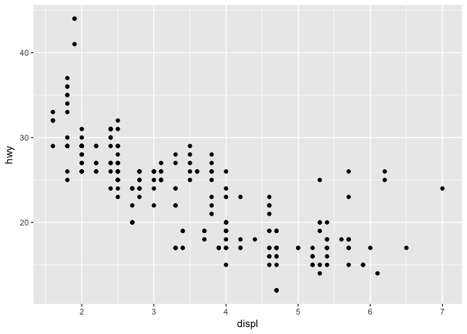<!-- -->

#### 3.2.4 Exercises
##### 1. run ggplot(data = mpg)

```r
ggplot(data = mpg)
```

<!-- -->
I get a blank plot, with no data populating it.

##### 2.  How many rows and columns are in mtcars?

```r
dim(mtcars)
```

```
## [1] 32 11
```
There are 32 rows and 11 columns in this dataframe

##### 3.  what does drv describe?

```r
?mpg
```
drv describes the transmission: f = front-wheel drive, r = rear wheel drive, 4 = 4wd

##### 4.  make scatterplot of hwy vs cyl

```r
ggplot(data = mpg) +
  geom_point(mapping = aes(x = cyl, y = hwy))
```

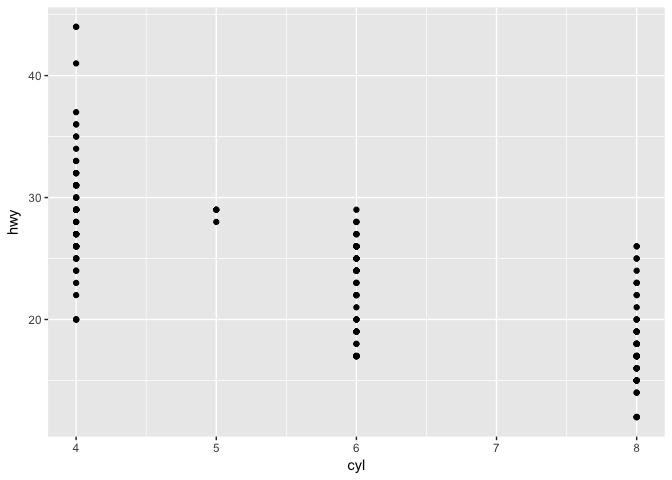<!-- -->

##### 5.  make scatterplot of class vs drv.  why not useful?

```r
ggplot(data = mpg) +
  geom_point(mapping = aes(x = class, y = drv))
```

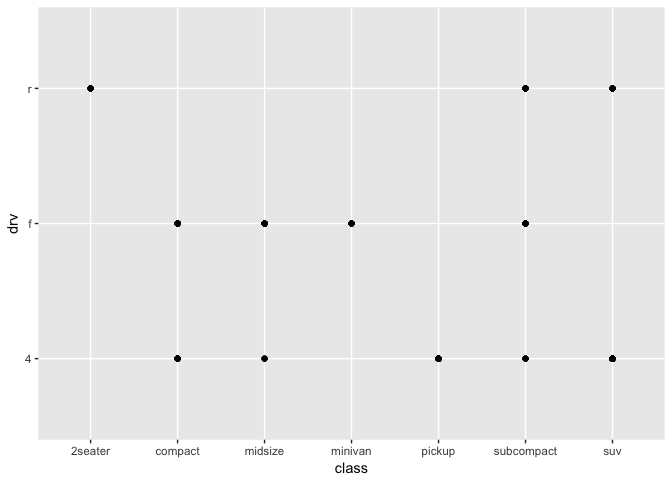<!-- -->

These data are overplotted.  Can't tell how many data points per position.

###  3.3: Aesthetic mappings
Can use levels (aesthetic properties) of data to provide more info in graph.

**NOTE** when shaped used as aesthetic, default is only 6 shapes per plot

_Figure 3.1_ shows the various shapes of points

#### 3.3.1 Exercises

##### 1.  What is wrong with below code?

```r
ggplot(data = mpg ) +
  geom_point(mapping = aes(x = displ, y = hwy, color = "blue"))
```

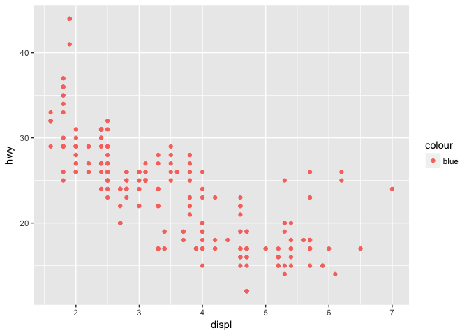<!-- -->

If points are supposed to be blue, code should be

```r
ggplot(data = mpg ) +
  geom_point(mapping = aes(x = displ, y = hwy), color = "blue")
```

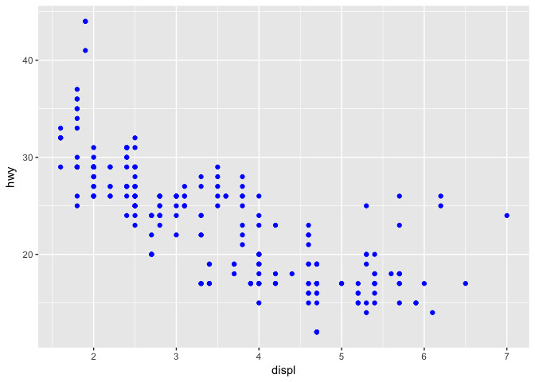<!-- -->

##### 2.  Which variables in mpg are categorical and which are continous?

```r
summary(mpg)
```

```
##  manufacturer          model               displ            year     
##  Length:234         Length:234         Min.   :1.600   Min.   :1999  
##  Class :character   Class :character   1st Qu.:2.400   1st Qu.:1999  
##  Mode  :character   Mode  :character   Median :3.300   Median :2004  
##                                        Mean   :3.472   Mean   :2004  
##                                        3rd Qu.:4.600   3rd Qu.:2008  
##                                        Max.   :7.000   Max.   :2008  
##       cyl           trans               drv                 cty       
##  Min.   :4.000   Length:234         Length:234         Min.   : 9.00  
##  1st Qu.:4.000   Class :character   Class :character   1st Qu.:14.00  
##  Median :6.000   Mode  :character   Mode  :character   Median :17.00  
##  Mean   :5.889                                         Mean   :16.86  
##  3rd Qu.:8.000                                         3rd Qu.:19.00  
##  Max.   :8.000                                         Max.   :35.00  
##       hwy             fl               class          
##  Min.   :12.00   Length:234         Length:234        
##  1st Qu.:18.00   Class :character   Class :character  
##  Median :24.00   Mode  :character   Mode  :character  
##  Mean   :23.44                                        
##  3rd Qu.:27.00                                        
##  Max.   :44.00
```
Categorical: manufacturer, model, trans, drv, fl, class

Continuous:  displ, year, cyl, cty, hwy

##### 3.  Map a continuous variable to color, size, and shape.

`ggplot(data = mpg) +
  geom_point(mapping = aes(x = displ, y = hwy, color = displ, size = year, shape = cyl))`
  
I ran the code; got an error message: continous variable can't be mapped to shape.  I omitted the code from this file to avoid knitting problems.


```r
ggplot(data = mpg) +
  geom_point(mapping = aes(x = displ, y = hwy, color = displ, size = year))
```

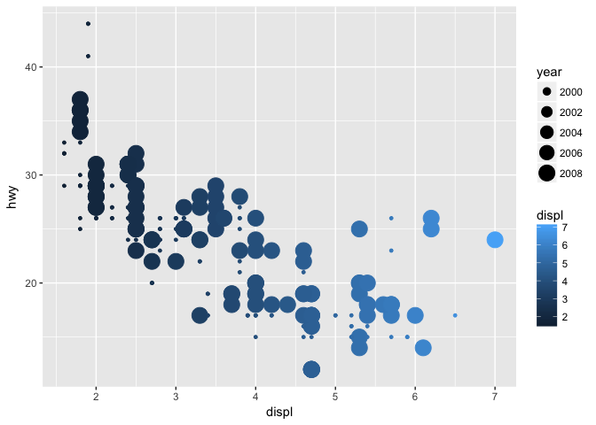<!-- -->

But I can map continuous variables to displ and to size. 
Try again, but this time choose variables with larger range


```r
ggplot(data = mpg) +
  geom_point(mapping = aes(x = displ, y = hwy, color = displ, size = cty))
```

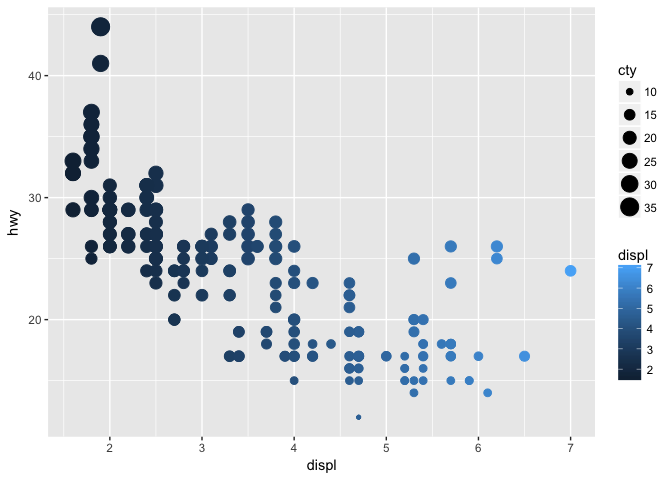<!-- -->

Dealt with that fine; just binned data.

##### 4.  Map same variable to multiple aesthetics

```r
ggplot(data = mpg) +
  geom_point(mapping = aes(x = displ, y = cty, color = drv, shape = drv))
```

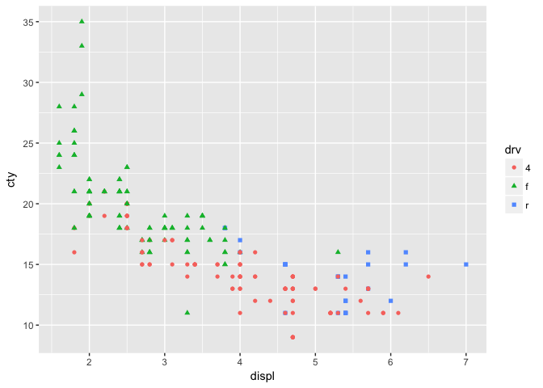<!-- -->
This works.

##### 5.  Explore the stroke aesthetic.

```r
ggplot(data=mpg) +
  geom_point(mapping = aes(x=displ, y = hwy, color = class, shape = class,stroke=1))
```

```
## Warning: The shape palette can deal with a maximum of 6 discrete values
## because more than 6 becomes difficult to discriminate; you have 7.
## Consider specifying shapes manually if you must have them.
```

```
## Warning: Removed 62 rows containing missing values (geom_point).
```

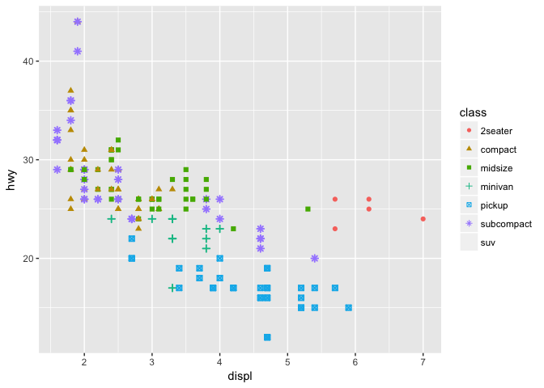<!-- -->

```r
ggplot(data=mpg) +
  geom_point(mapping = aes(x=displ, y = hwy, color = class, shape = class,stroke=5))
```

```
## Warning: The shape palette can deal with a maximum of 6 discrete values
## because more than 6 becomes difficult to discriminate; you have 7.
## Consider specifying shapes manually if you must have them.

## Warning: Removed 62 rows containing missing values (geom_point).
```

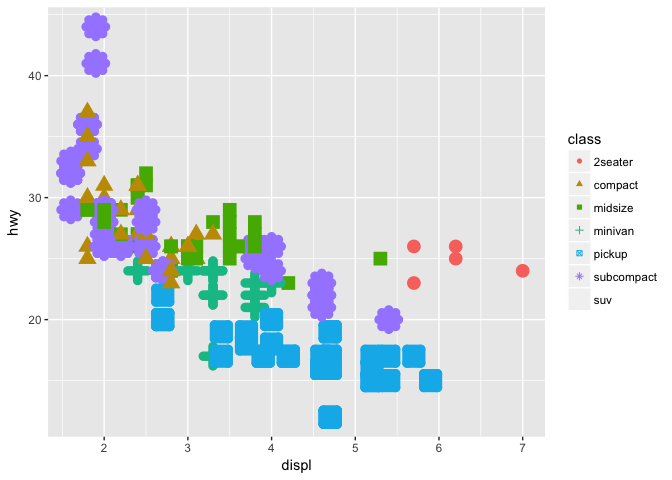<!-- -->

```r
ggplot(data=mpg) +
  geom_point(mapping = aes(x=displ, y = hwy, color = class, stroke = .1),shape=22)
```

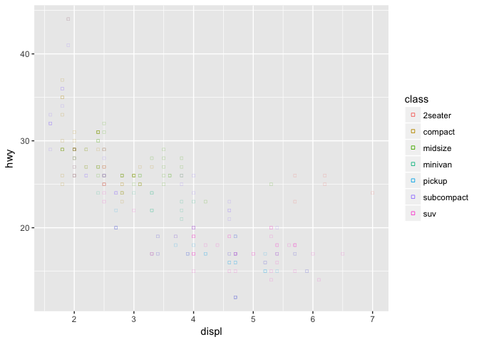<!-- -->

It seems as though all point shapes will take stroke as aesthetic

##### 6.  map an aesthetic to a value, not a variable

```r
ggplot(data=mpg) +
  geom_point(mapping = aes(x=displ, y = hwy, color = displ < 5))
```

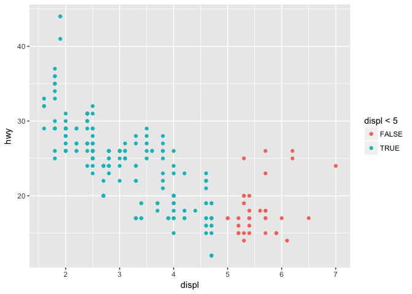<!-- -->

Kind of cool.  splits into two colors, less than or greater than 5

###  3.5: Facets
facet_wrap is for one variable: facet_wrap(~ class, nrow = 3)
facet_grid is for 2 varaibles: facet_grid(drv ~ cyl)

#### 3.5.1 Exercises

##### 1. facet on a continuous variable

```r
ggplot(data = mpg) +
  geom_point(mapping = aes(x = displ, y = cty)) +
  facet_wrap(~ hwy)
```

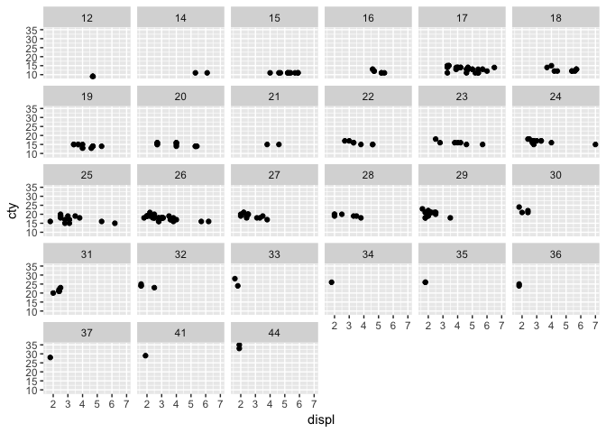<!-- -->

This is possible, but messy.  Facets each value independently

##### 2. Why empty cells in facet_grid(drv ~ cyl)?
Missing categories.  There are no 4 cylinder, rear wheel drive cars, for example.

```r
ggplot(data = mpg) +
  geom_point(mapping = aes(x = drv, y = cyl))
```

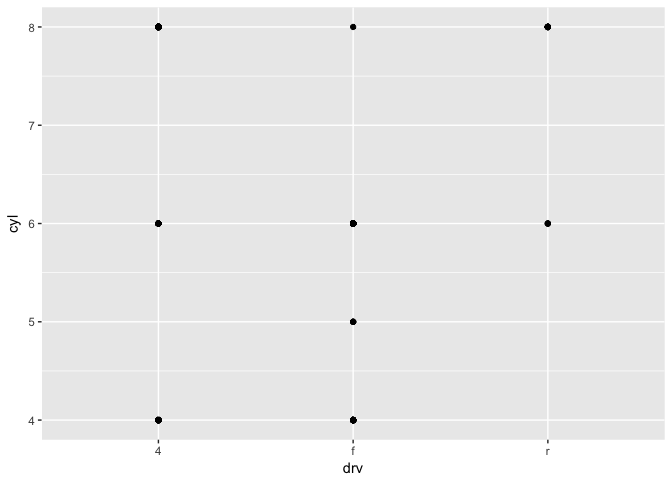<!-- -->

Overplotting, but again some categories are absent.

##### 3. What does . do in the following code?

```r
ggplot(data = mpg) +
  geom_point(mapping = aes(x = displ, y = hwy)) +
  facet_grid(drv ~ .)
```

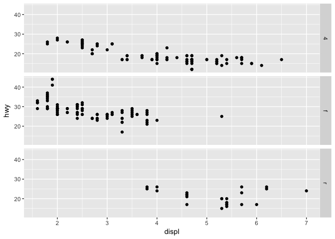<!-- -->

I faceted only by drive (made 3 rows)

```r
ggplot(data = mpg) +
  geom_point(mapping = aes(x = displ, y = hwy)) +
  facet_grid(. ~ cyl)
```

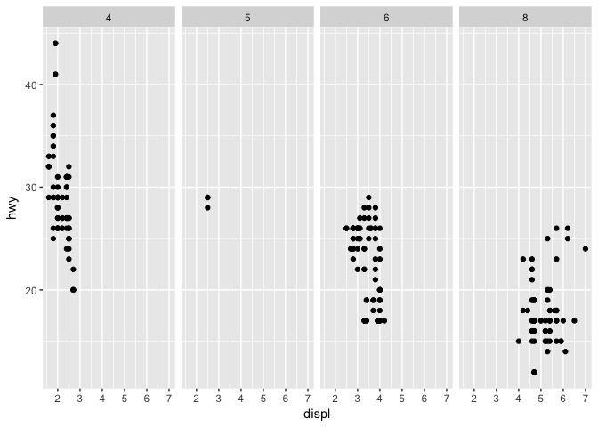<!-- -->

This faceted only by cyl, making 4 columns.

##### 4. Look at first faceted plot in below graph

```r
ggplot(data = mpg) +
  geom_point(mapping = aes(x = displ, y = hwy)) +
  facet_wrap( ~ class, nrow = 2)
```

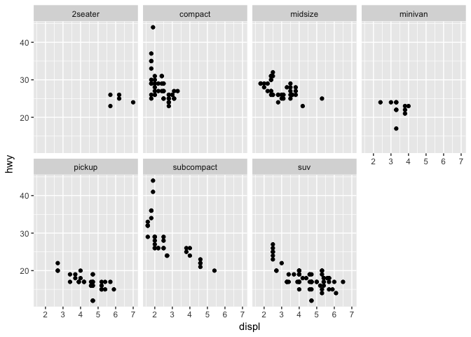<!-- -->

Advantages to faceting over color by class: can clearly see separate classes.  Might not be that useful for small datasets.
Conversely, if too many classes faceting also not useful.

##### 5. facet_wrap vs facet_grid

```r
?facet_wrap
# You can facet by multiple variables
ggplot(mpg, aes(displ, hwy)) +
  geom_point() +
  facet_wrap(~ cyl + drv)  # cool; I didn't know that worked
```

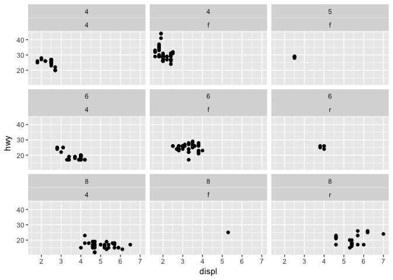<!-- -->

```r
# free scales can also be handy
ggplot(mpg, aes(displ, hwy)) +
  geom_point() +
  facet_wrap(~class, scales = "free")
```

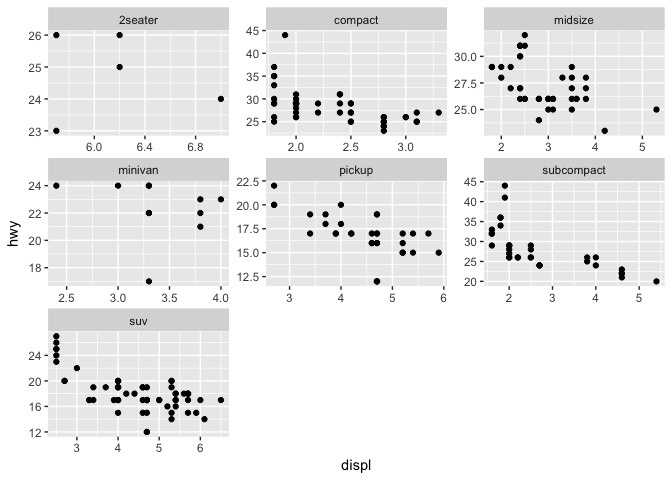<!-- -->

Handy because it wraps data into roughly symmetrical array of panels (while facet_grid(. ~ class) would instead give me a bunch of columns)

With facet_wrap, can specify number of columns (ncol) and rows (nrow) in the output array.  Note that I can also specify faceting by 2 values in facet_wrap

#####6. With facet_grid, you usually should put variable with more unique levels in columns.  Why?


```r
ggplot(data = mpg) +
  geom_point(mapping = aes(x = displ, y = hwy)) +
  facet_grid(drv ~ class)
```

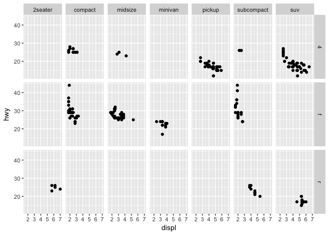<!-- -->

Given the shape of my monitor, this works pretty well

```r
ggplot(data = mpg) +
  geom_point(mapping = aes(x = displ, y = hwy)) +
  facet_grid(class ~ drv)
```

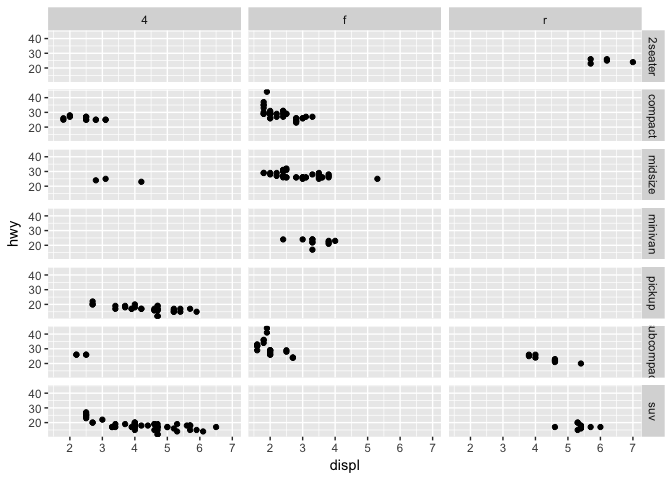<!-- -->

But this is an inefficient use of space - the x axes are much wider than y axes are tall.

Also, we usually display the dependent variable in the y axis (this is where we want to see differences.)  Best to keep full dynamic range there.


