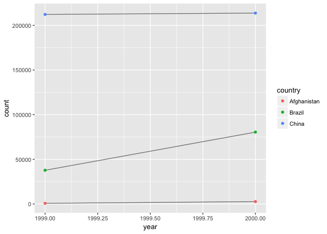

# Ch 12 - tidy data, part 1
Stacey Harmer  
6/11/2017  


Sections 12.1 - 12.4

#12 Tidy data

## 12.2.1  Tidy data exercises

### 12.2.1.1 Describe how the variables and observations are organised in each of the sample tables.

Table 1: each column is a variable, and every row is an observation
Table 2:  one of the columns ('type') is a factor, while the others are variables
Table 3:  one of hte colums ('rate') has two observations in it
Table 4:  two tibbles.  'year' is a factor now, and is spread over 2 columns in each tibble.

### 12.2.1.2 Compute the rate for table2, and table4a + table4b. You will need to perform four operations:
1.  extract # TB cases per country per year, and population # as well
2.  divide cases by population, then multiply by 10000
3.  Store in correct locations


```r
library(tidyverse)
```

```
## Loading tidyverse: ggplot2
## Loading tidyverse: tibble
## Loading tidyverse: tidyr
## Loading tidyverse: readr
## Loading tidyverse: purrr
## Loading tidyverse: dplyr
```

```
## Conflicts with tidy packages ----------------------------------------------
```

```
## filter(): dplyr, stats
## lag():    dplyr, stats
```

```r
head(table2)
```

```
## # A tibble: 6 × 4
##       country  year       type     count
##         <chr> <int>      <chr>     <int>
## 1 Afghanistan  1999      cases       745
## 2 Afghanistan  1999 population  19987071
## 3 Afghanistan  2000      cases      2666
## 4 Afghanistan  2000 population  20595360
## 5      Brazil  1999      cases     37737
## 6      Brazil  1999 population 172006362
```

```r
#table2 %>%
 # group_by(country, year) %>%
  #mutate(rate = filter(type == "cases")/filter(type == "population") )

kludge <- cbind(table2 %>%
  group_by(country, year) %>%
   filter(type == "cases"),
  table2 %>%
  group_by(country, year) %>%
   filter(type == "population"))

kludge %>%
  transform(country, year, 
            rate = kludge[, 4]/kludge[, 8] * 10000)
```

```
##       country year  type  count   country.1 year.1     type.1    count.1
## 1 Afghanistan 1999 cases    745 Afghanistan   1999 population   19987071
## 2 Afghanistan 2000 cases   2666 Afghanistan   2000 population   20595360
## 3      Brazil 1999 cases  37737      Brazil   1999 population  172006362
## 4      Brazil 2000 cases  80488      Brazil   2000 population  174504898
## 5       China 1999 cases 212258       China   1999 population 1272915272
## 6       China 2000 cases 213766       China   2000 population 1280428583
##   c..Afghanistan....Afghanistan....Brazil....Brazil....China...
## 1                                                   Afghanistan
## 2                                                   Afghanistan
## 3                                                        Brazil
## 4                                                        Brazil
## 5                                                         China
## 6                                                         China
##   c.1999L..2000L..1999L..2000L..1999L..2000L.  count.2
## 1                                        1999 0.372741
## 2                                        2000 1.294466
## 3                                        1999 2.193930
## 4                                        2000 4.612363
## 5                                        1999 1.667495
## 6                                        2000 1.669488
```

```r
# Ugly, but it works

# better way: make a new tibble from extracted vectors
table2_cases <-  filter(table2, type == "cases")[, c(1:2,4)]
table2_pop <- filter(table2, type == "population")[, 4]

table2_new <- bind_cols(table2_cases, table2_pop)
colnames(table2_new)[3:4] <- c("cases", "population") 

table2_new %>%
  mutate(rates = cases/population * 10000)
```

```
## # A tibble: 6 × 5
##       country  year  cases population    rates
##         <chr> <int>  <int>      <int>    <dbl>
## 1 Afghanistan  1999    745   19987071 0.372741
## 2 Afghanistan  2000   2666   20595360 1.294466
## 3      Brazil  1999  37737  172006362 2.193930
## 4      Brazil  2000  80488  174504898 4.612363
## 5       China  1999 212258 1272915272 1.667495
## 6       China  2000 213766 1280428583 1.669488
```
That was a drag.  Now do the same for Table 4


```r
table4a
```

```
## # A tibble: 3 × 3
##       country `1999` `2000`
## *       <chr>  <int>  <int>
## 1 Afghanistan    745   2666
## 2      Brazil  37737  80488
## 3       China 212258 213766
```

```r
table4b
```

```
## # A tibble: 3 × 3
##       country     `1999`     `2000`
## *       <chr>      <int>      <int>
## 1 Afghanistan   19987071   20595360
## 2      Brazil  172006362  174504898
## 3       China 1272915272 1280428583
```

```r
(rates <- tibble(rate.1999 = table4a$'1999'/table4b$'1999' *10000,
                rate.2000 = table4a$'2000'/table4b$'2000' * 10000))
```

```
## # A tibble: 3 × 2
##   rate.1999 rate.2000
##       <dbl>     <dbl>
## 1  0.372741  1.294466
## 2  2.193930  4.612363
## 3  1.667495  1.669488
```

```r
(table.4a.rates <- bind_cols(table4a[1], rates))
```

```
## # A tibble: 3 × 3
##       country rate.1999 rate.2000
##         <chr>     <dbl>     <dbl>
## 1 Afghanistan  0.372741  1.294466
## 2      Brazil  2.193930  4.612363
## 3       China  1.667495  1.669488
```

```r
#this worked; but more elegant answer on solutions page

tibble(country = table4a[["country"]],
       '1999' = table4a[['1999']]/ table4b[['1999']] * 10000,
       '2000' = table4a[['2000']]/ table4b[['2000']] * 10000
       )
```

```
## # A tibble: 3 × 3
##       country   `1999`   `2000`
##         <chr>    <dbl>    <dbl>
## 1 Afghanistan 0.372741 1.294466
## 2      Brazil 2.193930 4.612363
## 3       China 1.667495 1.669488
```

### 12.2.1.3  Recreate the plot showing change in cases over time using table2 instead of table1. What do you need to do first?


```r
library(ggplot2)
ggplot(table1, aes(year, cases)) + 
  geom_line(aes(group = country), colour = "grey50") + 
  geom_point(aes(colour = country))
```

<!-- -->

```r
table2
```

```
## # A tibble: 12 × 4
##        country  year       type      count
##          <chr> <int>      <chr>      <int>
## 1  Afghanistan  1999      cases        745
## 2  Afghanistan  1999 population   19987071
## 3  Afghanistan  2000      cases       2666
## 4  Afghanistan  2000 population   20595360
## 5       Brazil  1999      cases      37737
## 6       Brazil  1999 population  172006362
## 7       Brazil  2000      cases      80488
## 8       Brazil  2000 population  174504898
## 9        China  1999      cases     212258
## 10       China  1999 population 1272915272
## 11       China  2000      cases     213766
## 12       China  2000 population 1280428583
```

To plot this, I first need to filter out the population data


```r
table2 %>%
  filter(type == "cases") %>%
ggplot(aes(year, count)) + 
  geom_line(aes(group = country), colour = "grey50") + 
  geom_point(aes(colour = country))
```

<!-- -->
That was pretty easy.

## 12.3  Spreading and gathering
### 12.3.1  Gathering
makes wide tables longer and narrower

when some column names are values of a variable, not a variable name


```r
tidy4a <- table4a %>% 
  gather(`1999`, `2000`, key = "year", value = "cases")

tidy4b <- table4b %>% 
  gather(`1999`, `2000`, key = "year", value = "population")

# left join is useful here
left_join(tidy4a, tidy4b) # smart enough not to duplicate country and year
```

```
## Joining, by = c("country", "year")
```

```
## # A tibble: 6 × 4
##       country  year  cases population
##         <chr> <chr>  <int>      <int>
## 1 Afghanistan  1999    745   19987071
## 2      Brazil  1999  37737  172006362
## 3       China  1999 212258 1272915272
## 4 Afghanistan  2000   2666   20595360
## 5      Brazil  2000  80488  174504898
## 6       China  2000 213766 1280428583
```

### 12.3.2  Spreading
makes long tables shorter and wider

what is the key column? the one with variable names


```r
spread(table2, key = type, value = count)
```

```
## # A tibble: 6 × 4
##       country  year  cases population
## *       <chr> <int>  <int>      <int>
## 1 Afghanistan  1999    745   19987071
## 2 Afghanistan  2000   2666   20595360
## 3      Brazil  1999  37737  172006362
## 4      Brazil  2000  80488  174504898
## 5       China  1999 212258 1272915272
## 6       China  2000 213766 1280428583
```

### 12.3.3  Exercises

#### 12.3.3.1  Why are gather() and spread() not perfectly symmetrical?
Consider:


```r
stocks <- tibble(
  year   = c(2015, 2015, 2016, 2016),
  half  = c(   1,    2,     1,    2),
  return = c(1.88, 0.59, 0.92, 0.17)
)

stocks %>% 
  spread(year, return) %>% 
  gather("year", "return", `2015`:`2016`)
```

```
## # A tibble: 4 × 3
##    half  year return
##   <dbl> <chr>  <dbl>
## 1     1  2015   1.88
## 2     2  2015   0.59
## 3     1  2016   0.92
## 4     2  2016   0.17
```

the spread function made a wider tibble; colnames now half and 2015 and 2016; 
these are all numbers (dbl)  (same as original tibble)

Running gather on that - now year is a character.  this seems weird.
Gather converted the variable name to a character

Try again but with convert = T

```r
stocks %>% 
  spread(year, return) %>% 
  gather("year", "return", `2015`:`2016`, convert = T)
```

```
## # A tibble: 4 × 3
##    half  year return
##   <dbl> <int>  <dbl>
## 1     1  2015   1.88
## 2     2  2015   0.59
## 3     1  2016   0.92
## 4     2  2016   0.17
```
If I do this, year is an integer.
Help file says:  "if convert = T, will automatically run type.convert on key column"
type.convert will convert a character vector to logical, numeric, complex, or factor

Not fully symmetrical because column type information is lost!


#### 12.3.3.2  Why does this code fail?


```r
#table4a %>% 
 # gather(1999, 2000, key = "year", value = "cases")

#> Error in combine_vars(vars, ind_list): Position must be between 0 and n
```

Lack of tick marks, I think.


```r
table4a %>% 
  gather(`1999`, `2000`, key = "year", value = "cases")
```

```
## # A tibble: 6 × 3
##       country  year  cases
##         <chr> <chr>  <int>
## 1 Afghanistan  1999    745
## 2      Brazil  1999  37737
## 3       China  1999 212258
## 4 Afghanistan  2000   2666
## 5      Brazil  2000  80488
## 6       China  2000 213766
```

Yep.

```

#### 12.3.3.3  Why does spreading this tibble fail? How could you add a new column to fix the problem?


```r
people <- tribble(
  ~name,             ~key,    ~value,
  #-----------------|--------|------
  "Phillip Woods",   "age",       45,
  "Phillip Woods",   "height",   186,
  "Phillip Woods",   "age",       50,
  "Jessica Cordero", "age",       37,
  "Jessica Cordero", "height",   156
)
```

I could add a column 'observation' c(1,1,2,1,1)


```r
#  people2 <- right_join(people, c(1,1,2,1,1))
# this doesn't work
# cbind?
people2 <- cbind(people, c(1,1,2,1,1))
# that works, but messy
colnames(people2)[4] <- "obs"

people2 <- cbind(people, obs = c(1,1,2,1,1))
# this also works, and is more concise

spread(people2, key, value)
```

```
##              name obs age height
## 1 Jessica Cordero   1  37    156
## 2   Phillip Woods   1  45    186
## 3   Phillip Woods   2  50     NA
```

Or, I think if I got rid of one row that would do it also


```r
 # ( although data is lost here)
people3 <- people[c(1:2, 4:5),]

spread(people3, key = key, value = value )
```

```
## # A tibble: 2 × 3
##              name   age height
## *           <chr> <dbl>  <dbl>
## 1 Jessica Cordero    37    156
## 2   Phillip Woods    45    186
```


```

#### 12.3.3.4  Tidy the simple tibble below. Do you need to spread or gather it? What are the variables?

```r
preg <- tribble(
  ~pregnant, ~male, ~female,
  "yes",     NA,    10,
  "no",      20,    12
)
# the variables are pregnant, and sex
# so I need to gather it

gather(preg, male, female, key = "sex", value = "count")
```

```
## # A tibble: 4 × 3
##   pregnant    sex count
##      <chr>  <chr> <dbl>
## 1      yes   male    NA
## 2       no   male    20
## 3      yes female    10
## 4       no female    12
```

```r
# the help page points out that logical vectorw sould be easier to work with

gather(preg, male, female, key = "sex", value = "count") %>%
  mutate(pregnant = pregnant == "yes",
         female = sex == "female") %>%
  select(-sex)
```

```
## # A tibble: 4 × 3
##   pregnant count female
##      <lgl> <dbl>  <lgl>
## 1     TRUE    NA  FALSE
## 2    FALSE    20  FALSE
## 3     TRUE    10   TRUE
## 4    FALSE    12   TRUE
```

## 12.4  Separating and uniting

### 12.4.1  Separating


```r
library(tidyverse)
table3
```

```
## # A tibble: 6 × 3
##       country  year              rate
## *       <chr> <int>             <chr>
## 1 Afghanistan  1999      745/19987071
## 2 Afghanistan  2000     2666/20595360
## 3      Brazil  1999   37737/172006362
## 4      Brazil  2000   80488/174504898
## 5       China  1999 212258/1272915272
## 6       China  2000 213766/1280428583
```

```r
table3 %>% 
  separate(rate, into = c("cases", "population"))
```

```
## # A tibble: 6 × 4
##       country  year  cases population
## *       <chr> <int>  <chr>      <chr>
## 1 Afghanistan  1999    745   19987071
## 2 Afghanistan  2000   2666   20595360
## 3      Brazil  1999  37737  172006362
## 4      Brazil  2000  80488  174504898
## 5       China  1999 212258 1272915272
## 6       China  2000 213766 1280428583
```
Default is to leave column type as is (in this case, characters)


```r
table3 %>% 
  separate(rate, into = c("cases", "population"),convert = T)
```

```
## # A tibble: 6 × 4
##       country  year  cases population
## *       <chr> <int>  <int>      <int>
## 1 Afghanistan  1999    745   19987071
## 2 Afghanistan  2000   2666   20595360
## 3      Brazil  1999  37737  172006362
## 4      Brazil  2000  80488  174504898
## 5       China  1999 212258 1272915272
## 6       China  2000 213766 1280428583
```

```r
table3 %>% 
  separate(year, into = c("century", "year"), sep = 2, convert = T)
```

```
## # A tibble: 6 × 4
##       country century  year              rate
## *       <chr>   <int> <int>             <chr>
## 1 Afghanistan      19    99      745/19987071
## 2 Afghanistan      20     0     2666/20595360
## 3      Brazil      19    99   37737/172006362
## 4      Brazil      20     0   80488/174504898
## 5       China      19    99 212258/1272915272
## 6       China      20     0 213766/1280428583
```

```r
table3 %>% 
  separate(year, into = c("century", "year"), sep = 2) %>%
  separate(rate, into = c("cases", "population"), convert = T)
```

```
## # A tibble: 6 × 5
##       country century  year  cases population
## *       <chr>   <chr> <chr>  <int>      <int>
## 1 Afghanistan      19    99    745   19987071
## 2 Afghanistan      20    00   2666   20595360
## 3      Brazil      19    99  37737  172006362
## 4      Brazil      20    00  80488  174504898
## 5       China      19    99 212258 1272915272
## 6       China      20    00 213766 1280428583
```

Nice!


```r
table5
```

```
## # A tibble: 6 × 4
##       country century  year              rate
## *       <chr>   <chr> <chr>             <chr>
## 1 Afghanistan      19    99      745/19987071
## 2 Afghanistan      20    00     2666/20595360
## 3      Brazil      19    99   37737/172006362
## 4      Brazil      20    00   80488/174504898
## 5       China      19    99 212258/1272915272
## 6       China      20    00 213766/1280428583
```

```r
table5 %>% 
  unite(new, century, year, sep = "")
```

```
## # A tibble: 6 × 3
##       country   new              rate
## *       <chr> <chr>             <chr>
## 1 Afghanistan  1999      745/19987071
## 2 Afghanistan  2000     2666/20595360
## 3      Brazil  1999   37737/172006362
## 4      Brazil  2000   80488/174504898
## 5       China  1999 212258/1272915272
## 6       China  2000 213766/1280428583
```


### 12.4.3  Exercises

#### 12.4.3.1 What do the extra and fill arguments do in separate()? Experiment with the various options for the following two toy datasets.


```r
tibble(x = c("a,b,c", "d,e,f,g", "h,i,j")) %>% 
  separate(x, c("one", "two", "three"))
```

```
## Warning: Too many values at 1 locations: 2
```

```
## # A tibble: 3 × 3
##     one   two three
## * <chr> <chr> <chr>
## 1     a     b     c
## 2     d     e     f
## 3     h     i     j
```

```r
# default value for extra is warn; I got a warning telling me that one of my rows had
# more values than the others
tibble(x = c("a,b,c", "d,e,f,g", "h,i,j")) %>% 
  separate(x, c("one", "two", "three"), extra = "drop")
```

```
## # A tibble: 3 × 3
##     one   two three
## * <chr> <chr> <chr>
## 1     a     b     c
## 2     d     e     f
## 3     h     i     j
```

```r
# same output, no warning

tibble(x = c("a,b,c", "d,e,f,g", "h,i,j")) %>% 
  separate(x, c("one", "two", "three"), extra = "merge")
```

```
## # A tibble: 3 × 3
##     one   two three
## * <chr> <chr> <chr>
## 1     a     b     c
## 2     d     e   f,g
## 3     h     i     j
```

```r
# no values dropped, instead the 'extra' value left in the last cell of 2nd row

tibble(x = c("a,b,c", "d,e", "f,g,i")) %>% 
  separate(x, c("one", "two", "three"))
```

```
## Warning: Too few values at 1 locations: 2
```

```
## # A tibble: 3 × 3
##     one   two three
## * <chr> <chr> <chr>
## 1     a     b     c
## 2     d     e  <NA>
## 3     f     g     i
```

```r
# fill default value is 'warn'.  told me an NA was inserted

tibble(x = c("a,b,c", "d,e", "f,g,i")) %>% 
  separate(x, c("one", "two", "three"), fill = "right")
```

```
## # A tibble: 3 × 3
##     one   two three
## * <chr> <chr> <chr>
## 1     a     b     c
## 2     d     e  <NA>
## 3     f     g     i
```

```r
tibble(x = c("a,b,c", "d,e", "f,g,i")) %>% 
  separate(x, c("one", "two", "three"), fill = "left")
```

```
## # A tibble: 3 × 3
##     one   two three
## * <chr> <chr> <chr>
## 1     a     b     c
## 2  <NA>     d     e
## 3     f     g     i
```

```r
# sets where the NA gets inserted.  
```

#### 12.4.3.2 Both unite() and separate() have a remove argument. What does it do? Why would you set it to FALSE?

The help file tells me that default is remove; this removes the input columns from output df.  Makes sense; usually don't want same information twice. 

Might imagine wanting it to be false if: you want to check the conversion is accurate.  Or if you for some reason both want full value and abbreviated value.


```r
table3 %>% 
  separate(year, into = c("century", "year"), sep = 2, remove = F)
```

```
## # A tibble: 6 × 5
##       country  year century  year              rate
## *       <chr> <int>   <chr> <chr>             <chr>
## 1 Afghanistan  1999      19    99      745/19987071
## 2 Afghanistan  2000      20    00     2666/20595360
## 3      Brazil  1999      19    99   37737/172006362
## 4      Brazil  2000      20    00   80488/174504898
## 5       China  1999      19    99 212258/1272915272
## 6       China  2000      20    00 213766/1280428583
```

#### 12.4.3.3 Compare and contrast separate() and extract(). Why are there three variations of separation (by position, by separator, and with groups), but only one unite?

Separate with groups?  not sure what that means.  And what is the extract() function?  Does he mean []?
We were introduced to hte subsetting function in section 10.3.2


```r
df <- tibble(
  x = runif(5),
  y = rnorm(5)
)

df
```

```
## # A tibble: 5 × 2
##           x            y
##       <dbl>        <dbl>
## 1 0.1550694  0.260395548
## 2 0.2163179 -0.007569013
## 3 0.3838550  0.504033438
## 4 0.3647337  0.738817118
## 5 0.5304312 -0.464892017
```

```r
# remember: To use these in a pipe, you’ll need to use the special placeholder .:

df %>% .$x
```

```
## [1] 0.1550694 0.2163179 0.3838550 0.3647337 0.5304312
```

