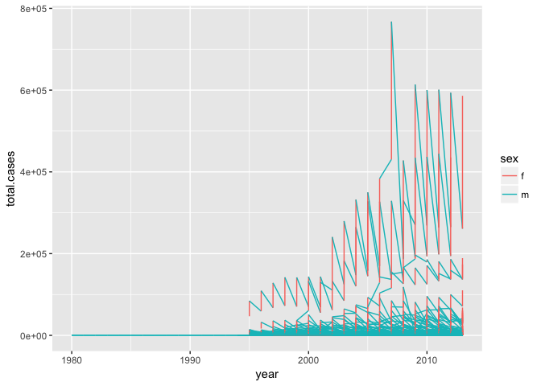
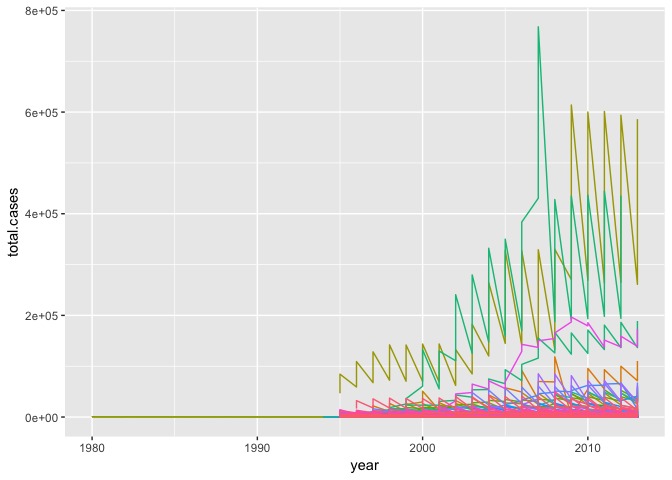

# Ch 12 - tidy data, part 2; Ch 13 - part 1
Stacey Harmer  
6/18/2017  


Sections 12.5 - 12.7

Sections 13.1 - 13.2

#12 Tidy data

## 12.5 Missing Values


```r
library(tidyverse)
```

```
## Loading tidyverse: ggplot2
## Loading tidyverse: tibble
## Loading tidyverse: tidyr
## Loading tidyverse: readr
## Loading tidyverse: purrr
## Loading tidyverse: dplyr
```

```
## Conflicts with tidy packages ----------------------------------------------
```

```
## filter(): dplyr, stats
## lag():    dplyr, stats
```

```r
stocks <- tibble(
  year   = c(2015, 2015, 2015, 2015, 2016, 2016, 2016),
  qtr    = c(   1,    2,    3,    4,    2,    3,    4),
  return = c(1.88, 0.59, 0.35,   NA, 0.92, 0.17, 2.66)
)

stocks %>% 
  spread(year, return)
```

```
## # A tibble: 4 × 3
##     qtr `2015` `2016`
## * <dbl>  <dbl>  <dbl>
## 1     1   1.88     NA
## 2     2   0.59   0.92
## 3     3   0.35   0.17
## 4     4     NA   2.66
```

```r
stocks %>% 
  spread(year, return) %>% 
  gather(year, return, `2015`:`2016`, na.rm = TRUE)
```

```
## # A tibble: 6 × 3
##     qtr  year return
## * <dbl> <chr>  <dbl>
## 1     1  2015   1.88
## 2     2  2015   0.59
## 3     3  2015   0.35
## 4     2  2016   0.92
## 5     3  2016   0.17
## 6     4  2016   2.66
```

```r
stocks
```

```
## # A tibble: 7 × 3
##    year   qtr return
##   <dbl> <dbl>  <dbl>
## 1  2015     1   1.88
## 2  2015     2   0.59
## 3  2015     3   0.35
## 4  2015     4     NA
## 5  2016     2   0.92
## 6  2016     3   0.17
## 7  2016     4   2.66
```

```r
stocks %>% 
  complete(year, qtr) # clever
```

```
## # A tibble: 8 × 3
##    year   qtr return
##   <dbl> <dbl>  <dbl>
## 1  2015     1   1.88
## 2  2015     2   0.59
## 3  2015     3   0.35
## 4  2015     4     NA
## 5  2016     1     NA
## 6  2016     2   0.92
## 7  2016     3   0.17
## 8  2016     4   2.66
```


```r
treatment <- tribble(
  ~ person,           ~ treatment, ~response,
  "Derrick Whitmore", 1,           7,
  NA,                 2,           10,
  NA,                 3,           9,
  "Katherine Burke",  1,           4
)

treatment
```

```
## # A tibble: 4 × 3
##             person treatment response
##              <chr>     <dbl>    <dbl>
## 1 Derrick Whitmore         1        7
## 2             <NA>         2       10
## 3             <NA>         3        9
## 4  Katherine Burke         1        4
```

```r
treatment %>%
  fill(person)
```

```
## # A tibble: 4 × 3
##             person treatment response
##              <chr>     <dbl>    <dbl>
## 1 Derrick Whitmore         1        7
## 2 Derrick Whitmore         2       10
## 3 Derrick Whitmore         3        9
## 4  Katherine Burke         1        4
```

### 12.5.1 Exercises

#### 12.5.1.1  Compare and contrast the fill arguments to spread() and complete().
spread: arguments are data, key (name of column whose values become column headings),
value (name of column whose values go into cells), fill

fill - default is NA.  if set, missing values replaced with this value.  
missing value might be explicitly missing (NA) or implicitly missing (absent)
So I can only have one default value

complete:
fill is a named list that for each variable supplies single value to use 
instead of NA

My list should be as long as the number of NAs that I want to replace; I can have different values inserted.

```r
?complete
library(dplyr, warn.conflicts = FALSE)
df <- data_frame(
  group = c(1:2, 1),
  item_id = c(1:2, 2),
  item_name = c("a", "b", "b"),
  value1 = 1:3,
  value2 = 4:6
)
df %>% complete(group, nesting(item_id, item_name), fill = list(value1 = 0))
```

```
## # A tibble: 4 × 5
##   group item_id item_name value1 value2
##   <dbl>   <dbl>     <chr>  <dbl>  <int>
## 1     1       1         a      1      4
## 2     1       2         b      3      6
## 3     2       1         a      0     NA
## 4     2       2         b      2      5
```

```r
df %>% complete(group, nesting(item_id, item_name), fill = list(value1 = 0, value2 = 5))
```

```
## # A tibble: 4 × 5
##   group item_id item_name value1 value2
##   <dbl>   <dbl>     <chr>  <dbl>  <dbl>
## 1     1       1         a      1      4
## 2     1       2         b      3      6
## 3     2       1         a      0      5
## 4     2       2         b      2      5
```

#### 12.5.1.2  What does the direction argument to fill() do?

direction specifies if the values are to be filled in in the up or down direction


```r
df <- data.frame(Month = 1:12, Year = c(2000, rep(NA, 11)))
df
```

```
##    Month Year
## 1      1 2000
## 2      2   NA
## 3      3   NA
## 4      4   NA
## 5      5   NA
## 6      6   NA
## 7      7   NA
## 8      8   NA
## 9      9   NA
## 10    10   NA
## 11    11   NA
## 12    12   NA
```

```r
df %>% fill(Year)
```

```
##    Month Year
## 1      1 2000
## 2      2 2000
## 3      3 2000
## 4      4 2000
## 5      5 2000
## 6      6 2000
## 7      7 2000
## 8      8 2000
## 9      9 2000
## 10    10 2000
## 11    11 2000
## 12    12 2000
```

```r
# or instead:
df.2 <- data.frame(Month = 1:12, Year = c(rep(NA, 11), 2000))
df.2
```

```
##    Month Year
## 1      1   NA
## 2      2   NA
## 3      3   NA
## 4      4   NA
## 5      5   NA
## 6      6   NA
## 7      7   NA
## 8      8   NA
## 9      9   NA
## 10    10   NA
## 11    11   NA
## 12    12 2000
```

```r
df.2 %>% fill(Year) # no fill
```

```
##    Month Year
## 1      1   NA
## 2      2   NA
## 3      3   NA
## 4      4   NA
## 5      5   NA
## 6      6   NA
## 7      7   NA
## 8      8   NA
## 9      9   NA
## 10    10   NA
## 11    11   NA
## 12    12 2000
```

```r
df.2 %>% fill(Year, .direction = "up") # that worked
```

```
##    Month Year
## 1      1 2000
## 2      2 2000
## 3      3 2000
## 4      4 2000
## 5      5 2000
## 6      6 2000
## 7      7 2000
## 8      8 2000
## 9      9 2000
## 10    10 2000
## 11    11 2000
## 12    12 2000
```

## 12.6 Case study

First, gather columns that are not variables, and fix a key name


```r
who1 <- who %>% 
  gather(new_sp_m014:newrel_f65, key = "key", value = "cases", na.rm = TRUE)
who1
```

```
## # A tibble: 76,046 × 6
##        country  iso2  iso3  year         key cases
## *        <chr> <chr> <chr> <int>       <chr> <int>
## 1  Afghanistan    AF   AFG  1997 new_sp_m014     0
## 2  Afghanistan    AF   AFG  1998 new_sp_m014    30
## 3  Afghanistan    AF   AFG  1999 new_sp_m014     8
## 4  Afghanistan    AF   AFG  2000 new_sp_m014    52
## 5  Afghanistan    AF   AFG  2001 new_sp_m014   129
## 6  Afghanistan    AF   AFG  2002 new_sp_m014    90
## 7  Afghanistan    AF   AFG  2003 new_sp_m014   127
## 8  Afghanistan    AF   AFG  2004 new_sp_m014   139
## 9  Afghanistan    AF   AFG  2005 new_sp_m014   151
## 10 Afghanistan    AF   AFG  2006 new_sp_m014   193
## # ... with 76,036 more rows
```

```r
who1 %>%
  count(key)
```

```
## # A tibble: 56 × 2
##             key     n
##           <chr> <int>
## 1   new_ep_f014  1032
## 2  new_ep_f1524  1021
## 3  new_ep_f2534  1021
## 4  new_ep_f3544  1021
## 5  new_ep_f4554  1017
## 6  new_ep_f5564  1017
## 7    new_ep_f65  1014
## 8   new_ep_m014  1038
## 9  new_ep_m1524  1026
## 10 new_ep_m2534  1020
## # ... with 46 more rows
```

```r
who2 <- who1 %>% 
  mutate(key = stringr::str_replace(key, "newrel", "new_rel"))
who2
```

```
## # A tibble: 76,046 × 6
##        country  iso2  iso3  year         key cases
##          <chr> <chr> <chr> <int>       <chr> <int>
## 1  Afghanistan    AF   AFG  1997 new_sp_m014     0
## 2  Afghanistan    AF   AFG  1998 new_sp_m014    30
## 3  Afghanistan    AF   AFG  1999 new_sp_m014     8
## 4  Afghanistan    AF   AFG  2000 new_sp_m014    52
## 5  Afghanistan    AF   AFG  2001 new_sp_m014   129
## 6  Afghanistan    AF   AFG  2002 new_sp_m014    90
## 7  Afghanistan    AF   AFG  2003 new_sp_m014   127
## 8  Afghanistan    AF   AFG  2004 new_sp_m014   139
## 9  Afghanistan    AF   AFG  2005 new_sp_m014   151
## 10 Afghanistan    AF   AFG  2006 new_sp_m014   193
## # ... with 76,036 more rows
```

Then, split up the information in the 'key' codes


```r
who3 <- who2 %>% 
  separate(key, c("new", "type", "sexage"), sep = "_")
who3
```

```
## # A tibble: 76,046 × 8
##        country  iso2  iso3  year   new  type sexage cases
## *        <chr> <chr> <chr> <int> <chr> <chr>  <chr> <int>
## 1  Afghanistan    AF   AFG  1997   new    sp   m014     0
## 2  Afghanistan    AF   AFG  1998   new    sp   m014    30
## 3  Afghanistan    AF   AFG  1999   new    sp   m014     8
## 4  Afghanistan    AF   AFG  2000   new    sp   m014    52
## 5  Afghanistan    AF   AFG  2001   new    sp   m014   129
## 6  Afghanistan    AF   AFG  2002   new    sp   m014    90
## 7  Afghanistan    AF   AFG  2003   new    sp   m014   127
## 8  Afghanistan    AF   AFG  2004   new    sp   m014   139
## 9  Afghanistan    AF   AFG  2005   new    sp   m014   151
## 10 Afghanistan    AF   AFG  2006   new    sp   m014   193
## # ... with 76,036 more rows
```

now drop redundant columns


```r
who4 <- who3 %>% 
  select(-new, -iso2, -iso3)
who4
```

```
## # A tibble: 76,046 × 5
##        country  year  type sexage cases
## *        <chr> <int> <chr>  <chr> <int>
## 1  Afghanistan  1997    sp   m014     0
## 2  Afghanistan  1998    sp   m014    30
## 3  Afghanistan  1999    sp   m014     8
## 4  Afghanistan  2000    sp   m014    52
## 5  Afghanistan  2001    sp   m014   129
## 6  Afghanistan  2002    sp   m014    90
## 7  Afghanistan  2003    sp   m014   127
## 8  Afghanistan  2004    sp   m014   139
## 9  Afghanistan  2005    sp   m014   151
## 10 Afghanistan  2006    sp   m014   193
## # ... with 76,036 more rows
```

And now split the sex and age info


```r
who5 <- who4 %>% 
  separate(sexage, c("sex", "age"), sep = 1)
who5
```

```
## # A tibble: 76,046 × 6
##        country  year  type   sex   age cases
## *        <chr> <int> <chr> <chr> <chr> <int>
## 1  Afghanistan  1997    sp     m   014     0
## 2  Afghanistan  1998    sp     m   014    30
## 3  Afghanistan  1999    sp     m   014     8
## 4  Afghanistan  2000    sp     m   014    52
## 5  Afghanistan  2001    sp     m   014   129
## 6  Afghanistan  2002    sp     m   014    90
## 7  Afghanistan  2003    sp     m   014   127
## 8  Afghanistan  2004    sp     m   014   139
## 9  Afghanistan  2005    sp     m   014   151
## 10 Afghanistan  2006    sp     m   014   193
## # ... with 76,036 more rows
```

Or, more elegantly:

```r
who %>%
  gather(code, value, new_sp_m014:newrel_f65, na.rm = TRUE) %>% 
  mutate(code = stringr::str_replace(code, "newrel", "new_rel")) %>%
  separate(code, c("new", "var", "sexage")) %>% 
  select(-new, -iso2, -iso3) %>% 
  separate(sexage, c("sex", "age"), sep = 1)
```

```
## # A tibble: 76,046 × 6
##        country  year   var   sex   age value
## *        <chr> <int> <chr> <chr> <chr> <int>
## 1  Afghanistan  1997    sp     m   014     0
## 2  Afghanistan  1998    sp     m   014    30
## 3  Afghanistan  1999    sp     m   014     8
## 4  Afghanistan  2000    sp     m   014    52
## 5  Afghanistan  2001    sp     m   014   129
## 6  Afghanistan  2002    sp     m   014    90
## 7  Afghanistan  2003    sp     m   014   127
## 8  Afghanistan  2004    sp     m   014   139
## 9  Afghanistan  2005    sp     m   014   151
## 10 Afghanistan  2006    sp     m   014   193
## # ... with 76,036 more rows
```

### 12.6.1 Exercises

#### 12.6.1.1 In this case study I set na.rm = TRUE just to make it easier to check that we had the correct values. Is this reasonable? Think about how missing values are represented in this dataset. Are there implicit missing values? What’s the difference between and NA and a 0?

There is a big differnece between NA and 0 here!  0 suggests a measurement was made, while NA suggests not data are avialble so no conclusions can be made

Are there implicit missing values?  Let's summarize by coutnry and year:


```r
who5 %>% 
  group_by(country, year) %>%
  nrow()  # group by didn't seem to work
```

```
## [1] 76046
```

```r
who5 %>% 
  group_by(country, year) %>%
  count() # that works, but 3,500 rows too many to look at
```

```
## Source: local data frame [3,484 x 3]
## Groups: country [?]
## 
##        country  year     n
##          <chr> <int> <int>
## 1  Afghanistan  1997    14
## 2  Afghanistan  1998    14
## 3  Afghanistan  1999    14
## 4  Afghanistan  2000    14
## 5  Afghanistan  2001    14
## 6  Afghanistan  2002    14
## 7  Afghanistan  2003    14
## 8  Afghanistan  2004    14
## 9  Afghanistan  2005    14
## 10 Afghanistan  2006    14
## # ... with 3,474 more rows
```

```r
  # this tells me my method not sound

# ask Julin for his example using 'complete'

# below is from the answer key page

gather(who, new_sp_m014:newrel_f65, key = "key", value = "cases") %>%
  group_by(country, year)  %>%
  mutate(missing = is.na(cases)) %>%
  select(country, year, missing) %>%
  distinct() %>%
  group_by(country, year) %>%
  filter(n() > 1)  # here, we are selecting for countries and years with more than one NA
```

```
## Source: local data frame [0 x 2]
## Groups: country, year [0]
## 
## # ... with 2 variables: country <chr>, year <int>
```

```r
# output is empty; so no cases in which some types of data reported but not other types in one country in one year
```

#### 12.6.1.2 What happens if you neglect the mutate() step? (mutate(key = stringr::str_replace(key, "newrel", "new_rel")))

In that step, we fixed a code name that lacked an underscore


```r
# as given:
who %>%
  gather(code, value, new_sp_m014:newrel_f65, na.rm = TRUE) %>% 
  mutate(code = stringr::str_replace(code, "newrel", "new_rel")) %>%
  separate(code, c("new", "var", "sexage")) %>% 
  select(-new, -iso2, -iso3) %>% 
  separate(sexage, c("sex", "age"), sep = 1)
```

```
## # A tibble: 76,046 × 6
##        country  year   var   sex   age value
## *        <chr> <int> <chr> <chr> <chr> <int>
## 1  Afghanistan  1997    sp     m   014     0
## 2  Afghanistan  1998    sp     m   014    30
## 3  Afghanistan  1999    sp     m   014     8
## 4  Afghanistan  2000    sp     m   014    52
## 5  Afghanistan  2001    sp     m   014   129
## 6  Afghanistan  2002    sp     m   014    90
## 7  Afghanistan  2003    sp     m   014   127
## 8  Afghanistan  2004    sp     m   014   139
## 9  Afghanistan  2005    sp     m   014   151
## 10 Afghanistan  2006    sp     m   014   193
## # ... with 76,036 more rows
```

```r
# leave out mutate
#who %>%
 # gather(code, value, new_sp_m014:newrel_f65, na.rm = TRUE) %>% 
  #separate(code, c("new", "var", "sexage")) %>% 
#  select(-new, -iso2, -iso3) %>% 
#  separate(sexage, c("sex", "age"), sep = 1)
# throws an error, because missing some values
```

#### 12.6.1.3 I claimed that iso2 and iso3 were redundant with country. Confirm this claim.

Can I use distinct?


```r
df <- data.frame(
  x = sample(10, 100, rep = TRUE),
  y = sample(10, 100, rep = TRUE)
)
df
```

```
##      x  y
## 1    7  8
## 2    8  8
## 3    9  6
## 4    6 10
## 5    4  2
## 6    3  7
## 7    4  6
## 8    3 10
## 9    4  9
## 10   4  6
## 11   3  7
## 12   2  4
## 13   5  3
## 14   5  8
## 15   4  6
## 16   1 10
## 17   1  1
## 18   1  6
## 19   5  3
## 20   5  1
## 21   5  2
## 22   8  3
## 23   8  1
## 24   4  5
## 25   5  8
## 26   8  4
## 27   5  4
## 28   3 10
## 29   3  9
## 30   1  5
## 31   4  5
## 32   6  5
## 33   3  2
## 34   2  3
## 35   7 10
## 36   5  6
## 37   3  2
## 38   1  3
## 39   5  2
## 40   7  1
## 41   7  2
## 42   6  1
## 43   5  4
## 44   6  2
## 45   8  4
## 46   6  6
## 47   2  8
## 48   5  2
## 49   1  1
## 50   2  2
## 51   6  3
## 52   5  5
## 53   2  5
## 54  10  9
## 55   5  7
## 56   5  4
## 57   6  3
## 58   5  7
## 59   5  6
## 60   6  4
## 61   6  6
## 62   1 10
## 63   3  2
## 64   6  6
## 65   6  8
## 66   3  6
## 67   4  1
## 68   8  7
## 69   6  9
## 70   9  9
## 71   4  5
## 72   3  6
## 73   7  4
## 74   9  8
## 75   3  9
## 76   9  2
## 77   2  4
## 78   3  1
## 79   4  9
## 80   9  1
## 81   1  8
## 82   5  4
## 83   4  1
## 84   4  1
## 85  10  5
## 86   1  5
## 87   8  8
## 88   3  1
## 89   8  4
## 90   5  1
## 91   1  3
## 92   9  5
## 93   3  1
## 94   6  5
## 95   1  5
## 96   4 10
## 97   3  9
## 98   8  2
## 99   3 10
## 100  4  7
```

```r
nrow(df)
```

```
## [1] 100
```

```r
nrow(distinct(df))
```

```
## [1] 60
```

```r
nrow(distinct(df, x, y))
```

```
## [1] 60
```

```r
who %>%
  select(country:iso3) %>%
  nrow()
```

```
## [1] 7240
```

```r
# 7240 rows

who %>%
  select(country:iso3) %>%
  distinct() %>%
  nrow()
```

```
## [1] 219
```

```r
#219 distinct rows


who %>%
  select(country) %>%
  distinct() %>%
  nrow()
```

```
## [1] 219
```

```r
#219 distinct rows, again.  So iso2 = iso3 = country
```

#### 12.6.1.4 For each country, year, and sex compute the total number of cases of TB. Make an informative visualisation of the data.


```r
who.tidy <- who %>%
  gather(code, value, new_sp_m014:newrel_f65, na.rm = TRUE) %>% 
  mutate(code = stringr::str_replace(code, "newrel", "new_rel")) %>%
  separate(code, c("new", "var", "sexage")) %>% 
  select(-new, -iso2, -iso3) %>% 
  separate(sexage, c("sex", "age"), sep = 1)

who.tidy %>%
  group_by(country, year, sex) %>% 
  summarize(total.cases = sum(value)) %>%  # about 7k rows of data
  ggplot(aes(x = year, y = total.cases)) +
  geom_line(aes(group = country, color = sex))
```

<!-- -->

```r
#messy!  

who.tidy %>%
  group_by(country, year, sex) %>% 
  summarize(total.cases = sum(value)) %>%  # about 7k rows of data
  ggplot(aes(x = year, y = total.cases)) +
  geom_line(aes(group = country, color = country)) +
  theme(legend.position="none")
```

<!-- -->

```r
# still yucky
```


#13 Relational data

## 13.2 nycflights 13


```r
library(tidyverse)
library(nycflights13)
airlines # 16 listed
```

```
## # A tibble: 16 × 2
##    carrier                        name
##      <chr>                       <chr>
## 1       9E           Endeavor Air Inc.
## 2       AA      American Airlines Inc.
## 3       AS        Alaska Airlines Inc.
## 4       B6             JetBlue Airways
## 5       DL        Delta Air Lines Inc.
## 6       EV    ExpressJet Airlines Inc.
## 7       F9      Frontier Airlines Inc.
## 8       FL AirTran Airways Corporation
## 9       HA      Hawaiian Airlines Inc.
## 10      MQ                   Envoy Air
## 11      OO       SkyWest Airlines Inc.
## 12      UA       United Air Lines Inc.
## 13      US             US Airways Inc.
## 14      VX              Virgin America
## 15      WN      Southwest Airlines Co.
## 16      YV          Mesa Airlines Inc.
```

```r
airports #1,458
```

```
## # A tibble: 1,458 × 8
##      faa                           name      lat        lon   alt    tz
##    <chr>                          <chr>    <dbl>      <dbl> <int> <dbl>
## 1    04G              Lansdowne Airport 41.13047  -80.61958  1044    -5
## 2    06A  Moton Field Municipal Airport 32.46057  -85.68003   264    -6
## 3    06C            Schaumburg Regional 41.98934  -88.10124   801    -6
## 4    06N                Randall Airport 41.43191  -74.39156   523    -5
## 5    09J          Jekyll Island Airport 31.07447  -81.42778    11    -5
## 6    0A9 Elizabethton Municipal Airport 36.37122  -82.17342  1593    -5
## 7    0G6        Williams County Airport 41.46731  -84.50678   730    -5
## 8    0G7  Finger Lakes Regional Airport 42.88356  -76.78123   492    -5
## 9    0P2   Shoestring Aviation Airfield 39.79482  -76.64719  1000    -5
## 10   0S9          Jefferson County Intl 48.05381 -122.81064   108    -8
## # ... with 1,448 more rows, and 2 more variables: dst <chr>, tzone <chr>
```

```r
tail(airports)
```

```
## # A tibble: 6 × 8
##     faa                      name      lat        lon   alt    tz   dst
##   <chr>                     <chr>    <dbl>      <dbl> <int> <dbl> <chr>
## 1   ZTY   Boston Back Bay Station 42.34780  -71.07500    20    -5     A
## 2   ZUN                Black Rock 35.08323 -108.79178  6454    -7     A
## 3   ZVE    New Haven Rail Station 41.29867  -72.92599     7    -5     A
## 4   ZWI Wilmington Amtrak Station 39.73667  -75.55167     0    -5     A
## 5   ZWU  Washington Union Station 38.89746  -77.00643    76    -5     A
## 6   ZYP              Penn Station 40.75050  -73.99350    35    -5     A
## # ... with 1 more variables: tzone <chr>
```

```r
planes #3,322 numbers
```

```
## # A tibble: 3,322 × 9
##    tailnum  year                    type     manufacturer     model
##      <chr> <int>                   <chr>            <chr>     <chr>
## 1   N10156  2004 Fixed wing multi engine          EMBRAER EMB-145XR
## 2   N102UW  1998 Fixed wing multi engine AIRBUS INDUSTRIE  A320-214
## 3   N103US  1999 Fixed wing multi engine AIRBUS INDUSTRIE  A320-214
## 4   N104UW  1999 Fixed wing multi engine AIRBUS INDUSTRIE  A320-214
## 5   N10575  2002 Fixed wing multi engine          EMBRAER EMB-145LR
## 6   N105UW  1999 Fixed wing multi engine AIRBUS INDUSTRIE  A320-214
## 7   N107US  1999 Fixed wing multi engine AIRBUS INDUSTRIE  A320-214
## 8   N108UW  1999 Fixed wing multi engine AIRBUS INDUSTRIE  A320-214
## 9   N109UW  1999 Fixed wing multi engine AIRBUS INDUSTRIE  A320-214
## 10  N110UW  1999 Fixed wing multi engine AIRBUS INDUSTRIE  A320-214
## # ... with 3,312 more rows, and 4 more variables: engines <int>,
## #   seats <int>, speed <int>, engine <chr>
```

```r
weather #26,130 rows
```

```
## # A tibble: 26,130 × 15
##    origin  year month   day  hour  temp  dewp humid wind_dir wind_speed
##     <chr> <dbl> <dbl> <int> <int> <dbl> <dbl> <dbl>    <dbl>      <dbl>
## 1     EWR  2013     1     1     0 37.04 21.92 53.97      230   10.35702
## 2     EWR  2013     1     1     1 37.04 21.92 53.97      230   13.80936
## 3     EWR  2013     1     1     2 37.94 21.92 52.09      230   12.65858
## 4     EWR  2013     1     1     3 37.94 23.00 54.51      230   13.80936
## 5     EWR  2013     1     1     4 37.94 24.08 57.04      240   14.96014
## 6     EWR  2013     1     1     6 39.02 26.06 59.37      270   10.35702
## 7     EWR  2013     1     1     7 39.02 26.96 61.63      250    8.05546
## 8     EWR  2013     1     1     8 39.02 28.04 64.43      240   11.50780
## 9     EWR  2013     1     1     9 39.92 28.04 62.21      250   12.65858
## 10    EWR  2013     1     1    10 39.02 28.04 64.43      260   12.65858
## # ... with 26,120 more rows, and 5 more variables: wind_gust <dbl>,
## #   precip <dbl>, pressure <dbl>, visib <dbl>, time_hour <dttm>
```

```r
tail(weather) # thes are for NYC airports
```

```
## # A tibble: 6 × 15
##   origin  year month   day  hour  temp  dewp humid wind_dir wind_speed
##    <chr> <dbl> <dbl> <int> <int> <dbl> <dbl> <dbl>    <dbl>      <dbl>
## 1    LGA  2013    12    30    18 37.04 21.92 53.97      340   17.26170
## 2    LGA  2013    12    30    19 35.96 19.94 51.78      340   13.80936
## 3    LGA  2013    12    30    20 33.98 17.06 49.51      330   17.26170
## 4    LGA  2013    12    30    21 32.00 15.08 49.19      340   14.96014
## 5    LGA  2013    12    30    22 30.92 12.92 46.74      320   17.26170
## 6    LGA  2013    12    30    23 28.94 10.94 46.41      330   18.41248
## # ... with 5 more variables: wind_gust <dbl>, precip <dbl>,
## #   pressure <dbl>, visib <dbl>, time_hour <dttm>
```

### 13.2.1 Exercises

#### 13.2.1.1 Imagine you wanted to draw (approximately) the route each plane flies from its origin to its destination. What variables would you need? What tables would you need to combine?

I'd need to know the origin, the destination, and any stops along the way.  Lat and lon would give me map locations.  So from 

airports - need faa, lat, lon
flights - need origin, dest 

actually, I think these are all direct so no need to worry about stops

#### 13.2.1.2 I forgot to draw the relationship between weather and airports. What is the relationship and how should it appear in the diagram?


```r
weather
```

```
## # A tibble: 26,130 × 15
##    origin  year month   day  hour  temp  dewp humid wind_dir wind_speed
##     <chr> <dbl> <dbl> <int> <int> <dbl> <dbl> <dbl>    <dbl>      <dbl>
## 1     EWR  2013     1     1     0 37.04 21.92 53.97      230   10.35702
## 2     EWR  2013     1     1     1 37.04 21.92 53.97      230   13.80936
## 3     EWR  2013     1     1     2 37.94 21.92 52.09      230   12.65858
## 4     EWR  2013     1     1     3 37.94 23.00 54.51      230   13.80936
## 5     EWR  2013     1     1     4 37.94 24.08 57.04      240   14.96014
## 6     EWR  2013     1     1     6 39.02 26.06 59.37      270   10.35702
## 7     EWR  2013     1     1     7 39.02 26.96 61.63      250    8.05546
## 8     EWR  2013     1     1     8 39.02 28.04 64.43      240   11.50780
## 9     EWR  2013     1     1     9 39.92 28.04 62.21      250   12.65858
## 10    EWR  2013     1     1    10 39.02 28.04 64.43      260   12.65858
## # ... with 26,120 more rows, and 5 more variables: wind_gust <dbl>,
## #   precip <dbl>, pressure <dbl>, visib <dbl>, time_hour <dttm>
```

```r
airports
```

```
## # A tibble: 1,458 × 8
##      faa                           name      lat        lon   alt    tz
##    <chr>                          <chr>    <dbl>      <dbl> <int> <dbl>
## 1    04G              Lansdowne Airport 41.13047  -80.61958  1044    -5
## 2    06A  Moton Field Municipal Airport 32.46057  -85.68003   264    -6
## 3    06C            Schaumburg Regional 41.98934  -88.10124   801    -6
## 4    06N                Randall Airport 41.43191  -74.39156   523    -5
## 5    09J          Jekyll Island Airport 31.07447  -81.42778    11    -5
## 6    0A9 Elizabethton Municipal Airport 36.37122  -82.17342  1593    -5
## 7    0G6        Williams County Airport 41.46731  -84.50678   730    -5
## 8    0G7  Finger Lakes Regional Airport 42.88356  -76.78123   492    -5
## 9    0P2   Shoestring Aviation Airfield 39.79482  -76.64719  1000    -5
## 10   0S9          Jefferson County Intl 48.05381 -122.81064   108    -8
## # ... with 1,448 more rows, and 2 more variables: dst <chr>, tzone <chr>
```

weather gives us a bunch of information for each airport at each time
I could use both dataframes to determine weather conditions for lat and lon at each time point

Draw line between 'faa' in flights and 'origin' in weather

#### 13.2.1.3  weather only contains information for the origin (NYC) airports. If it contained weather records for all airports in the USA, what additional relation would it define with flights?

we could determine weather conditions at the time the flights landed at their destination

#### 13.2.1.4 We know that some days of the year are “special”, and fewer people than usual fly on them. How might you represent that data as a data frame? What would be the primary keys of that table? How would it connect to the existing tables?

We could make a table with columns year, month, days of the year and hte next column a logical for holiday.

We'd connect it to flights via the year,month,day columns

