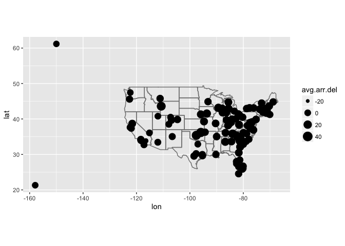
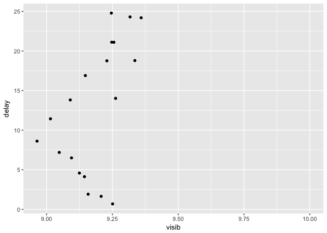

# Rclub_June28_Ch13
Stacey Harmer  
6/26/2017  

Finish chapter 13 (Relational data) 13.3 - 13.7


## 13.3  Keys

Primary key - uniquely identifies observation in its own table

Foreign key - 


```r
library(tidyverse)
```

```
## Loading tidyverse: ggplot2
## Loading tidyverse: tibble
## Loading tidyverse: tidyr
## Loading tidyverse: readr
## Loading tidyverse: purrr
## Loading tidyverse: dplyr
```

```
## Conflicts with tidy packages ----------------------------------------------
```

```
## filter(): dplyr, stats
## lag():    dplyr, stats
```

```r
library(nycflights13)

planes # tailnum is primary key; everything else relates back to it
```

```
## # A tibble: 3,322 × 9
##    tailnum  year                    type     manufacturer     model
##      <chr> <int>                   <chr>            <chr>     <chr>
## 1   N10156  2004 Fixed wing multi engine          EMBRAER EMB-145XR
## 2   N102UW  1998 Fixed wing multi engine AIRBUS INDUSTRIE  A320-214
## 3   N103US  1999 Fixed wing multi engine AIRBUS INDUSTRIE  A320-214
## 4   N104UW  1999 Fixed wing multi engine AIRBUS INDUSTRIE  A320-214
## 5   N10575  2002 Fixed wing multi engine          EMBRAER EMB-145LR
## 6   N105UW  1999 Fixed wing multi engine AIRBUS INDUSTRIE  A320-214
## 7   N107US  1999 Fixed wing multi engine AIRBUS INDUSTRIE  A320-214
## 8   N108UW  1999 Fixed wing multi engine AIRBUS INDUSTRIE  A320-214
## 9   N109UW  1999 Fixed wing multi engine AIRBUS INDUSTRIE  A320-214
## 10  N110UW  1999 Fixed wing multi engine AIRBUS INDUSTRIE  A320-214
## # ... with 3,312 more rows, and 4 more variables: engines <int>,
## #   seats <int>, speed <int>, engine <chr>
```

```r
length(planes$tailnum) # 3322
```

```
## [1] 3322
```

```r
length(unique(planes$tailnum)) # 3322
```

```
## [1] 3322
```

```r
flights # tailnum is foreign; 
```

```
## # A tibble: 336,776 × 19
##     year month   day dep_time sched_dep_time dep_delay arr_time
##    <int> <int> <int>    <int>          <int>     <dbl>    <int>
## 1   2013     1     1      517            515         2      830
## 2   2013     1     1      533            529         4      850
## 3   2013     1     1      542            540         2      923
## 4   2013     1     1      544            545        -1     1004
## 5   2013     1     1      554            600        -6      812
## 6   2013     1     1      554            558        -4      740
## 7   2013     1     1      555            600        -5      913
## 8   2013     1     1      557            600        -3      709
## 9   2013     1     1      557            600        -3      838
## 10  2013     1     1      558            600        -2      753
## # ... with 336,766 more rows, and 12 more variables: sched_arr_time <int>,
## #   arr_delay <dbl>, carrier <chr>, flight <int>, tailnum <chr>,
## #   origin <chr>, dest <chr>, air_time <dbl>, distance <dbl>, hour <dbl>,
## #   minute <dbl>, time_hour <dttm>
```

```r
length(flights$tailnum) # 336776
```

```
## [1] 336776
```

```r
length(unique(flights$tailnum)) # 4044
```

```
## [1] 4044
```

I should get used to using count instead


```r
planes %>% 
  count(tailnum) %>% 
  filter(n > 1)  # none
```

```
## # A tibble: 0 × 2
## # ... with 2 variables: tailnum <chr>, n <int>
```

```r
flights %>% 
  count(tailnum) %>% 
  filter(n > 1)  # 3,873 × 2
```

```
## # A tibble: 3,873 × 2
##    tailnum     n
##      <chr> <int>
## 1   D942DN     4
## 2   N0EGMQ   371
## 3   N10156   153
## 4   N102UW    48
## 5   N103US    46
## 6   N104UW    47
## 7   N10575   289
## 8   N105UW    45
## 9   N107US    41
## 10  N108UW    60
## # ... with 3,863 more rows
```

```r
weather %>% 
  count(year, month, day, hour, origin) %>% 
  filter(n > 1) # also none
```

```
## Source: local data frame [0 x 6]
## Groups: year, month, day, hour [0]
## 
## # ... with 6 variables: year <dbl>, month <dbl>, day <int>, hour <int>,
## #   origin <chr>, n <int>
```

YOu can add a primary key using 'mutate' and row_number  (this is a surrogate key)

### 13.3.1 Exercises

#### 13.3.1.1  Add a surrogate key to flights.


```r
flights.new.key <- flights %>%
  mutate(sur.key = row_number())

str(flights.new.key)
```

```
## Classes 'tbl_df', 'tbl' and 'data.frame':	336776 obs. of  20 variables:
##  $ year          : int  2013 2013 2013 2013 2013 2013 2013 2013 2013 2013 ...
##  $ month         : int  1 1 1 1 1 1 1 1 1 1 ...
##  $ day           : int  1 1 1 1 1 1 1 1 1 1 ...
##  $ dep_time      : int  517 533 542 544 554 554 555 557 557 558 ...
##  $ sched_dep_time: int  515 529 540 545 600 558 600 600 600 600 ...
##  $ dep_delay     : num  2 4 2 -1 -6 -4 -5 -3 -3 -2 ...
##  $ arr_time      : int  830 850 923 1004 812 740 913 709 838 753 ...
##  $ sched_arr_time: int  819 830 850 1022 837 728 854 723 846 745 ...
##  $ arr_delay     : num  11 20 33 -18 -25 12 19 -14 -8 8 ...
##  $ carrier       : chr  "UA" "UA" "AA" "B6" ...
##  $ flight        : int  1545 1714 1141 725 461 1696 507 5708 79 301 ...
##  $ tailnum       : chr  "N14228" "N24211" "N619AA" "N804JB" ...
##  $ origin        : chr  "EWR" "LGA" "JFK" "JFK" ...
##  $ dest          : chr  "IAH" "IAH" "MIA" "BQN" ...
##  $ air_time      : num  227 227 160 183 116 150 158 53 140 138 ...
##  $ distance      : num  1400 1416 1089 1576 762 ...
##  $ hour          : num  5 5 5 5 6 5 6 6 6 6 ...
##  $ minute        : num  15 29 40 45 0 58 0 0 0 0 ...
##  $ time_hour     : POSIXct, format: "2013-01-01 05:00:00" "2013-01-01 05:00:00" ...
##  $ sur.key       : int  1 2 3 4 5 6 7 8 9 10 ...
```

```r
summary(flights.new.key)
```

```
##       year          month             day           dep_time   
##  Min.   :2013   Min.   : 1.000   Min.   : 1.00   Min.   :   1  
##  1st Qu.:2013   1st Qu.: 4.000   1st Qu.: 8.00   1st Qu.: 907  
##  Median :2013   Median : 7.000   Median :16.00   Median :1401  
##  Mean   :2013   Mean   : 6.549   Mean   :15.71   Mean   :1349  
##  3rd Qu.:2013   3rd Qu.:10.000   3rd Qu.:23.00   3rd Qu.:1744  
##  Max.   :2013   Max.   :12.000   Max.   :31.00   Max.   :2400  
##                                                  NA's   :8255  
##  sched_dep_time   dep_delay          arr_time    sched_arr_time
##  Min.   : 106   Min.   : -43.00   Min.   :   1   Min.   :   1  
##  1st Qu.: 906   1st Qu.:  -5.00   1st Qu.:1104   1st Qu.:1124  
##  Median :1359   Median :  -2.00   Median :1535   Median :1556  
##  Mean   :1344   Mean   :  12.64   Mean   :1502   Mean   :1536  
##  3rd Qu.:1729   3rd Qu.:  11.00   3rd Qu.:1940   3rd Qu.:1945  
##  Max.   :2359   Max.   :1301.00   Max.   :2400   Max.   :2359  
##                 NA's   :8255      NA's   :8713                 
##    arr_delay          carrier              flight       tailnum         
##  Min.   : -86.000   Length:336776      Min.   :   1   Length:336776     
##  1st Qu.: -17.000   Class :character   1st Qu.: 553   Class :character  
##  Median :  -5.000   Mode  :character   Median :1496   Mode  :character  
##  Mean   :   6.895                      Mean   :1972                     
##  3rd Qu.:  14.000                      3rd Qu.:3465                     
##  Max.   :1272.000                      Max.   :8500                     
##  NA's   :9430                                                           
##     origin              dest              air_time        distance   
##  Length:336776      Length:336776      Min.   : 20.0   Min.   :  17  
##  Class :character   Class :character   1st Qu.: 82.0   1st Qu.: 502  
##  Mode  :character   Mode  :character   Median :129.0   Median : 872  
##                                        Mean   :150.7   Mean   :1040  
##                                        3rd Qu.:192.0   3rd Qu.:1389  
##                                        Max.   :695.0   Max.   :4983  
##                                        NA's   :9430                  
##       hour           minute        time_hour                  
##  Min.   : 1.00   Min.   : 0.00   Min.   :2013-01-01 05:00:00  
##  1st Qu.: 9.00   1st Qu.: 8.00   1st Qu.:2013-04-04 13:00:00  
##  Median :13.00   Median :29.00   Median :2013-07-03 10:00:00  
##  Mean   :13.18   Mean   :26.23   Mean   :2013-07-03 05:02:36  
##  3rd Qu.:17.00   3rd Qu.:44.00   3rd Qu.:2013-10-01 07:00:00  
##  Max.   :23.00   Max.   :59.00   Max.   :2013-12-31 23:00:00  
##                                                               
##     sur.key      
##  Min.   :     1  
##  1st Qu.: 84195  
##  Median :168388  
##  Mean   :168388  
##  3rd Qu.:252582  
##  Max.   :336776  
## 
```

#### 13.3.1.2  Identify the keys in the following datasets


```r
?Lahman::Batting
head(Lahman::Batting)
```

```
##    playerID yearID stint teamID lgID  G  AB  R  H X2B X3B HR RBI SB CS BB
## 1 abercda01   1871     1    TRO   NA  1   4  0  0   0   0  0   0  0  0  0
## 2  addybo01   1871     1    RC1   NA 25 118 30 32   6   0  0  13  8  1  4
## 3 allisar01   1871     1    CL1   NA 29 137 28 40   4   5  0  19  3  1  2
## 4 allisdo01   1871     1    WS3   NA 27 133 28 44  10   2  2  27  1  1  0
## 5 ansonca01   1871     1    RC1   NA 25 120 29 39  11   3  0  16  6  2  2
## 6 armstbo01   1871     1    FW1   NA 12  49  9 11   2   1  0   5  0  1  0
##   SO IBB HBP SH SF GIDP
## 1  0  NA  NA NA NA   NA
## 2  0  NA  NA NA NA   NA
## 3  5  NA  NA NA NA   NA
## 4  2  NA  NA NA NA   NA
## 5  1  NA  NA NA NA   NA
## 6  1  NA  NA NA NA   NA
```

I'd guess playerID is primary key

```r
Lahman::Batting %>% 
  count(playerID, yearID, stint) %>% 
  filter(n > 1)  # that is unique
```

```
## Source: local data frame [0 x 4]
## Groups: playerID, yearID [0]
## 
## # ... with 4 variables: playerID <chr>, yearID <int>, stint <int>, n <int>
```

```r
Lahman::Batting %>% 
  count(playerID, yearID, teamID) %>% 
  filter(n > 1)  # not unique
```

```
## Source: local data frame [56 x 4]
## Groups: playerID, yearID [56]
## 
##     playerID yearID teamID     n
##        <chr>  <int> <fctr> <int>
## 1  anderjo01   1898    BRO     2
## 2  baldwja01   2005    BAL     2
## 3  behrmha01   1947    BRO     2
## 4  clarkje02   2003    TEX     2
## 5  clarkni01   1905    CLE     2
## 6  cranddo01   1913    NY1     2
## 7  cranesa01   1890    NY1     2
## 8  donahpa01   1910    PHA     2
## 9  drillle01   1902    WS1     2
## 10 duceyro01   2000    PHI     2
## # ... with 46 more rows
```


```r
library(babynames)
head(babynames)
```

```
## # A tibble: 6 × 5
##    year   sex      name     n       prop
##   <dbl> <chr>     <chr> <int>      <dbl>
## 1  1880     F      Mary  7065 0.07238433
## 2  1880     F      Anna  2604 0.02667923
## 3  1880     F      Emma  2003 0.02052170
## 4  1880     F Elizabeth  1939 0.01986599
## 5  1880     F    Minnie  1746 0.01788861
## 6  1880     F  Margaret  1578 0.01616737
```

```r
# I'm guessing year, sex, name must all be combined to be unique
babynames %>%
  count(year, name) %>%
  filter(nn > 1)  #163,000 rows!
```

```
## Source: local data frame [163,187 x 3]
## Groups: year [136]
## 
##     year    name    nn
##    <dbl>   <chr> <int>
## 1   1880   Addie     2
## 2   1880   Allie     2
## 3   1880    Alma     2
## 4   1880   Alpha     2
## 5   1880    Alva     2
## 6   1880    Anna     2
## 7   1880   Annie     2
## 8   1880  Arthur     2
## 9   1880   Artie     2
## 10  1880 Augusta     2
## # ... with 163,177 more rows
```

```r
babynames %>%
 count(year, name, sex) %>%
 filter(nn > 1)  ## that did it
```

```
## Source: local data frame [0 x 4]
## Groups: year, name [0]
## 
## # ... with 4 variables: year <dbl>, name <chr>, sex <chr>, nn <int>
```


```r
library(nasaweather)
head(atmos)
```

```
## # A tibble: 6 × 11
##        lat   long  year month surftemp  temp pressure ozone cloudlow
##      <dbl>  <dbl> <int> <int>    <dbl> <dbl>    <dbl> <dbl>    <dbl>
## 1 36.20000 -113.8  1995     1    272.7 272.1      835   304      7.5
## 2 33.70435 -113.8  1995     1    279.5 282.2      940   304     11.5
## 3 31.20870 -113.8  1995     1    284.7 285.2      960   298     16.5
## 4 28.71304 -113.8  1995     1    289.3 290.7      990   276     20.5
## 5 26.21739 -113.8  1995     1    292.2 292.7     1000   274     26.0
## 6 23.72174 -113.8  1995     1    294.1 293.6     1000   264     30.0
## # ... with 2 more variables: cloudmid <dbl>, cloudhigh <dbl>
```

```r
atmos %>%
  count(lat, long, year, month) %>%
  filter(n > 1) # that is now unique
```

```
## Source: local data frame [0 x 5]
## Groups: lat, long, year [0]
## 
## # ... with 5 variables: lat <dbl>, long <dbl>, year <int>, month <int>,
## #   n <int>
```


```r
library(fueleconomy)
head(vehicles)
```

```
## # A tibble: 6 × 12
##      id       make               model  year                       class
##   <int>      <chr>               <chr> <int>                       <chr>
## 1 27550 AM General   DJ Po Vehicle 2WD  1984 Special Purpose Vehicle 2WD
## 2 28426 AM General   DJ Po Vehicle 2WD  1984 Special Purpose Vehicle 2WD
## 3 27549 AM General    FJ8c Post Office  1984 Special Purpose Vehicle 2WD
## 4 28425 AM General    FJ8c Post Office  1984 Special Purpose Vehicle 2WD
## 5  1032 AM General Post Office DJ5 2WD  1985 Special Purpose Vehicle 2WD
## 6  1033 AM General Post Office DJ8 2WD  1985 Special Purpose Vehicle 2WD
## # ... with 7 more variables: trans <chr>, drive <chr>, cyl <int>,
## #   displ <dbl>, fuel <chr>, hwy <int>, cty <int>
```

```r
vehicles %>%
  count(id) %>%
  filter(n > 1)  # finally!  A key variable
```

```
## # A tibble: 0 × 2
## # ... with 2 variables: id <int>, n <int>
```


```r
head(diamonds)
```

```
## # A tibble: 6 × 10
##   carat       cut color clarity depth table price     x     y     z
##   <dbl>     <ord> <ord>   <ord> <dbl> <dbl> <int> <dbl> <dbl> <dbl>
## 1  0.23     Ideal     E     SI2  61.5    55   326  3.95  3.98  2.43
## 2  0.21   Premium     E     SI1  59.8    61   326  3.89  3.84  2.31
## 3  0.23      Good     E     VS1  56.9    65   327  4.05  4.07  2.31
## 4  0.29   Premium     I     VS2  62.4    58   334  4.20  4.23  2.63
## 5  0.31      Good     J     SI2  63.3    58   335  4.34  4.35  2.75
## 6  0.24 Very Good     J    VVS2  62.8    57   336  3.94  3.96  2.48
```

```r
diamonds %>%
  count(carat, cut, color) %>%
  filter( n > 1) # not unique
```

```
## Source: local data frame [3,536 x 4]
## Groups: carat, cut [816]
## 
##    carat     cut color     n
##    <dbl>   <ord> <ord> <int>
## 1   0.20 Premium     D     2
## 2   0.20 Premium     E     5
## 3   0.20   Ideal     E     2
## 4   0.21 Premium     D     4
## 5   0.21 Premium     E     4
## 6   0.22 Premium     F     2
## 7   0.23    Good     D     3
## 8   0.23    Good     E    14
## 9   0.23    Good     F    11
## 10  0.23    Good     G     3
## # ... with 3,526 more rows
```

```r
diamonds %>%
  count(carat, cut, color, clarity) %>%
  filter( n > 1)
```

```
## Source: local data frame [8,080 x 5]
## Groups: carat, cut, color [2,914]
## 
##    carat     cut color clarity     n
##    <dbl>   <ord> <ord>   <ord> <int>
## 1   0.20 Premium     D     VS2     2
## 2   0.20 Premium     E     VS2     4
## 3   0.20   Ideal     E     VS2     2
## 4   0.21 Premium     D     VS2     4
## 5   0.21 Premium     E     VS2     2
## 6   0.22 Premium     F     SI1     2
## 7   0.23    Good     D    VVS1     2
## 8   0.23    Good     E     VS1     3
## 9   0.23    Good     E    VVS2     5
## 10  0.23    Good     E    VVS1     5
## # ... with 8,070 more rows
```

```r
diamonds %>%
  count(carat, cut, color, clarity, depth, table, price) %>%
  filter( n > 1) # still have 735 rows.  
```

```
## Source: local data frame [735 x 8]
## Groups: carat, cut, color, clarity, depth, table [552]
## 
##    carat       cut color clarity depth table price     n
##    <dbl>     <ord> <ord>   <ord> <dbl> <dbl> <int> <int>
## 1   0.23 Very Good     E     VS2  60.8    58   402     2
## 2   0.23 Very Good     E    VVS2  61.2    60   505     2
## 3   0.23 Very Good     E    VVS2  62.4    59   530     2
## 4   0.24 Very Good     E    VVS1  61.7    58   485     2
## 5   0.24 Very Good     G    VVS2  62.0    56   449     2
## 6   0.25 Very Good     F    VVS2  61.6    57   633     2
## 7   0.25   Premium     E    VVS2  62.5    59   576     2
## 8   0.25   Premium     E    VVS2  62.5    59   740     2
## 9   0.25     Ideal     E     VS2  62.1    57   535     2
## 10  0.26 Very Good     E    VVS2  63.0    58   597     2
## # ... with 725 more rows
```

```r
diamonds %>%
  count(carat, cut, color, clarity, depth, table, price, x , y , z) %>%
  filter( n > 1)  # still have 143 rows.
```

```
## Source: local data frame [143 x 11]
## Groups: carat, cut, color, clarity, depth, table, price, x, y [143]
## 
##    carat       cut color clarity depth table price     x     y     z     n
##    <dbl>     <ord> <ord>   <ord> <dbl> <dbl> <int> <dbl> <dbl> <dbl> <int>
## 1   0.30      Good     J     VS1  63.4    57   394  4.23  4.26  2.69     2
## 2   0.30 Very Good     G     VS2  63.0    55   526  4.29  4.31  2.71     2
## 3   0.30 Very Good     J     VS1  63.4    57   506  4.26  4.23  2.69     2
## 4   0.30   Premium     D     SI1  62.2    58   709  4.31  4.28  2.67     2
## 5   0.30     Ideal     G     VS2  63.0    55   675  4.31  4.29  2.71     2
## 6   0.30     Ideal     G      IF  62.1    55   863  4.32  4.35  2.69     2
## 7   0.30     Ideal     H     SI1  62.2    57   450  4.26  4.29  2.66     2
## 8   0.30     Ideal     H     SI1  62.2    57   450  4.27  4.28  2.66     2
## 9   0.31      Good     D     SI1  63.5    56   571  4.29  4.31  2.73     2
## 10  0.31 Very Good     D     SI1  63.5    56   732  4.31  4.29  2.73     2
## # ... with 133 more rows
```

```r
## WHY???????

diamonds %>%
  filter(carat == 0.30, 
         cut == "Good", 
         color == "J", 
         clarity == "VS1", 
         depth == 63.4, 
         table == 57) 
```

```
## # A tibble: 2 × 10
##   carat   cut color clarity depth table price     x     y     z
##   <dbl> <ord> <ord>   <ord> <dbl> <dbl> <int> <dbl> <dbl> <dbl>
## 1   0.3  Good     J     VS1  63.4    57   394  4.23  4.26  2.69
## 2   0.3  Good     J     VS1  63.4    57   394  4.23  4.26  2.69
```

```r
# These entries look hte same to me.  Nots sure whey they are listed twice
diamonds # A tibble: 53,940 × 10
```

```
## # A tibble: 53,940 × 10
##    carat       cut color clarity depth table price     x     y     z
##    <dbl>     <ord> <ord>   <ord> <dbl> <dbl> <int> <dbl> <dbl> <dbl>
## 1   0.23     Ideal     E     SI2  61.5    55   326  3.95  3.98  2.43
## 2   0.21   Premium     E     SI1  59.8    61   326  3.89  3.84  2.31
## 3   0.23      Good     E     VS1  56.9    65   327  4.05  4.07  2.31
## 4   0.29   Premium     I     VS2  62.4    58   334  4.20  4.23  2.63
## 5   0.31      Good     J     SI2  63.3    58   335  4.34  4.35  2.75
## 6   0.24 Very Good     J    VVS2  62.8    57   336  3.94  3.96  2.48
## 7   0.24 Very Good     I    VVS1  62.3    57   336  3.95  3.98  2.47
## 8   0.26 Very Good     H     SI1  61.9    55   337  4.07  4.11  2.53
## 9   0.22      Fair     E     VS2  65.1    61   337  3.87  3.78  2.49
## 10  0.23 Very Good     H     VS1  59.4    61   338  4.00  4.05  2.39
## # ... with 53,930 more rows
```

```r
unique(diamonds) # 53,794 × 10
```

```
## # A tibble: 53,794 × 10
##    carat       cut color clarity depth table price     x     y     z
##    <dbl>     <ord> <ord>   <ord> <dbl> <dbl> <int> <dbl> <dbl> <dbl>
## 1   0.23     Ideal     E     SI2  61.5    55   326  3.95  3.98  2.43
## 2   0.21   Premium     E     SI1  59.8    61   326  3.89  3.84  2.31
## 3   0.23      Good     E     VS1  56.9    65   327  4.05  4.07  2.31
## 4   0.29   Premium     I     VS2  62.4    58   334  4.20  4.23  2.63
## 5   0.31      Good     J     SI2  63.3    58   335  4.34  4.35  2.75
## 6   0.24 Very Good     J    VVS2  62.8    57   336  3.94  3.96  2.48
## 7   0.24 Very Good     I    VVS1  62.3    57   336  3.95  3.98  2.47
## 8   0.26 Very Good     H     SI1  61.9    55   337  4.07  4.11  2.53
## 9   0.22      Fair     E     VS2  65.1    61   337  3.87  3.78  2.49
## 10  0.23 Very Good     H     VS1  59.4    61   338  4.00  4.05  2.39
## # ... with 53,784 more rows
```

#### 13.3.1.4 Draw a diagram illustrating the connections between the Batting, Master, and Salaries tables in the Lahman package. Draw another diagram that shows the relationship between Master, Managers, AwardsManagers.


```r
library(Lahman)
head(Batting)  # playerID, yearID, stint, are the primary keys; then a bunch of stats for the player
```

```
##    playerID yearID stint teamID lgID  G  AB  R  H X2B X3B HR RBI SB CS BB
## 1 abercda01   1871     1    TRO   NA  1   4  0  0   0   0  0   0  0  0  0
## 2  addybo01   1871     1    RC1   NA 25 118 30 32   6   0  0  13  8  1  4
## 3 allisar01   1871     1    CL1   NA 29 137 28 40   4   5  0  19  3  1  2
## 4 allisdo01   1871     1    WS3   NA 27 133 28 44  10   2  2  27  1  1  0
## 5 ansonca01   1871     1    RC1   NA 25 120 29 39  11   3  0  16  6  2  2
## 6 armstbo01   1871     1    FW1   NA 12  49  9 11   2   1  0   5  0  1  0
##   SO IBB HBP SH SF GIDP
## 1  0  NA  NA NA NA   NA
## 2  0  NA  NA NA NA   NA
## 3  5  NA  NA NA NA   NA
## 4  2  NA  NA NA NA   NA
## 5  1  NA  NA NA NA   NA
## 6  1  NA  NA NA NA   NA
```

```r
head(Master)  # info on each player.  Primary key is playerID.  easy to relate to Batting
```

```
##    playerID birthYear birthMonth birthDay birthCountry birthState
## 1 aardsda01      1981         12       27          USA         CO
## 2 aaronha01      1934          2        5          USA         AL
## 3 aaronto01      1939          8        5          USA         AL
## 4  aasedo01      1954          9        8          USA         CA
## 5  abadan01      1972          8       25          USA         FL
## 6  abadfe01      1985         12       17         D.R.  La Romana
##    birthCity deathYear deathMonth deathDay deathCountry deathState
## 1     Denver        NA         NA       NA         <NA>       <NA>
## 2     Mobile        NA         NA       NA         <NA>       <NA>
## 3     Mobile      1984          8       16          USA         GA
## 4     Orange        NA         NA       NA         <NA>       <NA>
## 5 Palm Beach        NA         NA       NA         <NA>       <NA>
## 6  La Romana        NA         NA       NA         <NA>       <NA>
##   deathCity nameFirst nameLast        nameGiven weight height bats throws
## 1      <NA>     David  Aardsma      David Allan    220     75    R      R
## 2      <NA>      Hank    Aaron      Henry Louis    180     72    R      R
## 3   Atlanta    Tommie    Aaron       Tommie Lee    190     75    R      R
## 4      <NA>       Don     Aase   Donald William    190     75    R      R
## 5      <NA>      Andy     Abad    Fausto Andres    184     73    L      L
## 6      <NA>  Fernando     Abad Fernando Antonio    220     73    L      L
##        debut  finalGame  retroID   bbrefID  deathDate  birthDate
## 1 2004-04-06 2015-08-23 aardd001 aardsda01       <NA> 1981-12-27
## 2 1954-04-13 1976-10-03 aaroh101 aaronha01       <NA> 1934-02-05
## 3 1962-04-10 1971-09-26 aarot101 aaronto01 1984-08-16 1939-08-05
## 4 1977-07-26 1990-10-03 aased001  aasedo01       <NA> 1954-09-08
## 5 2001-09-10 2006-04-13 abada001  abadan01       <NA> 1972-08-25
## 6 2010-07-28 2015-10-03 abadf001  abadfe01       <NA> 1985-12-17
```

```r
head(Managers)  # can get teamID and year here; relate back to Batting to see who the manager was.  Possible complication: can have multilple managers per year; if so, might be hard to figure out how 'stint' in Batting relates to managers
```

```
##    playerID yearID teamID lgID inseason  G  W  L rank plyrMgr
## 1 wrighha01   1871    BS1   NA        1 31 20 10    3       Y
## 2  woodji01   1871    CH1   NA        1 28 19  9    2       Y
## 3 paborch01   1871    CL1   NA        1 29 10 19    8       Y
## 4 lennobi01   1871    FW1   NA        1 14  5  9    8       Y
## 5 deaneha01   1871    FW1   NA        2  5  2  3    8       Y
## 6 fergubo01   1871    NY2   NA        1 33 16 17    5       Y
```

```r
head(Salaries) # can related playerID and year and team to performance in the Batting tibble.
```

```
##   yearID teamID lgID  playerID salary
## 1   1985    ATL   NL barkele01 870000
## 2   1985    ATL   NL bedrost01 550000
## 3   1985    ATL   NL benedbr01 545000
## 4   1985    ATL   NL  campri01 633333
## 5   1985    ATL   NL ceronri01 625000
## 6   1985    ATL   NL chambch01 800000
```

How would you characterise the relationship between the Batting, Pitching, and Fielding tables?


```r
?Pitching #  44139 observations 
?Batting  # 101332 observations - more people bat than pitch
?Fielding # 170526 observations - more people field than bat (?)
```

These are parallel tibbles I think.  

## 13.4  Mutating joins

TO combine variables from 2 tables.


```r
flights2 <- flights %>% 
  select(year:day, hour, origin, dest, tailnum, carrier)
flights2
```

```
## # A tibble: 336,776 × 8
##     year month   day  hour origin  dest tailnum carrier
##    <int> <int> <int> <dbl>  <chr> <chr>   <chr>   <chr>
## 1   2013     1     1     5    EWR   IAH  N14228      UA
## 2   2013     1     1     5    LGA   IAH  N24211      UA
## 3   2013     1     1     5    JFK   MIA  N619AA      AA
## 4   2013     1     1     5    JFK   BQN  N804JB      B6
## 5   2013     1     1     6    LGA   ATL  N668DN      DL
## 6   2013     1     1     5    EWR   ORD  N39463      UA
## 7   2013     1     1     6    EWR   FLL  N516JB      B6
## 8   2013     1     1     6    LGA   IAD  N829AS      EV
## 9   2013     1     1     6    JFK   MCO  N593JB      B6
## 10  2013     1     1     6    LGA   ORD  N3ALAA      AA
## # ... with 336,766 more rows
```

Now add full airline name to the above

```r
head(airlines)
```

```
## # A tibble: 6 × 2
##   carrier                     name
##     <chr>                    <chr>
## 1      9E        Endeavor Air Inc.
## 2      AA   American Airlines Inc.
## 3      AS     Alaska Airlines Inc.
## 4      B6          JetBlue Airways
## 5      DL     Delta Air Lines Inc.
## 6      EV ExpressJet Airlines Inc.
```

```r
flights2 %>%
  select(-origin, -dest) %>% 
  left_join(airlines, by = "carrier")
```

```
## # A tibble: 336,776 × 7
##     year month   day  hour tailnum carrier                     name
##    <int> <int> <int> <dbl>   <chr>   <chr>                    <chr>
## 1   2013     1     1     5  N14228      UA    United Air Lines Inc.
## 2   2013     1     1     5  N24211      UA    United Air Lines Inc.
## 3   2013     1     1     5  N619AA      AA   American Airlines Inc.
## 4   2013     1     1     5  N804JB      B6          JetBlue Airways
## 5   2013     1     1     6  N668DN      DL     Delta Air Lines Inc.
## 6   2013     1     1     5  N39463      UA    United Air Lines Inc.
## 7   2013     1     1     6  N516JB      B6          JetBlue Airways
## 8   2013     1     1     6  N829AS      EV ExpressJet Airlines Inc.
## 9   2013     1     1     6  N593JB      B6          JetBlue Airways
## 10  2013     1     1     6  N3ALAA      AA   American Airlines Inc.
## # ... with 336,766 more rows
```

### 13.4.1  Understanding joins

### 13.4.2 Inner join.  

Note that the output will only be the rows that match each other - danger!!

### 13.4.3 Outer join.  

Specify what is to be retained.  left_join keeps all in hte first table (x); right_join keeps all in teh second table (y); full_join keeps all observations in both tables.

Left join is default join!!!

### 13.4.4 Duplicate keys.

What happens when keys are not unique??  

1.the joining key is primary in one table but not in the other.  The information in the non-primary key is duplicated.


```r
x <- tribble(
  ~key, ~val_x,
     1, "x1",
     2, "x2",
     2, "x3",
     1, "x4"
)
y <- tribble(
  ~key, ~val_y,
     1, "y1",
     2, "y2"
)
left_join(x, y, by = "key")
```

```
## # A tibble: 4 × 3
##     key val_x val_y
##   <dbl> <chr> <chr>
## 1     1    x1    y1
## 2     2    x2    y2
## 3     2    x3    y2
## 4     1    x4    y1
```

2.  Both tables have duplicate keys.  Problem!

### 13.4.5 Defininig the key columns


```r
head(flights2)
```

```
## # A tibble: 6 × 8
##    year month   day  hour origin  dest tailnum carrier
##   <int> <int> <int> <dbl>  <chr> <chr>   <chr>   <chr>
## 1  2013     1     1     5    EWR   IAH  N14228      UA
## 2  2013     1     1     5    LGA   IAH  N24211      UA
## 3  2013     1     1     5    JFK   MIA  N619AA      AA
## 4  2013     1     1     5    JFK   BQN  N804JB      B6
## 5  2013     1     1     6    LGA   ATL  N668DN      DL
## 6  2013     1     1     5    EWR   ORD  N39463      UA
```

```r
head(weather)
```

```
## # A tibble: 6 × 15
##   origin  year month   day  hour  temp  dewp humid wind_dir wind_speed
##    <chr> <dbl> <dbl> <int> <int> <dbl> <dbl> <dbl>    <dbl>      <dbl>
## 1    EWR  2013     1     1     0 37.04 21.92 53.97      230   10.35702
## 2    EWR  2013     1     1     1 37.04 21.92 53.97      230   13.80936
## 3    EWR  2013     1     1     2 37.94 21.92 52.09      230   12.65858
## 4    EWR  2013     1     1     3 37.94 23.00 54.51      230   13.80936
## 5    EWR  2013     1     1     4 37.94 24.08 57.04      240   14.96014
## 6    EWR  2013     1     1     6 39.02 26.06 59.37      270   10.35702
## # ... with 5 more variables: wind_gust <dbl>, precip <dbl>,
## #   pressure <dbl>, visib <dbl>, time_hour <dttm>
```

```r
flights %>%
  left_join(weather)
```

```
## Joining, by = c("year", "month", "day", "origin", "hour", "time_hour")
```

```
## # A tibble: 336,776 × 28
##     year month   day dep_time sched_dep_time dep_delay arr_time
##    <dbl> <dbl> <int>    <int>          <int>     <dbl>    <int>
## 1   2013     1     1      517            515         2      830
## 2   2013     1     1      533            529         4      850
## 3   2013     1     1      542            540         2      923
## 4   2013     1     1      544            545        -1     1004
## 5   2013     1     1      554            600        -6      812
## 6   2013     1     1      554            558        -4      740
## 7   2013     1     1      555            600        -5      913
## 8   2013     1     1      557            600        -3      709
## 9   2013     1     1      557            600        -3      838
## 10  2013     1     1      558            600        -2      753
## # ... with 336,766 more rows, and 21 more variables: sched_arr_time <int>,
## #   arr_delay <dbl>, carrier <chr>, flight <int>, tailnum <chr>,
## #   origin <chr>, dest <chr>, air_time <dbl>, distance <dbl>, hour <dbl>,
## #   minute <dbl>, time_hour <dttm>, temp <dbl>, dewp <dbl>, humid <dbl>,
## #   wind_dir <dbl>, wind_speed <dbl>, wind_gust <dbl>, precip <dbl>,
## #   pressure <dbl>, visib <dbl>
```

Natural join just uses all the column names that match between the tables

### 13.4.6 Exercises

### 13.4.6.1  Compute the average delay by destination, then join on the airports data frame so you can show the spatial distribution of delays.  

I assume this means average arrival delay (?)


```r
head(flights) # dest has the faa code for destination
```

```
## # A tibble: 6 × 19
##    year month   day dep_time sched_dep_time dep_delay arr_time
##   <int> <int> <int>    <int>          <int>     <dbl>    <int>
## 1  2013     1     1      517            515         2      830
## 2  2013     1     1      533            529         4      850
## 3  2013     1     1      542            540         2      923
## 4  2013     1     1      544            545        -1     1004
## 5  2013     1     1      554            600        -6      812
## 6  2013     1     1      554            558        -4      740
## # ... with 12 more variables: sched_arr_time <int>, arr_delay <dbl>,
## #   carrier <chr>, flight <int>, tailnum <chr>, origin <chr>, dest <chr>,
## #   air_time <dbl>, distance <dbl>, hour <dbl>, minute <dbl>,
## #   time_hour <dttm>
```

```r
head(airports)  # faa is the airport code
```

```
## # A tibble: 6 × 8
##     faa                           name      lat       lon   alt    tz
##   <chr>                          <chr>    <dbl>     <dbl> <int> <dbl>
## 1   04G              Lansdowne Airport 41.13047 -80.61958  1044    -5
## 2   06A  Moton Field Municipal Airport 32.46057 -85.68003   264    -6
## 3   06C            Schaumburg Regional 41.98934 -88.10124   801    -6
## 4   06N                Randall Airport 41.43191 -74.39156   523    -5
## 5   09J          Jekyll Island Airport 31.07447 -81.42778    11    -5
## 6   0A9 Elizabethton Municipal Airport 36.37122 -82.17342  1593    -5
## # ... with 2 more variables: dst <chr>, tzone <chr>
```

```r
avg.delays <- flights %>%
  group_by(dest) %>%
  summarize(avg.arr.del = mean(arr_delay, na.rm = T)) %>%
  right_join(airports, c("dest" = "faa")) %>%
  filter(avg.arr.del != "NA")

avg.delays
```

```
## # A tibble: 101 × 9
##     dest avg.arr.del                              name      lat        lon
##    <chr>       <dbl>                             <chr>    <dbl>      <dbl>
## 1    ABQ    4.381890 Albuquerque International Sunport 35.04022 -106.60919
## 2    ACK    4.852273                     Nantucket Mem 41.25305  -70.06018
## 3    ALB   14.397129                       Albany Intl 42.74827  -73.80169
## 4    ANC   -2.500000        Ted Stevens Anchorage Intl 61.17436 -149.99636
## 5    ATL   11.300113   Hartsfield Jackson Atlanta Intl 33.63672  -84.42807
## 6    AUS    6.019909             Austin Bergstrom Intl 30.19453  -97.66989
## 7    AVL    8.003831        Asheville Regional Airport 35.43619  -82.54181
## 8    BDL    7.048544                      Bradley Intl 41.93889  -72.68322
## 9    BGR    8.027933                       Bangor Intl 44.80744  -68.82814
## 10   BHM   16.877323                   Birmingham Intl 33.56294  -86.75355
## # ... with 91 more rows, and 4 more variables: alt <int>, tz <dbl>,
## #   dst <chr>, tzone <chr>
```

```r
# gives a tibble with 101 rows.
```

Now put this data onto the US map


```r
airports %>%
  semi_join(flights, c("faa" = "dest"))
```

```
## # A tibble: 101 × 8
##      faa                            name      lat        lon   alt    tz
##    <chr>                           <chr>    <dbl>      <dbl> <int> <dbl>
## 1    IAH    George Bush Intercontinental 29.98443  -95.34144    97    -6
## 2    MIA                      Miami Intl 25.79325  -80.29056     8    -5
## 3    ATL Hartsfield Jackson Atlanta Intl 33.63672  -84.42807  1026    -5
## 4    ORD              Chicago Ohare Intl 41.97860  -87.90484   668    -6
## 5    FLL  Fort Lauderdale Hollywood Intl 26.07258  -80.15275     9    -5
## 6    IAD          Washington Dulles Intl 38.94453  -77.45581   313    -5
## 7    MCO                    Orlando Intl 28.42939  -81.30899    96    -5
## 8    PBI                 Palm Beach Intl 26.68316  -80.09559    19    -5
## 9    TPA                      Tampa Intl 27.97547  -82.53325    26    -5
## 10   LAX                Los Angeles Intl 33.94254 -118.40807   126    -8
## # ... with 91 more rows, and 2 more variables: dst <chr>, tzone <chr>
```

```r
# this didn't do what I expected

avg.delays %>%
  ggplot(aes(lon, lat, size = avg.arr.del)) +
    borders("state") +
    geom_point() +
    coord_quickmap()
```

```
## 
## Attaching package: 'maps'
```

```
## The following object is masked from 'package:purrr':
## 
##     map
```

```
## Warning: Removed 1 rows containing missing values (geom_point).
```

<!-- -->

```r
avg.delays %>%
  ggplot(aes(lon, lat, color = avg.arr.del)) +
    borders("state") +
    geom_point() +
    coord_quickmap() # better
```

<!-- -->

```r
avg.delays %>%
  ggplot(aes(lon, lat, color = avg.arr.del)) +
    borders("state") +
    geom_point() +
    coord_quickmap() +
    scale_colour_gradient(low = "blue", high = "red")
```

<!-- -->

### 13.4.6.2 Add the location of the origin and destination (i.e. the lat and lon) to flights.

This would be an left join

```r
head(flights)
```

```
## # A tibble: 6 × 19
##    year month   day dep_time sched_dep_time dep_delay arr_time
##   <int> <int> <int>    <int>          <int>     <dbl>    <int>
## 1  2013     1     1      517            515         2      830
## 2  2013     1     1      533            529         4      850
## 3  2013     1     1      542            540         2      923
## 4  2013     1     1      544            545        -1     1004
## 5  2013     1     1      554            600        -6      812
## 6  2013     1     1      554            558        -4      740
## # ... with 12 more variables: sched_arr_time <int>, arr_delay <dbl>,
## #   carrier <chr>, flight <int>, tailnum <chr>, origin <chr>, dest <chr>,
## #   air_time <dbl>, distance <dbl>, hour <dbl>, minute <dbl>,
## #   time_hour <dttm>
```

```r
head(airports)
```

```
## # A tibble: 6 × 8
##     faa                           name      lat       lon   alt    tz
##   <chr>                          <chr>    <dbl>     <dbl> <int> <dbl>
## 1   04G              Lansdowne Airport 41.13047 -80.61958  1044    -5
## 2   06A  Moton Field Municipal Airport 32.46057 -85.68003   264    -6
## 3   06C            Schaumburg Regional 41.98934 -88.10124   801    -6
## 4   06N                Randall Airport 41.43191 -74.39156   523    -5
## 5   09J          Jekyll Island Airport 31.07447 -81.42778    11    -5
## 6   0A9 Elizabethton Municipal Airport 36.37122 -82.17342  1593    -5
## # ... with 2 more variables: dst <chr>, tzone <chr>
```

```r
flights %>%
  left_join(airports, by = c("origin" = "faa")) %>%
  left_join(airports, by = c("dest" = "faa"))
```

```
## # A tibble: 336,776 × 33
##     year month   day dep_time sched_dep_time dep_delay arr_time
##    <int> <int> <int>    <int>          <int>     <dbl>    <int>
## 1   2013     1     1      517            515         2      830
## 2   2013     1     1      533            529         4      850
## 3   2013     1     1      542            540         2      923
## 4   2013     1     1      544            545        -1     1004
## 5   2013     1     1      554            600        -6      812
## 6   2013     1     1      554            558        -4      740
## 7   2013     1     1      555            600        -5      913
## 8   2013     1     1      557            600        -3      709
## 9   2013     1     1      557            600        -3      838
## 10  2013     1     1      558            600        -2      753
## # ... with 336,766 more rows, and 26 more variables: sched_arr_time <int>,
## #   arr_delay <dbl>, carrier <chr>, flight <int>, tailnum <chr>,
## #   origin <chr>, dest <chr>, air_time <dbl>, distance <dbl>, hour <dbl>,
## #   minute <dbl>, time_hour <dttm>, name.x <chr>, lat.x <dbl>,
## #   lon.x <dbl>, alt.x <int>, tz.x <dbl>, dst.x <chr>, tzone.x <chr>,
## #   name.y <chr>, lat.y <dbl>, lon.y <dbl>, alt.y <int>, tz.y <dbl>,
## #   dst.y <chr>, tzone.y <chr>
```

```r
#works, but very messy.
```

### 13.4.6.3 Is there a relationship between the age of a plane and its delays?

To address this, I will join flights with planes


```r
head(flights)
```

```
## # A tibble: 6 × 19
##    year month   day dep_time sched_dep_time dep_delay arr_time
##   <int> <int> <int>    <int>          <int>     <dbl>    <int>
## 1  2013     1     1      517            515         2      830
## 2  2013     1     1      533            529         4      850
## 3  2013     1     1      542            540         2      923
## 4  2013     1     1      544            545        -1     1004
## 5  2013     1     1      554            600        -6      812
## 6  2013     1     1      554            558        -4      740
## # ... with 12 more variables: sched_arr_time <int>, arr_delay <dbl>,
## #   carrier <chr>, flight <int>, tailnum <chr>, origin <chr>, dest <chr>,
## #   air_time <dbl>, distance <dbl>, hour <dbl>, minute <dbl>,
## #   time_hour <dttm>
```

```r
head(planes)
```

```
## # A tibble: 6 × 9
##   tailnum  year                    type     manufacturer     model engines
##     <chr> <int>                   <chr>            <chr>     <chr>   <int>
## 1  N10156  2004 Fixed wing multi engine          EMBRAER EMB-145XR       2
## 2  N102UW  1998 Fixed wing multi engine AIRBUS INDUSTRIE  A320-214       2
## 3  N103US  1999 Fixed wing multi engine AIRBUS INDUSTRIE  A320-214       2
## 4  N104UW  1999 Fixed wing multi engine AIRBUS INDUSTRIE  A320-214       2
## 5  N10575  2002 Fixed wing multi engine          EMBRAER EMB-145LR       2
## 6  N105UW  1999 Fixed wing multi engine AIRBUS INDUSTRIE  A320-214       2
## # ... with 3 more variables: seats <int>, speed <int>, engine <chr>
```

```r
flights.age <- 
  flights %>%
  left_join(planes, by = "tailnum")

cor.test(flights.age$arr_delay, flights.age$year.y)
```

```
## 
## 	Pearson's product-moment correlation
## 
## data:  flights.age$arr_delay and flights.age$year.y
## t = 9.2491, df = 273850, p-value < 2.2e-16
## alternative hypothesis: true correlation is not equal to 0
## 95 percent confidence interval:
##  0.01392712 0.02141544
## sample estimates:
##        cor 
## 0.01767153
```

```r
# cor is 0.01767153; nope, not much correlation

ggplot(flights.age, aes(x = year.y, y = arr_delay)) +
  geom_hex()
```

```
## Warning: Removed 62923 rows containing non-finite values (stat_binhex).
```

<!-- -->

The one striking correlation is that htere are more delays as the years go on.

BElow is code from answer key

```r
plane_ages <- 
  planes %>%
  mutate(age = 2017 - year) %>%
  select(tailnum, age)

flights %>%
  inner_join(plane_ages, by = "tailnum") %>%
  group_by(age) %>%
  filter(!is.na(dep_delay)) %>%
  summarise(delay = mean(dep_delay)) %>%
  ggplot(aes(x = age, y = delay)) +
  geom_point() +
  geom_line()
```

```
## Warning: Removed 1 rows containing missing values (geom_point).
```

```
## Warning: Removed 1 rows containing missing values (geom_path).
```

<!-- -->

### 13.4.6.4  What weather conditions make it more likely to see a delay?


```r
head(weather)
```

```
## # A tibble: 6 × 15
##   origin  year month   day  hour  temp  dewp humid wind_dir wind_speed
##    <chr> <dbl> <dbl> <int> <int> <dbl> <dbl> <dbl>    <dbl>      <dbl>
## 1    EWR  2013     1     1     0 37.04 21.92 53.97      230   10.35702
## 2    EWR  2013     1     1     1 37.04 21.92 53.97      230   13.80936
## 3    EWR  2013     1     1     2 37.94 21.92 52.09      230   12.65858
## 4    EWR  2013     1     1     3 37.94 23.00 54.51      230   13.80936
## 5    EWR  2013     1     1     4 37.94 24.08 57.04      240   14.96014
## 6    EWR  2013     1     1     6 39.02 26.06 59.37      270   10.35702
## # ... with 5 more variables: wind_gust <dbl>, precip <dbl>,
## #   pressure <dbl>, visib <dbl>, time_hour <dttm>
```

```r
head(flights)
```

```
## # A tibble: 6 × 19
##    year month   day dep_time sched_dep_time dep_delay arr_time
##   <int> <int> <int>    <int>          <int>     <dbl>    <int>
## 1  2013     1     1      517            515         2      830
## 2  2013     1     1      533            529         4      850
## 3  2013     1     1      542            540         2      923
## 4  2013     1     1      544            545        -1     1004
## 5  2013     1     1      554            600        -6      812
## 6  2013     1     1      554            558        -4      740
## # ... with 12 more variables: sched_arr_time <int>, arr_delay <dbl>,
## #   carrier <chr>, flight <int>, tailnum <chr>, origin <chr>, dest <chr>,
## #   air_time <dbl>, distance <dbl>, hour <dbl>, minute <dbl>,
## #   time_hour <dttm>
```

```r
# I am just going to consider dep_delay for this one

flights %>%
  left_join(weather, by = c("origin", "year", "month", "day", "hour")) %>%
  select(c(year:dep_delay, temp:visib, hour)) %>%
  group_by(hour) %>%
  summarize(delay = mean(dep_delay, na.rm = T), temp = mean(temp, na.rm = T)) %>%
  ggplot(aes(x = temp, y = delay)) +
  geom_point()
```

```
## Warning: Removed 1 rows containing missing values (geom_point).
```

<!-- -->

```r
# there seems to be a correlation!  Is this just time of day?

flights %>%
  left_join(weather, by = c("origin", "year", "month", "day", "hour")) %>%
  select(c(year:dep_delay, temp:visib, hour)) %>%
  group_by(hour) %>%
  summarize(delay = mean(dep_delay, na.rm = T), temp = mean(temp, na.rm = T)) %>%
  ggplot(aes(x = temp, y = hour)) +
  geom_point()
```

<!-- -->

```r
flights %>%
  left_join(weather, by = c("origin", "year", "month", "day", "hour")) %>%
  select(c(year:dep_delay, temp:visib, hour)) %>%
  group_by(hour) %>%
  summarize(delay = mean(dep_delay, na.rm = T), temp = mean(temp, na.rm = T)) %>%
  ggplot(aes(x = hour, y = delay)) +
  geom_point()  # for sure a correlation here (dep hour and delay)
```

```
## Warning: Removed 1 rows containing missing values (geom_point).
```

<!-- -->

```r
flights %>%
  left_join(weather, by = c("origin", "year", "month", "day", "hour")) %>%
  select(c(year:dep_delay, temp:visib, hour)) %>%
  group_by(hour) %>%
  summarize(delay = mean(dep_delay, na.rm = T), visib = mean(visib, na.rm = T)) %>%
  ggplot(aes(x = visib, y = delay)) +
  geom_point() # looks like visib is related to temp
```

```
## Warning: Removed 1 rows containing missing values (geom_point).
```

<!-- -->

```r
flights %>%
  left_join(weather, by = c("origin", "year", "month", "day", "hour")) %>%
  select(c(year:dep_delay, temp:visib, hour)) %>%
  group_by(hour) %>%
  summarize(delay = mean(dep_delay, na.rm = T), visib = mean(visib, na.rm = T),
            temp = mean(temp, na.rm = T)) %>%
  ggplot(aes(x = visib, y = temp)) +
  geom_point()  #these seem correlated
```

<!-- -->

```r
# wind

flights %>%
  left_join(weather, by = c("origin", "year", "month", "day", "hour")) %>%
  select(c(year:dep_delay, temp:visib, hour)) %>%
  group_by(hour) %>%
  summarize(delay = mean(dep_delay, na.rm = T), visib = mean(visib, na.rm = T),
            temp = mean(temp, na.rm = T), wind = mean(wind_speed, na.rm = T)) %>%
  ggplot(aes(x = wind, y = delay)) +
  geom_point()  #these seem correlated also - maybe best yet
```

```
## Warning: Removed 1 rows containing missing values (geom_point).
```

<!-- -->

```r
# gusts
flights %>%
  left_join(weather, by = c("origin", "year", "month", "day", "hour")) %>%
  select(c(year:dep_delay, temp:visib, hour)) %>%
  group_by(hour) %>%
  summarize(delay = mean(dep_delay, na.rm = T), visib = mean(visib, na.rm = T),
            temp = mean(temp, na.rm = T), wind.gust = mean(wind_gust, na.rm = T)) %>%
  ggplot(aes(x = wind.gust, y = delay)) +
  geom_point()  # similar to above
```

```
## Warning: Removed 1 rows containing missing values (geom_point).
```

<!-- -->

```r
# time of day component with wind?
flights %>%
  left_join(weather, by = c("origin", "year", "month", "day", "hour")) %>%
  select(c(year:dep_delay, temp:visib, hour)) %>%
  group_by(hour) %>%
  summarize(delay = mean(dep_delay, na.rm = T), visib = mean(visib, na.rm = T),
            temp = mean(temp, na.rm = T), wind.gust = mean(wind_gust, na.rm = T)) %>%
  ggplot(aes(x = hour, y = wind.gust)) +
  geom_point()  # yes, these are correlated too.
```

<!-- -->

```r
# rain

flights %>%
  left_join(weather, by = c("origin", "year", "month", "day", "hour")) %>%
  select(c(year:dep_delay, temp:visib, hour)) %>%
  group_by(hour) %>%
  summarize(delay = mean(dep_delay, na.rm = T), visib = mean(visib, na.rm = T),
            temp = mean(temp, na.rm = T), precip = mean(precip, na.rm = T)) %>%
  ggplot(aes(x = precip, y = delay)) +
  geom_point()  # not a great correlation here
```

```
## Warning: Removed 1 rows containing missing values (geom_point).
```

<!-- -->

Looks to me like time of day matters a lot, as does wind speed, wind gusts, and maybe visibility
However, weather is correlated with time of day, so hard to say which matter most.

### 13.4.6.5  What happened on June 13 2013? Display the spatial pattern of delays, and then use Google to cross-reference with the weather.

First, need to figure out delays on this day (by origin and by hour)

```r
# Want to first filter flights so I have only that day

flights.June13.2013 <- flights %>%
  filter(year == 2013, month == 6, day == 13) %>%
# group by origin and by hour
  group_by(origin, hour) %>% # and now calculate mean departure delays
  summarize(delay = mean(dep_delay, na.rm = T)) %>%
  left_join(airports, by = c("origin" = "faa"))
  

flights.June13.2013 %>%
  ggplot(aes(lon, lat, color = delay)) +
    borders(database = "state", region = c("new york")) +
    geom_point() +
    scale_colour_gradient(low = "blue", high = "red") +
    coord_quickmap() # better, but I'd like to just see the city.
```

<!-- -->

```r
# not a great display
```

Google says: An unusually strong non-tropical low pressure for June affected the Northeast on June 13-14, 2013, following tropical storm Andrea and another low pressure earlier in the same week that brought Central Park to near record June rainfall. While impacts from this storm were less significant than originally expected, it managed to produce another 1-3 inches of rain in the Northeast and a widespread severe weather outbreak in the Mid Atlantic region.

The answer key suggested the following (looking at arrivals at dest!):


```r
library(viridis)
```

```
## Loading required package: viridisLite
```

```r
flights %>%
  filter(year == 2013, month == 6, day == 13) %>%
  group_by(dest) %>%
  summarise(delay = mean(arr_delay, na.rm = TRUE)) %>%
  inner_join(airports, by = c("dest" = "faa")) %>%
  ggplot(aes(y = lat, x = lon, size = delay, colour = delay)) +
  borders("state") +
  geom_point() +
  coord_quickmap() + 
  scale_color_viridis()
```

```
## Warning: Removed 3 rows containing missing values (geom_point).
```

<!-- -->

```r
# OK, that is better than mine
```

Might have been interesting to plot departure delay by time across the day


```r
flights.June13.2013  %>%
  ggplot(aes(x = hour, y = delay)) +
  geom_point() + 
  facet_grid( origin ~ .)
```

<!-- -->

A bad day to travel

## 13.5 Filtering joins

These affect the obsevations, not the variables

```r
top_dest <- flights %>%
  count(dest, sort = TRUE) %>%
  head(10)
top_dest
```

```
## # A tibble: 10 × 2
##     dest     n
##    <chr> <int>
## 1    ORD 17283
## 2    ATL 17215
## 3    LAX 16174
## 4    BOS 15508
## 5    MCO 14082
## 6    CLT 14064
## 7    SFO 13331
## 8    FLL 12055
## 9    MIA 11728
## 10   DCA  9705
```
semi-join keeps ony the rows in x that have a match in y


```r
flights %>% 
  semi_join(top_dest)
```

```
## Joining, by = "dest"
```

```
## # A tibble: 141,145 × 19
##     year month   day dep_time sched_dep_time dep_delay arr_time
##    <int> <int> <int>    <int>          <int>     <dbl>    <int>
## 1   2013     1     1      554            558        -4      740
## 2   2013     1     1      558            600        -2      753
## 3   2013     1     1      608            600         8      807
## 4   2013     1     1      629            630        -1      824
## 5   2013     1     1      656            700        -4      854
## 6   2013     1     1      709            700         9      852
## 7   2013     1     1      715            713         2      911
## 8   2013     1     1      739            745        -6      918
## 9   2013     1     1      749            710        39      939
## 10  2013     1     1      828            830        -2     1027
## # ... with 141,135 more rows, and 12 more variables: sched_arr_time <int>,
## #   arr_delay <dbl>, carrier <chr>, flight <int>, tailnum <chr>,
## #   origin <chr>, dest <chr>, air_time <dbl>, distance <dbl>, hour <dbl>,
## #   minute <dbl>, time_hour <dttm>
```

```r
flights %>% 
  semi_join(top_dest) %>%
  distinct(dest) # indeed, only 10 airports
```

```
## Joining, by = "dest"
```

```
## # A tibble: 10 × 1
##     dest
##    <chr>
## 1    ORD
## 2    ATL
## 3    LAX
## 4    BOS
## 5    MCO
## 6    CLT
## 7    SFO
## 8    FLL
## 9    MIA
## 10   DCA
```

I don't really understand this well


```r
x <- tribble(
  ~key, ~val_x, ~gt,
     1, "x1", "Col",
     2, "x2", "Ler",
     3, "x3", "Col"
)
x
```

```
## # A tibble: 3 × 3
##     key val_x    gt
##   <dbl> <chr> <chr>
## 1     1    x1   Col
## 2     2    x2   Ler
## 3     3    x3   Col
```

```r
y <- tribble(
  ~key, ~val_y, ~gt,
     1, "y1", "Col",
     2, "y2", "Col",
     4, "y3", "WS"
)
y
```

```
## # A tibble: 3 × 3
##     key val_y    gt
##   <dbl> <chr> <chr>
## 1     1    y1   Col
## 2     2    y2   Col
## 3     4    y3    WS
```

```r
semi_join(x, y)
```

```
## Joining, by = c("key", "gt")
```

```
## # A tibble: 1 × 3
##     key val_x    gt
##   <dbl> <chr> <chr>
## 1     1    x1   Col
```


### 13.5.1 Exercises

#### 13.5.1.1  What does it mean for a flight to have a missing tailnum? What do the tail numbers that don’t have a matching record in planes have in common? (Hint: one variable explains ~90% of the problems.)


```r
summary(planes) # all planes in the tibble have a tailnumber, so he must be asking about the join between the flights and the planes tibbles
```

```
##    tailnum               year          type           manufacturer      
##  Length:3322        Min.   :1956   Length:3322        Length:3322       
##  Class :character   1st Qu.:1997   Class :character   Class :character  
##  Mode  :character   Median :2001   Mode  :character   Mode  :character  
##                     Mean   :2000                                        
##                     3rd Qu.:2005                                        
##                     Max.   :2013                                        
##                     NA's   :70                                          
##     model              engines          seats           speed      
##  Length:3322        Min.   :1.000   Min.   :  2.0   Min.   : 90.0  
##  Class :character   1st Qu.:2.000   1st Qu.:140.0   1st Qu.:107.5  
##  Mode  :character   Median :2.000   Median :149.0   Median :162.0  
##                     Mean   :1.995   Mean   :154.3   Mean   :236.8  
##                     3rd Qu.:2.000   3rd Qu.:182.0   3rd Qu.:432.0  
##                     Max.   :4.000   Max.   :450.0   Max.   :432.0  
##                                                     NA's   :3299   
##     engine         
##  Length:3322       
##  Class :character  
##  Mode  :character  
##                    
##                    
##                    
## 
```

```r
summary(flights) # there is a tailnum for every entry, so the issue is that some of the tailnum in flights are not present in the planes tibble
```

```
##       year          month             day           dep_time   
##  Min.   :2013   Min.   : 1.000   Min.   : 1.00   Min.   :   1  
##  1st Qu.:2013   1st Qu.: 4.000   1st Qu.: 8.00   1st Qu.: 907  
##  Median :2013   Median : 7.000   Median :16.00   Median :1401  
##  Mean   :2013   Mean   : 6.549   Mean   :15.71   Mean   :1349  
##  3rd Qu.:2013   3rd Qu.:10.000   3rd Qu.:23.00   3rd Qu.:1744  
##  Max.   :2013   Max.   :12.000   Max.   :31.00   Max.   :2400  
##                                                  NA's   :8255  
##  sched_dep_time   dep_delay          arr_time    sched_arr_time
##  Min.   : 106   Min.   : -43.00   Min.   :   1   Min.   :   1  
##  1st Qu.: 906   1st Qu.:  -5.00   1st Qu.:1104   1st Qu.:1124  
##  Median :1359   Median :  -2.00   Median :1535   Median :1556  
##  Mean   :1344   Mean   :  12.64   Mean   :1502   Mean   :1536  
##  3rd Qu.:1729   3rd Qu.:  11.00   3rd Qu.:1940   3rd Qu.:1945  
##  Max.   :2359   Max.   :1301.00   Max.   :2400   Max.   :2359  
##                 NA's   :8255      NA's   :8713                 
##    arr_delay          carrier              flight       tailnum         
##  Min.   : -86.000   Length:336776      Min.   :   1   Length:336776     
##  1st Qu.: -17.000   Class :character   1st Qu.: 553   Class :character  
##  Median :  -5.000   Mode  :character   Median :1496   Mode  :character  
##  Mean   :   6.895                      Mean   :1972                     
##  3rd Qu.:  14.000                      3rd Qu.:3465                     
##  Max.   :1272.000                      Max.   :8500                     
##  NA's   :9430                                                           
##     origin              dest              air_time        distance   
##  Length:336776      Length:336776      Min.   : 20.0   Min.   :  17  
##  Class :character   Class :character   1st Qu.: 82.0   1st Qu.: 502  
##  Mode  :character   Mode  :character   Median :129.0   Median : 872  
##                                        Mean   :150.7   Mean   :1040  
##                                        3rd Qu.:192.0   3rd Qu.:1389  
##                                        Max.   :695.0   Max.   :4983  
##                                        NA's   :9430                  
##       hour           minute        time_hour                  
##  Min.   : 1.00   Min.   : 0.00   Min.   :2013-01-01 05:00:00  
##  1st Qu.: 9.00   1st Qu.: 8.00   1st Qu.:2013-04-04 13:00:00  
##  Median :13.00   Median :29.00   Median :2013-07-03 10:00:00  
##  Mean   :13.18   Mean   :26.23   Mean   :2013-07-03 05:02:36  
##  3rd Qu.:17.00   3rd Qu.:44.00   3rd Qu.:2013-10-01 07:00:00  
##  Max.   :23.00   Max.   :59.00   Max.   :2013-12-31 23:00:00  
## 
```

```r
flights %>%
  anti_join(planes, by = "tailnum") %>%
  select(time_hour, origin, dest, carrier) %>%
  distinct(carrier)
```

```
## # A tibble: 10 × 1
##    carrier
##      <chr>
## 1       MQ
## 2       AA
## 3       US
## 4       WN
## 5       FL
## 6       UA
## 7       DL
## 8       F9
## 9       B6
## 10      9E
```

```r
# 10 carriers

flights %>%
  anti_join(planes, by = "tailnum") %>%  # 52,606 flights without recognized tailnum
  select(time_hour, origin, dest, carrier) %>%
  count(carrier, sort = T)
```

```
## # A tibble: 10 × 2
##    carrier     n
##      <chr> <int>
## 1       MQ 25397
## 2       AA 22558
## 3       UA  1693
## 4       9E  1044
## 5       B6   830
## 6       US   699
## 7       FL   187
## 8       DL   110
## 9       F9    50
## 10      WN    38
```

```r
flights %>%
  count(carrier, sort = T)
```

```
## # A tibble: 16 × 2
##    carrier     n
##      <chr> <int>
## 1       UA 58665
## 2       B6 54635
## 3       EV 54173
## 4       DL 48110
## 5       AA 32729
## 6       MQ 26397
## 7       US 20536
## 8       9E 18460
## 9       WN 12275
## 10      VX  5162
## 11      FL  3260
## 12      AS   714
## 13      F9   685
## 14      YV   601
## 15      HA   342
## 16      OO    32
```

```r
# I can see that few MQ flights have a recognized tailnum in the planes tibble
# AA isn't much beter
(25397 + 22558) /52606  # = 0.911588
```

```
## [1] 0.911588
```

#### 13.5.1.2  Filter flights to only show flights with planes that have flown at least 100 flights.

I guess this means only show flights where the total # of flights with specific tailnum is over 100


```r
freq.flyers <- flights %>%
  count(tailnum, sort = TRUE) %>%
  filter(n > 100)

summary(freq.flyers) # seems fine
```

```
##    tailnum                n         
##  Length:1201        Min.   : 101.0  
##  Class :character   1st Qu.: 119.0  
##  Mode  :character   Median : 162.0  
##                     Mean   : 190.8  
##                     3rd Qu.: 255.0  
##                     Max.   :2512.0
```

```r
flights %>%
  semi_join(freq.flyers)
```

```
## Joining, by = "tailnum"
```

```
## # A tibble: 229,202 × 19
##     year month   day dep_time sched_dep_time dep_delay arr_time
##    <int> <int> <int>    <int>          <int>     <dbl>    <int>
## 1   2013     1     2       NA           1545        NA       NA
## 2   2013     1     2       NA           1601        NA       NA
## 3   2013     1     3       NA            857        NA       NA
## 4   2013     1     3       NA            645        NA       NA
## 5   2013     1     4       NA            845        NA       NA
## 6   2013     1     4       NA           1830        NA       NA
## 7   2013     1     5       NA            840        NA       NA
## 8   2013     1     7       NA            820        NA       NA
## 9   2013     1     8       NA           1645        NA       NA
## 10  2013     1     9       NA            755        NA       NA
## # ... with 229,192 more rows, and 12 more variables: sched_arr_time <int>,
## #   arr_delay <dbl>, carrier <chr>, flight <int>, tailnum <chr>,
## #   origin <chr>, dest <chr>, air_time <dbl>, distance <dbl>, hour <dbl>,
## #   minute <dbl>, time_hour <dttm>
```

#### 13.5.1.3  Combine fueleconomy::vehicles and fueleconomy::common to find only the records for the most common models.


```r
library(fueleconomy)
head(vehicles) #33,442 rows
```

```
## # A tibble: 6 × 12
##      id       make               model  year                       class
##   <int>      <chr>               <chr> <int>                       <chr>
## 1 27550 AM General   DJ Po Vehicle 2WD  1984 Special Purpose Vehicle 2WD
## 2 28426 AM General   DJ Po Vehicle 2WD  1984 Special Purpose Vehicle 2WD
## 3 27549 AM General    FJ8c Post Office  1984 Special Purpose Vehicle 2WD
## 4 28425 AM General    FJ8c Post Office  1984 Special Purpose Vehicle 2WD
## 5  1032 AM General Post Office DJ5 2WD  1985 Special Purpose Vehicle 2WD
## 6  1033 AM General Post Office DJ8 2WD  1985 Special Purpose Vehicle 2WD
## # ... with 7 more variables: trans <chr>, drive <chr>, cyl <int>,
## #   displ <dbl>, fuel <chr>, hwy <int>, cty <int>
```

```r
head(common) #347 common models
```

```
## Source: local data frame [6 x 4]
## Groups: make [2]
## 
##    make   model     n years
##   <chr>   <chr> <int> <int>
## 1 Acura Integra    42    16
## 2 Acura  Legend    28    10
## 3 Acura MDX 4WD    12    12
## 4 Acura     NSX    28    14
## 5 Acura     TSX    27    11
## 6  Audi      A4    49    19
```

```r
vehicles %>%
  semi_join(common, by = c( "make","model") ) #14,531 rows
```

```
## # A tibble: 14,531 × 12
##       id  make   model  year           class           trans
##    <int> <chr>   <chr> <int>           <chr>           <chr>
## 1   1833 Acura Integra  1986 Subcompact Cars Automatic 4-spd
## 2   1834 Acura Integra  1986 Subcompact Cars    Manual 5-spd
## 3   3037 Acura Integra  1987 Subcompact Cars Automatic 4-spd
## 4   3038 Acura Integra  1987 Subcompact Cars    Manual 5-spd
## 5   4183 Acura Integra  1988 Subcompact Cars Automatic 4-spd
## 6   4184 Acura Integra  1988 Subcompact Cars    Manual 5-spd
## 7   5303 Acura Integra  1989 Subcompact Cars Automatic 4-spd
## 8   5304 Acura Integra  1989 Subcompact Cars    Manual 5-spd
## 9   6442 Acura Integra  1990 Subcompact Cars Automatic 4-spd
## 10  6443 Acura Integra  1990 Subcompact Cars    Manual 5-spd
## # ... with 14,521 more rows, and 6 more variables: drive <chr>, cyl <int>,
## #   displ <dbl>, fuel <chr>, hwy <int>, cty <int>
```

#### 13.5.1.4  Find the 48 hours (over the course of the whole year) that have the worst delays. Cross-reference it with the weather data. Can you see any patterns?

The weather data is only for LGA, JFK, and EWR, so I guess the rlevant delays are dep_delay

How can I select for 48 hour windows?  I could calculate mean delay for each year, month,day, hour and then somehow do a sliding window over 48 rows.

"If you need rolling aggregates (i.e. a sum computed over a rolling window), try the RcppRoll package.""

```r
library(RcppRoll) # roll_mean looks useful

# First, calculate mean delay for each hour

mean.delays <- flights %>%
  group_by(year, month, day, hour) %>%
summarize(mean_delay = mean(dep_delay, na.rm = T))

mean.delays #6,936 rows
```

```
## Source: local data frame [6,936 x 5]
## Groups: year, month, day [?]
## 
##     year month   day  hour mean_delay
##    <int> <int> <int> <dbl>      <dbl>
## 1   2013     1     1     5  0.5000000
## 2   2013     1     1     6  2.1568627
## 3   2013     1     1     7  3.5102041
## 4   2013     1     1     8  0.4482759
## 5   2013     1     1     9  5.3392857
## 6   2013     1     1    10  0.3333333
## 7   2013     1     1    11  3.1891892
## 8   2013     1     1    12  5.7500000
## 9   2013     1     1    13 20.3703704
## 10  2013     1     1    14 17.2500000
## # ... with 6,926 more rows
```

```r
summary(mean.delays)
```

```
##       year          month             day             hour   
##  Min.   :2013   Min.   : 1.000   Min.   : 1.00   Min.   : 1  
##  1st Qu.:2013   1st Qu.: 4.000   1st Qu.: 8.00   1st Qu.: 9  
##  Median :2013   Median : 7.000   Median :16.00   Median :14  
##  Mean   :2013   Mean   : 6.526   Mean   :15.72   Mean   :14  
##  3rd Qu.:2013   3rd Qu.:10.000   3rd Qu.:23.00   3rd Qu.:19  
##  Max.   :2013   Max.   :12.000   Max.   :31.00   Max.   :23  
##                                                              
##    mean_delay     
##  Min.   :-18.000  
##  1st Qu.:  1.054  
##  Median :  6.571  
##  Mean   : 12.986  
##  3rd Qu.: 15.441  
##  Max.   :269.000  
##  NA's   :13
```

```r
rolling_means <- mean.delays %>%
  ungroup() %>%
  mutate(rolling_mean_48 = roll_mean(mean_delay, n = 48, na.rm = T, fill = NA, align = "right"))

summary(rolling_means)
```

```
##       year          month             day             hour   
##  Min.   :2013   Min.   : 1.000   Min.   : 1.00   Min.   : 1  
##  1st Qu.:2013   1st Qu.: 4.000   1st Qu.: 8.00   1st Qu.: 9  
##  Median :2013   Median : 7.000   Median :16.00   Median :14  
##  Mean   :2013   Mean   : 6.526   Mean   :15.72   Mean   :14  
##  3rd Qu.:2013   3rd Qu.:10.000   3rd Qu.:23.00   3rd Qu.:19  
##  Max.   :2013   Max.   :12.000   Max.   :31.00   Max.   :23  
##                                                              
##    mean_delay      rolling_mean_48 
##  Min.   :-18.000   Min.   :-1.574  
##  1st Qu.:  1.054   1st Qu.: 5.185  
##  Median :  6.571   Median : 9.874  
##  Mean   : 12.986   Mean   :13.017  
##  3rd Qu.: 15.441   3rd Qu.:18.498  
##  Max.   :269.000   Max.   :53.144  
##  NA's   :13        NA's   :47
```

```r
rolling_means %>%
  filter(rolling_mean_48 == max(rolling_mean_48, na.rm = T))
```

```
## # A tibble: 1 × 6
##    year month   day  hour mean_delay rolling_mean_48
##   <int> <int> <int> <dbl>      <dbl>           <dbl>
## 1  2013     6    28    23        142         53.1441
```

OK!  2013, June 28.  Google doesn't reveal much on that date.

Now crosss-reference with the weather data


```r
weather %>%
  semi_join(
    rolling_means %>%
  filter(rolling_mean_48 == max(rolling_mean_48, na.rm = T))
  )
```

```
## Joining, by = c("year", "month", "day", "hour")
```

```
## # A tibble: 3 × 15
##   origin  year month   day  hour  temp  dewp humid wind_dir wind_speed
##    <chr> <dbl> <dbl> <int> <int> <dbl> <dbl> <dbl>    <dbl>      <dbl>
## 1    EWR  2013     6    28    23 80.06 69.08 69.23      190   13.80936
## 2    JFK  2013     6    28    23 73.04 69.08 87.41      190   14.96014
## 3    LGA  2013     6    28    23 78.98 69.08 71.72      180   11.50780
## # ... with 5 more variables: wind_gust <dbl>, precip <dbl>,
## #   pressure <dbl>, visib <dbl>, time_hour <dttm>
```

```r
# no obvious problems on that day. Expand to a few days around it

View(weather %>%
  filter(year == 2013, month == 6, day == 25:28))
```

```
## Warning in c(1L, 1L, 1L, 1L, 1L, 1L, 1L, 1L, 1L, 1L, 1L, 1L, 1L, 1L, 1L, :
## longer object length is not a multiple of shorter object length
```
The weather still seems fine.

#### 13.5.1.5  What does anti_join(flights, airports, by = c("dest" = "faa")) tell you? What does anti_join(airports, flights, by = c("faa" = "dest")) tell you?


```r
head(flights)
```

```
## # A tibble: 6 × 19
##    year month   day dep_time sched_dep_time dep_delay arr_time
##   <int> <int> <int>    <int>          <int>     <dbl>    <int>
## 1  2013     1     1      517            515         2      830
## 2  2013     1     1      533            529         4      850
## 3  2013     1     1      542            540         2      923
## 4  2013     1     1      544            545        -1     1004
## 5  2013     1     1      554            600        -6      812
## 6  2013     1     1      554            558        -4      740
## # ... with 12 more variables: sched_arr_time <int>, arr_delay <dbl>,
## #   carrier <chr>, flight <int>, tailnum <chr>, origin <chr>, dest <chr>,
## #   air_time <dbl>, distance <dbl>, hour <dbl>, minute <dbl>,
## #   time_hour <dttm>
```

```r
head(airports)
```

```
## # A tibble: 6 × 8
##     faa                           name      lat       lon   alt    tz
##   <chr>                          <chr>    <dbl>     <dbl> <int> <dbl>
## 1   04G              Lansdowne Airport 41.13047 -80.61958  1044    -5
## 2   06A  Moton Field Municipal Airport 32.46057 -85.68003   264    -6
## 3   06C            Schaumburg Regional 41.98934 -88.10124   801    -6
## 4   06N                Randall Airport 41.43191 -74.39156   523    -5
## 5   09J          Jekyll Island Airport 31.07447 -81.42778    11    -5
## 6   0A9 Elizabethton Municipal Airport 36.37122 -82.17342  1593    -5
## # ... with 2 more variables: dst <chr>, tzone <chr>
```

```r
anti_join(flights, airports, by = c("dest" = "faa"))
```

```
## # A tibble: 7,602 × 19
##     year month   day dep_time sched_dep_time dep_delay arr_time
##    <int> <int> <int>    <int>          <int>     <dbl>    <int>
## 1   2013     1     1     2353           2359        -6      425
## 2   2013     1     2     2351           2359        -8      427
## 3   2013     1     3     2349           2359       -10      434
## 4   2013     1     4     2358           2359        -1      436
## 5   2013     1     5       14           2359        15      503
## 6   2013     1     6     2353           2359        -6      441
## 7   2013     1     7       49           2359        50      531
## 8   2013     1     8     2351           2359        -8      417
## 9   2013     1     9        2           2359         3      432
## 10  2013     1    10       16           2359        17      447
## # ... with 7,592 more rows, and 12 more variables: sched_arr_time <int>,
## #   arr_delay <dbl>, carrier <chr>, flight <int>, tailnum <chr>,
## #   origin <chr>, dest <chr>, air_time <dbl>, distance <dbl>, hour <dbl>,
## #   minute <dbl>, time_hour <dttm>
```

```r
# these would be flights going to airports not in the airports tibble

anti_join(airports, flights, by = c("faa" = "dest"))
```

```
## # A tibble: 1,357 × 8
##      faa                        name      lat        lon   alt    tz   dst
##    <chr>                       <chr>    <dbl>      <dbl> <int> <dbl> <chr>
## 1    ZYP                Penn Station 40.75050  -73.99350    35    -5     A
## 2    ZWU    Washington Union Station 38.89746  -77.00643    76    -5     A
## 3    ZWI   Wilmington Amtrak Station 39.73667  -75.55167     0    -5     A
## 4    ZVE      New Haven Rail Station 41.29867  -72.92599     7    -5     A
## 5    ZUN                  Black Rock 35.08323 -108.79178  6454    -7     A
## 6    ZTY     Boston Back Bay Station 42.34780  -71.07500    20    -5     A
## 7    ZTF     Stamford Amtrak Station 41.04694  -73.54149     0    -5     A
## 8    ZSY          Scottsdale Airport 33.62289 -111.91053  1519    -7     A
## 9    ZSF  Springfield Amtrak Station 42.10600  -72.59305    65    -5     A
## 10   ZRZ New Carrollton Rail Station 38.94800  -76.87190    39    -5     A
## # ... with 1,347 more rows, and 1 more variables: tzone <chr>
```

```r
# these are airports listed in the airports tibble but that aren't visited by flights listed in flight tibble.
```

#### 13.5.1.6  You might expect that there’s an implicit relationship between plane and airline, because each plane is flown by a single airline. Confirm or reject this hypothesis using the tools you’ve learned above.


```r
head(airlines) # list of carrier names
```

```
## # A tibble: 6 × 2
##   carrier                     name
##     <chr>                    <chr>
## 1      9E        Endeavor Air Inc.
## 2      AA   American Airlines Inc.
## 3      AS     Alaska Airlines Inc.
## 4      B6          JetBlue Airways
## 5      DL     Delta Air Lines Inc.
## 6      EV ExpressJet Airlines Inc.
```

```r
head(planes) # tailnum is listed
```

```
## # A tibble: 6 × 9
##   tailnum  year                    type     manufacturer     model engines
##     <chr> <int>                   <chr>            <chr>     <chr>   <int>
## 1  N10156  2004 Fixed wing multi engine          EMBRAER EMB-145XR       2
## 2  N102UW  1998 Fixed wing multi engine AIRBUS INDUSTRIE  A320-214       2
## 3  N103US  1999 Fixed wing multi engine AIRBUS INDUSTRIE  A320-214       2
## 4  N104UW  1999 Fixed wing multi engine AIRBUS INDUSTRIE  A320-214       2
## 5  N10575  2002 Fixed wing multi engine          EMBRAER EMB-145LR       2
## 6  N105UW  1999 Fixed wing multi engine AIRBUS INDUSTRIE  A320-214       2
## # ... with 3 more variables: seats <int>, speed <int>, engine <chr>
```

```r
head(flights) # tailnum and carrier is listed.
```

```
## # A tibble: 6 × 19
##    year month   day dep_time sched_dep_time dep_delay arr_time
##   <int> <int> <int>    <int>          <int>     <dbl>    <int>
## 1  2013     1     1      517            515         2      830
## 2  2013     1     1      533            529         4      850
## 3  2013     1     1      542            540         2      923
## 4  2013     1     1      544            545        -1     1004
## 5  2013     1     1      554            600        -6      812
## 6  2013     1     1      554            558        -4      740
## # ... with 12 more variables: sched_arr_time <int>, arr_delay <dbl>,
## #   carrier <chr>, flight <int>, tailnum <chr>, origin <chr>, dest <chr>,
## #   air_time <dbl>, distance <dbl>, hour <dbl>, minute <dbl>,
## #   time_hour <dttm>
```

```r
# So I think the question is whether the same tailnum is always linked with the same carrier in the flights tibble

# I think I want to merge flights with itself using tailnum as the key, and then compare carrier.x with carrier.y.  Inner join?

not.matched <- inner_join(flights, flights, by = "tailnum") %>%  # generates a very long table, with 37 columns and 63,032,928 rows
  filter(carrier.x != carrier.y)

# the full code returns tibble that is  4,318,330 × 37 - much too big

# let's hone in on what is of interest
not.matched %>%
  filter(tailnum != "NA") %>%
  select(tailnum, carrier.x, carrier.y) %>%
  distinct()  # this gives me 34 rows
```

```
## # A tibble: 34 × 3
##    tailnum carrier.x carrier.y
##      <chr>     <chr>     <chr>
## 1   N978AT        FL        DL
## 2   N977AT        FL        DL
## 3   N935AT        FL        DL
## 4   N232PQ        9E        EV
## 5   N933AT        FL        DL
## 6   N990AT        FL        DL
## 7   N146PQ        9E        EV
## 8   N153PQ        9E        EV
## 9   N981AT        FL        DL
## 10  N979AT        FL        DL
## # ... with 24 more rows
```

```r
# how many planes?
not.matched %>%
  filter(tailnum != "NA") %>%
  select(tailnum) %>%
  distinct()  # 17 tailnum
```

```
## # A tibble: 17 × 1
##    tailnum
##      <chr>
## 1   N978AT
## 2   N977AT
## 3   N935AT
## 4   N232PQ
## 5   N933AT
## 6   N990AT
## 7   N146PQ
## 8   N153PQ
## 9   N981AT
## 10  N979AT
## 11  N181PQ
## 12  N989AT
## 13  N176PQ
## 14  N228PQ
## 15  N994AT
## 16  N200PQ
## 17  N197PQ
```

```r
View(not.matched %>%
  filter(tailnum != "NA") %>%
  select(tailnum, carrier.x, carrier.y) %>%
  distinct()  )
```

I see same tailnum shared by FL (AirTran) and DL (Delta), by 9E (Endeavor) and EV (ExpressJet)
Googling tells me AirTran was acquired by Sowthwest in 2014, and in 2013 Endeavor became a subsidiary of Delta.

The answer key is more elegant:

```r
flights %>%
  group_by(tailnum, carrier) %>%
  count() %>%
  filter(n() > 1) %>%
  select(tailnum) %>%
  distinct()  # 18 tailnumbers
```

```
## Source: local data frame [18 x 1]
## Groups: tailnum [18]
## 
##    tailnum
##      <chr>
## 1   N146PQ
## 2   N153PQ
## 3   N176PQ
## 4   N181PQ
## 5   N197PQ
## 6   N200PQ
## 7   N228PQ
## 8   N232PQ
## 9   N933AT
## 10  N935AT
## 11  N977AT
## 12  N978AT
## 13  N979AT
## 14  N981AT
## 15  N989AT
## 16  N990AT
## 17  N994AT
## 18    <NA>
```

