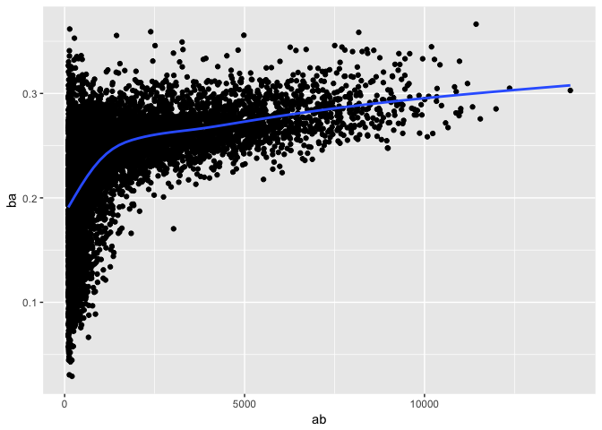
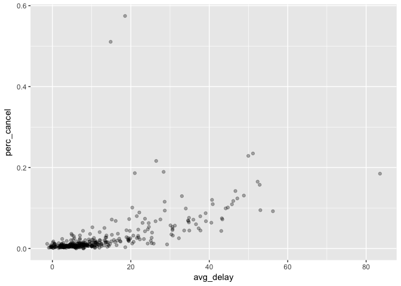
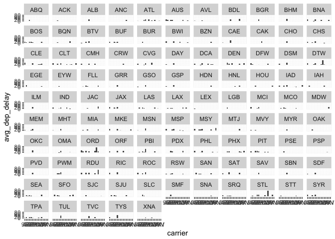
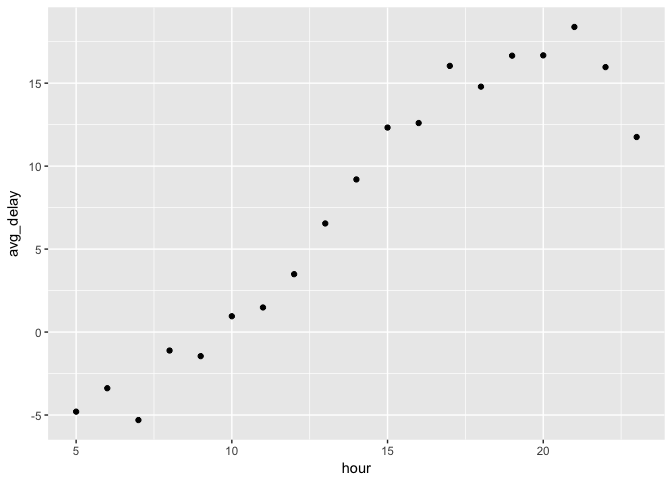
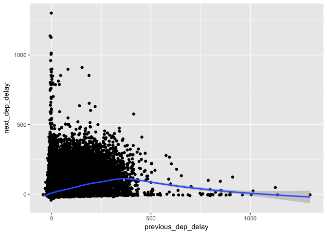
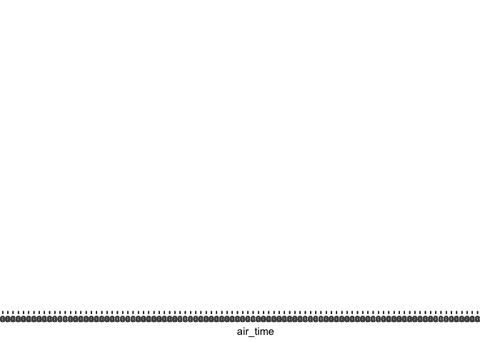

# DataTrans_part2_2017-05-10.Rmd


### Data Transformation (Ch 3 in book, Ch 5 online)


```r
library(nycflights13)
library(tidyverse)
```

```
## Loading tidyverse: ggplot2
## Loading tidyverse: tibble
## Loading tidyverse: tidyr
## Loading tidyverse: readr
## Loading tidyverse: purrr
## Loading tidyverse: dplyr
```

```
## Conflicts with tidy packages ----------------------------------------------
```

```
## filter(): dplyr, stats
## lag():    dplyr, stats
```

```r
head(flights)
```

```
## # A tibble: 6 × 19
##    year month   day dep_time sched_dep_time dep_delay arr_time
##   <int> <int> <int>    <int>          <int>     <dbl>    <int>
## 1  2013     1     1      517            515         2      830
## 2  2013     1     1      533            529         4      850
## 3  2013     1     1      542            540         2      923
## 4  2013     1     1      544            545        -1     1004
## 5  2013     1     1      554            600        -6      812
## 6  2013     1     1      554            558        -4      740
## # ... with 12 more variables: sched_arr_time <int>, arr_delay <dbl>,
## #   carrier <chr>, flight <int>, tailnum <chr>, origin <chr>, dest <chr>,
## #   air_time <dbl>, distance <dbl>, hour <dbl>, minute <dbl>,
## #   time_hour <dttm>
```

#### 5.6  Group Summaries  

```r
by_dest <- group_by(flights, dest)
summary(by_dest)
```

```
##       year          month             day           dep_time   
##  Min.   :2013   Min.   : 1.000   Min.   : 1.00   Min.   :   1  
##  1st Qu.:2013   1st Qu.: 4.000   1st Qu.: 8.00   1st Qu.: 907  
##  Median :2013   Median : 7.000   Median :16.00   Median :1401  
##  Mean   :2013   Mean   : 6.549   Mean   :15.71   Mean   :1349  
##  3rd Qu.:2013   3rd Qu.:10.000   3rd Qu.:23.00   3rd Qu.:1744  
##  Max.   :2013   Max.   :12.000   Max.   :31.00   Max.   :2400  
##                                                  NA's   :8255  
##  sched_dep_time   dep_delay          arr_time    sched_arr_time
##  Min.   : 106   Min.   : -43.00   Min.   :   1   Min.   :   1  
##  1st Qu.: 906   1st Qu.:  -5.00   1st Qu.:1104   1st Qu.:1124  
##  Median :1359   Median :  -2.00   Median :1535   Median :1556  
##  Mean   :1344   Mean   :  12.64   Mean   :1502   Mean   :1536  
##  3rd Qu.:1729   3rd Qu.:  11.00   3rd Qu.:1940   3rd Qu.:1945  
##  Max.   :2359   Max.   :1301.00   Max.   :2400   Max.   :2359  
##                 NA's   :8255      NA's   :8713                 
##    arr_delay          carrier              flight       tailnum         
##  Min.   : -86.000   Length:336776      Min.   :   1   Length:336776     
##  1st Qu.: -17.000   Class :character   1st Qu.: 553   Class :character  
##  Median :  -5.000   Mode  :character   Median :1496   Mode  :character  
##  Mean   :   6.895                      Mean   :1972                     
##  3rd Qu.:  14.000                      3rd Qu.:3465                     
##  Max.   :1272.000                      Max.   :8500                     
##  NA's   :9430                                                           
##     origin              dest              air_time        distance   
##  Length:336776      Length:336776      Min.   : 20.0   Min.   :  17  
##  Class :character   Class :character   1st Qu.: 82.0   1st Qu.: 502  
##  Mode  :character   Mode  :character   Median :129.0   Median : 872  
##                                        Mean   :150.7   Mean   :1040  
##                                        3rd Qu.:192.0   3rd Qu.:1389  
##                                        Max.   :695.0   Max.   :4983  
##                                        NA's   :9430                  
##       hour           minute        time_hour                  
##  Min.   : 1.00   Min.   : 0.00   Min.   :2013-01-01 05:00:00  
##  1st Qu.: 9.00   1st Qu.: 8.00   1st Qu.:2013-04-04 13:00:00  
##  Median :13.00   Median :29.00   Median :2013-07-03 10:00:00  
##  Mean   :13.18   Mean   :26.23   Mean   :2013-07-03 05:02:36  
##  3rd Qu.:17.00   3rd Qu.:44.00   3rd Qu.:2013-10-01 07:00:00  
##  Max.   :23.00   Max.   :59.00   Max.   :2013-12-31 23:00:00  
## 
```

```r
summarize(by_dest, count = n())
```

```
## # A tibble: 105 × 2
##     dest count
##    <chr> <int>
## 1    ABQ   254
## 2    ACK   265
## 3    ALB   439
## 4    ANC     8
## 5    ATL 17215
## 6    AUS  2439
## 7    AVL   275
## 8    BDL   443
## 9    BGR   375
## 10   BHM   297
## # ... with 95 more rows
```

```r
delay <- summarize(by_dest, count = n(),
          dist = mean(distance, na.rm = T),
          delay = mean(arr_delay, na.rm = T))

delay <- filter(delay, count > 20, dest != "HNL")
```

Pipes!

```r
not_cancelled <- flights %>%
  filter(!is.na(dep_delay), !is.na(arr_delay))
```

batting data

```r
batting <- as_tibble(Lahman::Batting)

batters <- batting %>%
  group_by(playerID) %>%
    summarize(
      ba = sum(H, na.rm = T) / sum(AB, na.rm = T),
      ab = sum(AB, na.rm =T)
    )
```

weird!  When I summarize(batters), I get
"data frame with 0 columns and 0 rows"
but whtn I type 'batters', I see a dataframe


```r
batters %>%
  filter(ab > 100) %>%
    ggplot(mapping = aes(x = ab, y = ba)) +
  geom_point() +
  geom_smooth(se = F)
```

```
## `geom_smooth()` using method = 'gam'
```

<!-- -->
subsetting


```r
not_cancelled %>%
  group_by(year, month, day) %>%
  summarize(
    avg_delay1 = mean(arr_delay), 
    avg_delay2 = mean(arr_delay[arr_delay > 0])
  )
```

```
## Source: local data frame [365 x 5]
## Groups: year, month [?]
## 
##     year month   day avg_delay1 avg_delay2
##    <int> <int> <int>      <dbl>      <dbl>
## 1   2013     1     1 12.6510229   32.48156
## 2   2013     1     2 12.6928879   32.02991
## 3   2013     1     3  5.7333333   27.66087
## 4   2013     1     4 -1.9328194   28.30976
## 5   2013     1     5 -1.5258020   22.55882
## 6   2013     1     6  4.2364294   24.37270
## 7   2013     1     7 -4.9473118   27.76132
## 8   2013     1     8 -3.2275785   20.78909
## 9   2013     1     9 -0.2642777   25.63415
## 10  2013     1    10 -5.8988159   27.34545
## # ... with 355 more rows
```
Measures of spread


```r
not_cancelled %>%
  group_by(dest) %>%
  summarize(distance_sd = sd(distance)) %>%
  arrange(desc(distance_sd))
```

```
## # A tibble: 104 × 2
##     dest distance_sd
##    <chr>       <dbl>
## 1    EGE   10.542765
## 2    SAN   10.350094
## 3    SFO   10.216017
## 4    HNL   10.004197
## 5    SEA    9.977993
## 6    LAS    9.907786
## 7    PDX    9.873299
## 8    PHX    9.862546
## 9    LAX    9.657195
## 10   IND    9.458066
## # ... with 94 more rows
```

Rank

```r
not_cancelled %>%
  group_by(year, month, day) %>%
  mutate(r = min_rank(desc(dep_time))) %>%
  filter(r %in% range(r))
```

```
## Source: local data frame [770 x 20]
## Groups: year, month, day [365]
## 
##     year month   day dep_time sched_dep_time dep_delay arr_time
##    <int> <int> <int>    <int>          <int>     <dbl>    <int>
## 1   2013     1     1      517            515         2      830
## 2   2013     1     1     2356           2359        -3      425
## 3   2013     1     2       42           2359        43      518
## 4   2013     1     2     2354           2359        -5      413
## 5   2013     1     3       32           2359        33      504
## 6   2013     1     3     2349           2359       -10      434
## 7   2013     1     4       25           2359        26      505
## 8   2013     1     4     2358           2359        -1      429
## 9   2013     1     4     2358           2359        -1      436
## 10  2013     1     5       14           2359        15      503
## # ... with 760 more rows, and 13 more variables: sched_arr_time <int>,
## #   arr_delay <dbl>, carrier <chr>, flight <int>, tailnum <chr>,
## #   origin <chr>, dest <chr>, air_time <dbl>, distance <dbl>, hour <dbl>,
## #   minute <dbl>, time_hour <dttm>, r <int>
```
Count

```r
not_cancelled %>%
  group_by(dest) %>%
  summarize(carriers = n_distinct(carrier)) %>%
  arrange(desc(carriers))
```

```
## # A tibble: 104 × 2
##     dest carriers
##    <chr>    <int>
## 1    ATL        7
## 2    BOS        7
## 3    CLT        7
## 4    ORD        7
## 5    TPA        7
## 6    AUS        6
## 7    DCA        6
## 8    DTW        6
## 9    IAD        6
## 10   MSP        6
## # ... with 94 more rows
```

Proportion: note that when used with numeric functions, mean can tell you proportion

```r
not_cancelled %>%
  group_by(year, month, day) %>%
  summarize(hour_perc = mean(arr_delay > 60))
```

```
## Source: local data frame [365 x 4]
## Groups: year, month [?]
## 
##     year month   day  hour_perc
##    <int> <int> <int>      <dbl>
## 1   2013     1     1 0.07220217
## 2   2013     1     2 0.08512931
## 3   2013     1     3 0.05666667
## 4   2013     1     4 0.03964758
## 5   2013     1     5 0.03486750
## 6   2013     1     6 0.04704463
## 7   2013     1     7 0.03333333
## 8   2013     1     8 0.02130045
## 9   2013     1     9 0.02015677
## 10  2013     1    10 0.01829925
## # ... with 355 more rows
```
grouping by multiple variables

```r
daily <- group_by(flights, year, month, day)
head(daily, n =2)
```

```
## Source: local data frame [2 x 19]
## Groups: year, month, day [1]
## 
##    year month   day dep_time sched_dep_time dep_delay arr_time
##   <int> <int> <int>    <int>          <int>     <dbl>    <int>
## 1  2013     1     1      517            515         2      830
## 2  2013     1     1      533            529         4      850
## # ... with 12 more variables: sched_arr_time <int>, arr_delay <dbl>,
## #   carrier <chr>, flight <int>, tailnum <chr>, origin <chr>, dest <chr>,
## #   air_time <dbl>, distance <dbl>, hour <dbl>, minute <dbl>,
## #   time_hour <dttm>
```

```r
per_day <- summarize(daily, flights = n())
head(per_day, n = 2)
```

```
## Source: local data frame [2 x 4]
## Groups: year, month [1]
## 
##    year month   day flights
##   <int> <int> <int>   <int>
## 1  2013     1     1     842
## 2  2013     1     2     943
```

```r
per_month <- summarize(per_day, flights = sum(flights))
head(per_month, n =2)  
```

```
## Source: local data frame [2 x 3]
## Groups: year [1]
## 
##    year month flights
##   <int> <int>   <int>
## 1  2013     1   27004
## 2  2013     2   24951
```

```r
per_year <- summarize(per_month, flights = sum(flights))
head(per_year, n = 2)
```

```
## # A tibble: 1 × 2
##    year flights
##   <int>   <int>
## 1  2013  336776
```
ungroup


```r
daily %>%
  summarize(flights = n()) #summarized by flights per day
```

```
## Source: local data frame [365 x 4]
## Groups: year, month [?]
## 
##     year month   day flights
##    <int> <int> <int>   <int>
## 1   2013     1     1     842
## 2   2013     1     2     943
## 3   2013     1     3     914
## 4   2013     1     4     915
## 5   2013     1     5     720
## 6   2013     1     6     832
## 7   2013     1     7     933
## 8   2013     1     8     899
## 9   2013     1     9     902
## 10  2013     1    10     932
## # ... with 355 more rows
```

```r
daily %>%
  ungroup() %>%
  summarize(flights = n()) # summary of all flights all year
```

```
## # A tibble: 1 × 1
##   flights
##     <int>
## 1  336776
```

#### 5.6.7  Exercises

##### 5.6.7.1  Think of at least 5 ways to assess typical delay characteristics of a group of flights.  

Which is more important?  Arrival delay or departure delay?  
To me, arrival delay. This can mean you'll miss your next connection.

How to find flights that are:

 15 min early 50% of time, and 15 min late 50% of time:

```r
delay.15 <- not_cancelled %>%
  group_by(flight) %>%
  summarize(
    late_15 = mean(arr_delay == 15),
    early_15 = mean(arr_delay == -15)
    ) %>%
  filter(late_15 == .5, early_15 == .5)
# no such flights exist
 
#did it work?  Try only one filter
delay.15 <- not_cancelled %>%
  group_by(flight) %>%
  summarize(
    late_15 = mean(arr_delay == 15),
    early_15 = mean(arr_delay == -15)
    ) %>%
  filter(late_15 == .5)
# Yes, 3 flights found
```

A flight is always 10 minutes late.  
I could easily modify the above.  But what would be a different way?

```r
#  str(not_cancelled) tells me there are 327,346 rows in dataframe(observations)
#  not_cancelled %>% count(flight) tells me there are 3,835 flights in dataset

delay.10 <- not_cancelled %>%
  group_by(flight) %>%  # 3,835 total flights when grouped this way
  filter(arr_delay == 10) %>% # sort by flight num to be sure it worked
  arrange(flight)
# although of course it doesn't tell us that ALL versions of that flight are delayed 10 min
# str(delay.10) tells me there are 3,373 observations.  
# I think that I have retrieved the rows in which arr_delay is 10 min, and that this happened at least once in all cases

delay.10 <- not_cancelled %>%
  group_by(flight) %>%  
  summarize(
    perc_late_10 = mean(arr_delay == 10)
    )

delay.10 <- not_cancelled %>%
  group_by(flight) %>%  
  summarize(
    perc_late_10 = mean(arr_delay == 10)) %>%
    filter(perc_late_10 == 1)  # there are 5 such flights

# can I move helpful information into output?
# I couldn't figure out how
```

A flight is 30 minutes early 50% of the time, and 30 min late 50% of the time


```r
delay.30 <- not_cancelled %>%
  group_by(flight) %>%
  summarize(
    late_30 = sum(arr_delay == 30),
    early_30 = sum(arr_delay == -30),
    count = n()
    ) %>%  
  filter(late_30/count == .5, early_30/count == .5) 
# nothing came up with this filter

delay.30 <- not_cancelled %>%
  group_by(flight) %>%
  summarize(
    late_30 = sum(arr_delay == 30),
    early_30 = sum(arr_delay == -30),
    count = n()
    ) %>%   #now I need to filter so sum/total = .5
  filter(late_30/count == .5 )
# two flights are late 30 min half the time; only 2 flights, though
```
99% of the time a flight is on time.  1% of the time it is 2 hr (120 min) late


```r
timely.99 <- not_cancelled %>%
  group_by(flight) %>%
  filter(arr_delay == 0 | arr_delay == 120) %>%
  summarize(
    on_time_99 = mean(arr_delay == 0),
    count = n() 
  ) %>%
filter(on_time_99/count == 0.99)

# no flights fit this criterion
```


##### 5.6.2  Think of a new way to accomplish each of the following
(without using count)

```r
not_cancelled %>%
  count(dest) # this sums up total # flights to each airport
```

```
## # A tibble: 104 × 2
##     dest     n
##    <chr> <int>
## 1    ABQ   254
## 2    ACK   264
## 3    ALB   418
## 4    ANC     8
## 5    ATL 16837
## 6    AUS  2411
## 7    AVL   261
## 8    BDL   412
## 9    BGR   358
## 10   BHM   269
## # ... with 94 more rows
```

```r
not_cancelled %>%
  group_by(dest) %>%
  summarize(
    num_flights = n()) # that works
```

```
## # A tibble: 104 × 2
##     dest num_flights
##    <chr>       <int>
## 1    ABQ         254
## 2    ACK         264
## 3    ALB         418
## 4    ANC           8
## 5    ATL       16837
## 6    AUS        2411
## 7    AVL         261
## 8    BDL         412
## 9    BGR         358
## 10   BHM         269
## # ... with 94 more rows
```

```r
not_cancelled %>%
  group_by(dest) %>%
  summarize(
    num_flights = sum(!is.na(flight))) #also works
```

```
## # A tibble: 104 × 2
##     dest num_flights
##    <chr>       <int>
## 1    ABQ         254
## 2    ACK         264
## 3    ALB         418
## 4    ANC           8
## 5    ATL       16837
## 6    AUS        2411
## 7    AVL         261
## 8    BDL         412
## 9    BGR         358
## 10   BHM         269
## # ... with 94 more rows
```


```r
not_cancelled %>%
  count(tailnum, wt = distance) # this sums total # miles plane flew
```

```
## # A tibble: 4,037 × 2
##    tailnum      n
##      <chr>  <dbl>
## 1   D942DN   3418
## 2   N0EGMQ 239143
## 3   N10156 109664
## 4   N102UW  25722
## 5   N103US  24619
## 6   N104UW  24616
## 7   N10575 139903
## 8   N105UW  23618
## 9   N107US  21677
## 10  N108UW  32070
## # ... with 4,027 more rows
```

```r
not_cancelled %>%
  group_by(tailnum) %>%
  summarize(
    distance_plane = sum(distance))  # works
```

```
## # A tibble: 4,037 × 2
##    tailnum distance_plane
##      <chr>          <dbl>
## 1   D942DN           3418
## 2   N0EGMQ         239143
## 3   N10156         109664
## 4   N102UW          25722
## 5   N103US          24619
## 6   N104UW          24616
## 7   N10575         139903
## 8   N105UW          23618
## 9   N107US          21677
## 10  N108UW          32070
## # ... with 4,027 more rows
```

##### 5.6.3  what is wrong with defining cancelled flights as those that either had an NA for departure delay or an NA for arrival delay?

Seems like a pretty good definition to me.  Let's look at examples

```r
no_dep_delay <- filter(flights, is.na(dep_delay), !is.na(arr_delay))
# nothing matches this; all flights with NA for dep_delay also have NA for arr_delay.  Makes sense.

no_arr_delay <- filter(flights, !is.na(dep_delay), is.na(arr_delay))
#  About 1200 flights have NA for arrival delay, but do report a dep_delay.

View(no_arr_delay)
```

```
## Warning: running command ''/usr/bin/otool' -L '/Library/Frameworks/
## R.framework/Resources/modules/R_de.so'' had status 69
```

```r
summary(no_arr_delay)
```

```
##       year          month             day           dep_time   
##  Min.   :2013   Min.   : 1.000   Min.   : 1.00   Min.   :   5  
##  1st Qu.:2013   1st Qu.: 4.000   1st Qu.: 8.00   1st Qu.:1054  
##  Median :2013   Median : 6.000   Median :14.00   Median :1526  
##  Mean   :2013   Mean   : 6.377   Mean   :15.14   Mean   :1438  
##  3rd Qu.:2013   3rd Qu.: 9.000   3rd Qu.:22.00   3rd Qu.:1806  
##  Max.   :2013   Max.   :12.000   Max.   :31.00   Max.   :2359  
##                                                                
##  sched_dep_time   dep_delay         arr_time    sched_arr_time
##  Min.   : 515   Min.   :-14.00   Min.   :   2   Min.   :   3  
##  1st Qu.:1037   1st Qu.: -3.00   1st Qu.:1235   1st Qu.:1244  
##  Median :1459   Median :  6.00   Median :1816   Median :1714  
##  Mean   :1396   Mean   : 36.02   Mean   :1569   Mean   :1606  
##  3rd Qu.:1711   3rd Qu.: 48.00   3rd Qu.:2107   3rd Qu.:1946  
##  Max.   :2359   Max.   :634.00   Max.   :2359   Max.   :2359  
##                                  NA's   :458                  
##    arr_delay      carrier              flight         tailnum         
##  Min.   : NA    Length:1175        Min.   :   1.0   Length:1175       
##  1st Qu.: NA    Class :character   1st Qu.: 732.5   Class :character  
##  Median : NA    Mode  :character   Median :1942.0   Mode  :character  
##  Mean   :NaN                       Mean   :2334.1                     
##  3rd Qu.: NA                       3rd Qu.:4016.0                     
##  Max.   : NA                       Max.   :6177.0                     
##  NA's   :1175                                                         
##     origin              dest              air_time       distance     
##  Length:1175        Length:1175        Min.   : NA    Min.   :  94.0  
##  Class :character   Class :character   1st Qu.: NA    1st Qu.: 603.5  
##  Mode  :character   Mode  :character   Median : NA    Median : 944.0  
##                                        Mean   :NaN    Mean   :1104.1  
##                                        3rd Qu.: NA    3rd Qu.:1395.5  
##                                        Max.   : NA    Max.   :4963.0  
##                                        NA's   :1175                   
##       hour           minute        time_hour                  
##  Min.   : 5.00   Min.   : 0.00   Min.   :2013-01-01 14:00:00  
##  1st Qu.:10.00   1st Qu.:11.00   1st Qu.:2013-04-18 06:00:00  
##  Median :14.00   Median :30.00   Median :2013-06-28 10:00:00  
##  Mean   :13.67   Mean   :29.46   Mean   :2013-06-27 08:48:30  
##  3rd Qu.:17.00   3rd Qu.:45.00   3rd Qu.:2013-09-02 12:00:00  
##  Max.   :23.00   Max.   :59.00   Max.   :2013-12-31 20:00:00  
## 
```
Some have an arrival time, some do not. (all have at least a scheduled arrival time.) None have an air time.
Not clear to me what happened.  

##### 5.6.4  Look at the number of cancelled flights per day.  Is there a pattern?  Is the proportion related to average delay?
I will use the flights with NA for arr_delay as cancelled flights


```r
flights %>%
  group_by(year, month, day) %>%
  summarize(
    perc_cancel = mean(is.na(arr_delay)),
    avg_delay = mean(dep_delay, na.rm = T), 
    n = n()
    ) %>%   #  pipe this to ggplot
ggplot(mapping = aes(x = avg_delay, y = perc_cancel)) +
  geom_point(alpha = 0.3)
```

<!-- -->
As you might expect, more cencellations on days with longer average delays.

##### 5.6.5  Which carrier has the worst delays?

```r
# simple approach

rank.delays <- not_cancelled %>%
  group_by(carrier) %>%
  summarize(
    avg_dep_delay = mean(dep_delay),
    count = n()
  ) %>%
  arrange(desc(avg_dep_delay))

airlines # 9E is the worst, it is Endeavor Air.  Then ExpressJet, then Mesa
```

```
## # A tibble: 16 × 2
##    carrier                        name
##      <chr>                       <chr>
## 1       9E           Endeavor Air Inc.
## 2       AA      American Airlines Inc.
## 3       AS        Alaska Airlines Inc.
## 4       B6             JetBlue Airways
## 5       DL        Delta Air Lines Inc.
## 6       EV    ExpressJet Airlines Inc.
## 7       F9      Frontier Airlines Inc.
## 8       FL AirTran Airways Corporation
## 9       HA      Hawaiian Airlines Inc.
## 10      MQ                   Envoy Air
## 11      OO       SkyWest Airlines Inc.
## 12      UA       United Air Lines Inc.
## 13      US             US Airways Inc.
## 14      VX              Virgin America
## 15      WN      Southwest Airlines Co.
## 16      YV          Mesa Airlines Inc.
```
Challenge: can you disentangle the effects of bad airports vs. bad carriers? Why/why not? (Hint: think about flights %>% group_by(carrier, dest) %>% summarise(n()))


```r
rank.delays.2 <- not_cancelled %>%
  group_by(carrier,dest) %>%
  summarize(
    avg_dep_delay = mean(dep_delay),
    count = n()
  ) %>%
  arrange(desc(dest, avg_dep_delay))
```
How would I plot that?  Maybe dest by delay, facet by carrier?

```r
not_cancelled %>%
  group_by(carrier,dest) %>%
  summarize(
    avg_dep_delay = mean(dep_delay),
    count = n()
  ) %>%
  ggplot(mapping = aes(x = carrier, y = avg_dep_delay)) +
  geom_col() +
  facet_wrap( ~ dest)
```

<!-- -->

```r
# that is too busy to really be useful.  
```

##### 5.6.6  What does the sort() argument to count() do?


```r
# the help page tells me sort sorts output in descending order
# might want to do this to examine # of flights to each destination

sort_flights <- not_cancelled %>%
  group_by(carrier,dest) %>%
  count(flight, sort = T)
# something seems wrong about the output, but I don't really wnat to figure it out now
```

#### 5.7  Group Mutates
window functions are used in conjuncton with mutate and filter

##### 5.7.1  Refer back to the lists of useful mutate and filtering functions. Describe how each operation changes when you combine it with grouping.

Well, that sounds tedious.  Useful mutate functions include arithmetic, log, offsets,ranking.  These all naturally work with groups.  Logical comparisons end up giving you T/F results that can be added.

Useful filter functions include comparisons, logical operators.  Nice to use with groups to get overview of traits.

##### 5.7.2  Which plane (tailnum) has worst on-time record?

```r
# maybe the easiest thing is to compute fraction of arr_delay == 0.

ranked_delay <- not_cancelled %>%
  group_by(tailnum) %>%
  mutate(
    on_time = mean(arr_delay == 0),  # planes never on time
    avg_delay = mean(arr_delay), # then average delay
    count = n()
  ) %>%
  select(year:day, carrier, tailnum, on_time, avg_delay, count) %>%
  arrange(on_time, avg_delay)

head(ranked_delay)  # looks good
```

```
## Source: local data frame [6 x 8]
## Groups: tailnum [4]
## 
##    year month   day carrier tailnum on_time avg_delay count
##   <int> <int> <int>   <chr>   <chr>   <dbl>     <dbl> <int>
## 1  2013     9    14      AS  N560AS       0     -53.0     1
## 2  2013     5     4      AS  N315AS       0     -51.0     1
## 3  2013    10    12      AS  N517AS       0     -40.5     2
## 4  2013     2    19      AS  N517AS       0     -40.5     2
## 5  2013     1     2      AS  N592AS       0     -35.5     4
## 6  2013    10     3      AS  N592AS       0     -35.5     4
```

##### 5.7.3  What time of day should you fly to avoid delays?

```r
str(not_cancelled) # hour should be useful
```

```
## Classes 'tbl_df', 'tbl' and 'data.frame':	327346 obs. of  19 variables:
##  $ year          : int  2013 2013 2013 2013 2013 2013 2013 2013 2013 2013 ...
##  $ month         : int  1 1 1 1 1 1 1 1 1 1 ...
##  $ day           : int  1 1 1 1 1 1 1 1 1 1 ...
##  $ dep_time      : int  517 533 542 544 554 554 555 557 557 558 ...
##  $ sched_dep_time: int  515 529 540 545 600 558 600 600 600 600 ...
##  $ dep_delay     : num  2 4 2 -1 -6 -4 -5 -3 -3 -2 ...
##  $ arr_time      : int  830 850 923 1004 812 740 913 709 838 753 ...
##  $ sched_arr_time: int  819 830 850 1022 837 728 854 723 846 745 ...
##  $ arr_delay     : num  11 20 33 -18 -25 12 19 -14 -8 8 ...
##  $ carrier       : chr  "UA" "UA" "AA" "B6" ...
##  $ flight        : int  1545 1714 1141 725 461 1696 507 5708 79 301 ...
##  $ tailnum       : chr  "N14228" "N24211" "N619AA" "N804JB" ...
##  $ origin        : chr  "EWR" "LGA" "JFK" "JFK" ...
##  $ dest          : chr  "IAH" "IAH" "MIA" "BQN" ...
##  $ air_time      : num  227 227 160 183 116 150 158 53 140 138 ...
##  $ distance      : num  1400 1416 1089 1576 762 ...
##  $ hour          : num  5 5 5 5 6 5 6 6 6 6 ...
##  $ minute        : num  15 29 40 45 0 58 0 0 0 0 ...
##  $ time_hour     : POSIXct, format: "2013-01-01 05:00:00" "2013-01-01 05:00:00" ...
```

```r
by_time <- not_cancelled %>%
  group_by(hour) %>%
  summarize(
    avg_delay = mean(arr_delay, na.rm = T),
    count = n()
  ) %>%
  ggplot(mapping = aes(x = hour, y = avg_delay)) +
  geom_point()

by_time
```

<!-- -->

```r
# makes sense.
```

##### 5.7.4  Compute total number of minutes of delay for each dest.  For each flight compute proportion of the total delay for its destination.

Compute total number of minutes of delay for each dest.

```r
not_cancelled %>%
  count(dest, wt = arr_delay)
```

```
## # A tibble: 104 × 2
##     dest      n
##    <chr>  <dbl>
## 1    ABQ   1113
## 2    ACK   1281
## 3    ALB   6018
## 4    ANC    -20
## 5    ATL 190260
## 6    AUS  14514
## 7    AVL   2089
## 8    BDL   2904
## 9    BGR   2874
## 10   BHM   4540
## # ... with 94 more rows
```
For each flight compute the proportion of the total delay for its destination.
(I think I am supposed to figure out what fraction of the above total is due to each flight)

```r
not_cancelled %>%
  group_by(dest) %>%
  mutate(
    flight_delay = sum(arr_delay),
    perc_tot_delay = arr_delay/sum(arr_delay)
  ) %>%
  select(year:day, arr_delay, carrier, flight, dest, flight_delay, perc_tot_delay) %>%
  arrange(desc(perc_tot_delay))
```

```
## Source: local data frame [327,346 x 9]
## Groups: dest [104]
## 
##     year month   day arr_delay carrier flight  dest flight_delay
##    <int> <int> <int>     <dbl>   <chr>  <int> <chr>        <dbl>
## 1   2013     3    30       101      UA    385   MTJ           25
## 2   2013     7    27       -47      UA    887   ANC          -20
## 3   2013    12    19       847      DL   1223   SLC          432
## 4   2013     5    13       -70      B6    217   LGB          -41
## 5   2013     8    27       -66      B6   1013   LGB          -41
## 6   2013     8    10       -31      UA    887   ANC          -20
## 7   2013     7    14       -62      B6   1013   LGB          -41
## 8   2013    11    13       -59      B6   1013   LGB          -41
## 9   2013     3    16        43      UA    441   HDN           30
## 10  2013     1     3       -56      B6    217   LGB          -41
## # ... with 327,336 more rows, and 1 more variables: perc_tot_delay <dbl>
```

##### 5.7.5  Delays are typically temporally correlated: even once the problem that caused the initial delay has been resolved, later flights are delayed to allow earlier flights to leave. Using lag() explore how the delay of a flight is related to the delay of the immediately preceding flight.


```r
# I think the most direct thing to do would be to sort by time and then graph time and lag time for dep_delay

not_cancelled %>%
  mutate(
    previous_dep_delay = dep_delay,
    next_dep_delay = lag(previous_dep_delay)
  ) %>%
  ggplot(mapping = aes(x = previous_dep_delay, y = next_dep_delay)) + 
  geom_point(, aes = 0.2) +
  geom_smooth()
```

```
## Warning: Ignoring unknown parameters: aes
```

```
## `geom_smooth()` using method = 'gam'
```

```
## Warning: Removed 1 rows containing non-finite values (stat_smooth).
```

```
## Warning: Removed 1 rows containing missing values (geom_point).
```

<!-- -->

```r
# not as direct a relationship as you might expect
```

##### 5.7.6  Look at each destination. Can you find flights that are suspiciously fast? (i.e. flights that represent a potential data entry error). Compute the air time a flight relative to the shortest flight to that destination. Which flights were most delayed in the air?

Can you find flights that are suspiciously fast? Compute the air time a flight relative to the shortest flight to that destination

```r
times <- not_cancelled %>%
  group_by(dest) %>%
  mutate(fastest = min(air_time)) %>%
  arrange(dest, desc(air_time))

ggplot(times, aes(x = air_time, y = fastest)) +
  geom_point(alpha = .2) + 
  facet_grid(.~dest)
```

<!-- -->

```r
# too many points to be useful

# so let's sort instead

times <- not_cancelled %>%
  group_by(dest) %>%
  mutate(flight_time_mean = mean(air_time),
         fold_flight_mean = air_time / flight_time_mean
         ) %>%
  arrange(fold_flight_mean)

head(times)
```

```
## Source: local data frame [6 x 21]
## Groups: dest [5]
## 
##    year month   day dep_time sched_dep_time dep_delay arr_time
##   <int> <int> <int>    <int>          <int>     <dbl>    <int>
## 1  2013     3     2     1450           1500       -10     1547
## 2  2013     5    25     1709           1700         9     1923
## 3  2013     5    13     2040           2025        15     2225
## 4  2013     1    25     1954           2000        -6     2131
## 5  2013     3    23     1914           1910         4     2045
## 6  2013     7     2     1558           1513        45     1745
## # ... with 14 more variables: sched_arr_time <int>, arr_delay <dbl>,
## #   carrier <chr>, flight <int>, tailnum <chr>, origin <chr>, dest <chr>,
## #   air_time <dbl>, distance <dbl>, hour <dbl>, minute <dbl>,
## #   time_hour <dttm>, flight_time_mean <dbl>, fold_flight_mean <dbl>
```

##### 5.7.7  Find all destinations flown by at least 2 carriers.  then rank the carriers (?)

```r
not_cancelled %>%
  select(year:day, carrier, flight, tailnum, dest, arr_delay) %>%
  group_by(dest, carrier) %>%
  count(carrier) 
```

```
## Source: local data frame [312 x 3]
## Groups: dest [?]
## 
##     dest carrier     n
##    <chr>   <chr> <int>
## 1    ABQ      B6   254
## 2    ACK      B6   264
## 3    ALB      EV   418
## 4    ANC      UA     8
## 5    ATL      9E    56
## 6    ATL      DL 10452
## 7    ATL      EV  1656
## 8    ATL      FL  2278
## 9    ATL      MQ  2235
## 10   ATL      UA   102
## # ... with 302 more rows
```

```r
# This tells me how many flights each carrier had to the given destinations

not_cancelled %>%
  select(year:day, carrier, flight, tailnum, dest, arr_delay) %>%
  group_by(dest, carrier) %>%
  count(carrier) %>%
  arrange(dest, desc(n))
```

```
## Source: local data frame [312 x 3]
## Groups: dest [104]
## 
##     dest carrier     n
##    <chr>   <chr> <int>
## 1    ABQ      B6   254
## 2    ACK      B6   264
## 3    ALB      EV   418
## 4    ANC      UA     8
## 5    ATL      DL 10452
## 6    ATL      FL  2278
## 7    ATL      MQ  2235
## 8    ATL      EV  1656
## 9    ATL      UA   102
## 10   ATL      WN    58
## # ... with 302 more rows
```

```r
# and this sorts by # of flights per carrier to each destination
```

##### 5.7.8  For each plane, count the number of flights before the first delay of greater than 1 hour.
Not quite sure what to do.  I think use tailnum as sorting criterion


```r
num_b4_delay <- not_cancelled %>%
  group_by(tailnum) %>%
  filter(arr_delay < 60)

head(num_b4_delay)
```

```
## Source: local data frame [6 x 19]
## Groups: tailnum [6]
## 
##    year month   day dep_time sched_dep_time dep_delay arr_time
##   <int> <int> <int>    <int>          <int>     <dbl>    <int>
## 1  2013     1     1      517            515         2      830
## 2  2013     1     1      533            529         4      850
## 3  2013     1     1      542            540         2      923
## 4  2013     1     1      544            545        -1     1004
## 5  2013     1     1      554            600        -6      812
## 6  2013     1     1      554            558        -4      740
## # ... with 12 more variables: sched_arr_time <int>, arr_delay <dbl>,
## #   carrier <chr>, flight <int>, tailnum <chr>, origin <chr>, dest <chr>,
## #   air_time <dbl>, distance <dbl>, hour <dbl>, minute <dbl>,
## #   time_hour <dttm>
```

```r
summary(num_b4_delay) # not quite right.  Want to count flights before dleay > 60.  Stuck!
```

```
##       year          month             day           dep_time   
##  Min.   :2013   Min.   : 1.000   Min.   : 1.00   Min.   :   1  
##  1st Qu.:2013   1st Qu.: 4.000   1st Qu.: 8.00   1st Qu.: 856  
##  Median :2013   Median : 7.000   Median :16.00   Median :1331  
##  Mean   :2013   Mean   : 6.583   Mean   :15.74   Mean   :1316  
##  3rd Qu.:2013   3rd Qu.:10.000   3rd Qu.:23.00   3rd Qu.:1719  
##  Max.   :2013   Max.   :12.000   Max.   :31.00   Max.   :2400  
##  sched_dep_time   dep_delay          arr_time    sched_arr_time
##  Min.   : 500   Min.   :-43.000   Min.   :   1   Min.   :   1  
##  1st Qu.: 900   1st Qu.: -5.000   1st Qu.:1102   1st Qu.:1111  
##  Median :1329   Median : -2.000   Median :1518   Median :1525  
##  Mean   :1317   Mean   :  3.194   Mean   :1498   Mean   :1513  
##  3rd Qu.:1710   3rd Qu.:  5.000   3rd Qu.:1923   3rd Qu.:1927  
##  Max.   :2359   Max.   :121.000   Max.   :2400   Max.   :2359  
##    arr_delay         carrier              flight       tailnum         
##  Min.   :-86.000   Length:299029      Min.   :   1   Length:299029     
##  1st Qu.:-18.000   Class :character   1st Qu.: 537   Class :character  
##  Median : -7.000   Mode  :character   Median :1454   Mode  :character  
##  Mean   : -3.818                      Mean   :1912                     
##  3rd Qu.:  7.000                      3rd Qu.:3367                     
##  Max.   : 59.000                      Max.   :6181                     
##     origin              dest              air_time        distance   
##  Length:299029      Length:299029      Min.   : 20.0   Min.   :  80  
##  Class :character   Class :character   1st Qu.: 83.0   1st Qu.: 509  
##  Mode  :character   Mode  :character   Median :130.0   Median : 937  
##                                        Mean   :151.5   Mean   :1057  
##                                        3rd Qu.:193.0   3rd Qu.:1400  
##                                        Max.   :691.0   Max.   :4983  
##       hour           minute        time_hour                  
##  Min.   : 5.00   Min.   : 0.00   Min.   :2013-01-01 05:00:00  
##  1st Qu.: 9.00   1st Qu.: 8.00   1st Qu.:2013-04-04 06:00:00  
##  Median :13.00   Median :29.00   Median :2013-07-06 08:00:00  
##  Mean   :12.91   Mean   :26.11   Mean   :2013-07-04 07:02:29  
##  3rd Qu.:17.00   3rd Qu.:44.00   3rd Qu.:2013-10-03 14:00:00  
##  Max.   :23.00   Max.   :59.00   Max.   :2013-12-31 23:00:00
```

