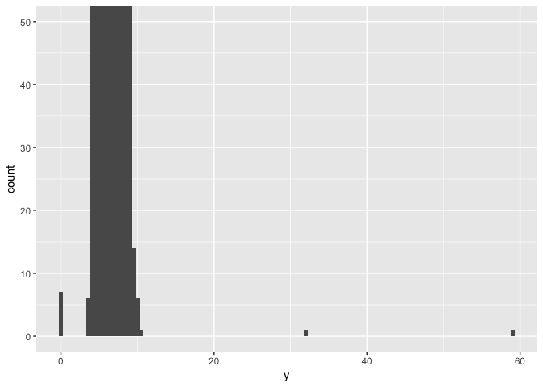
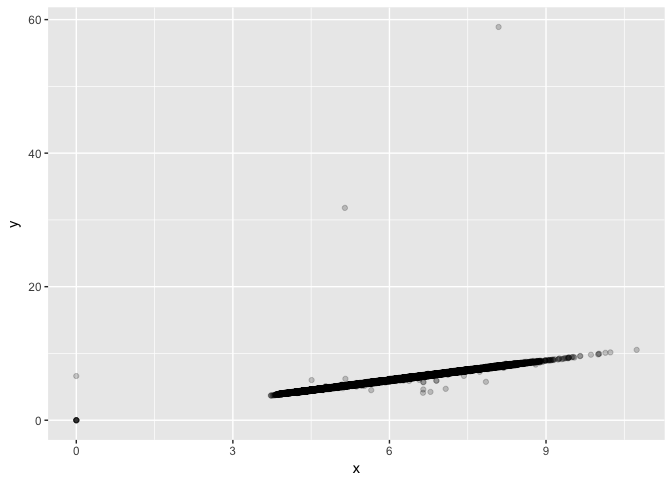
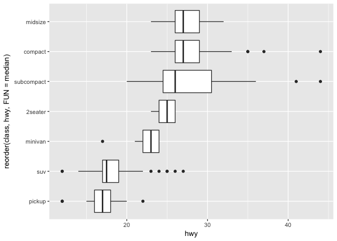
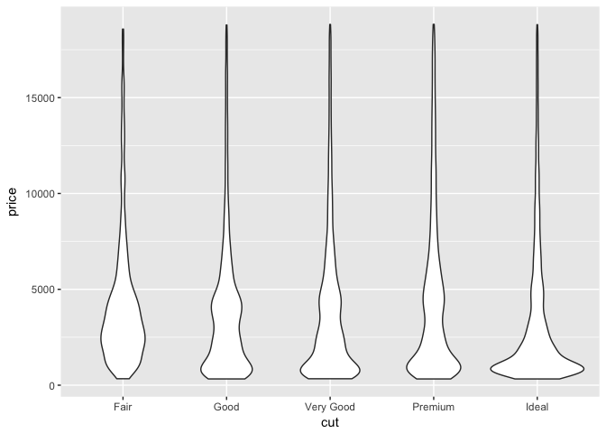
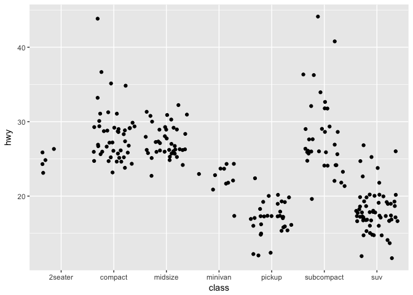
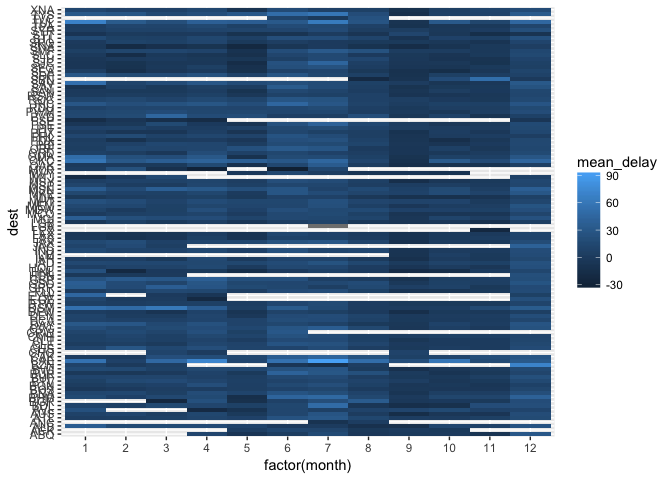
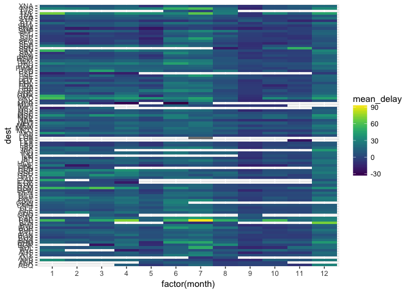
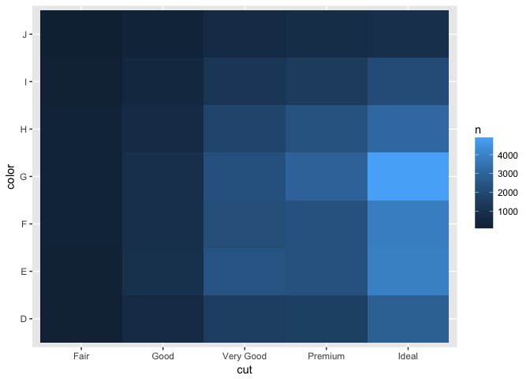
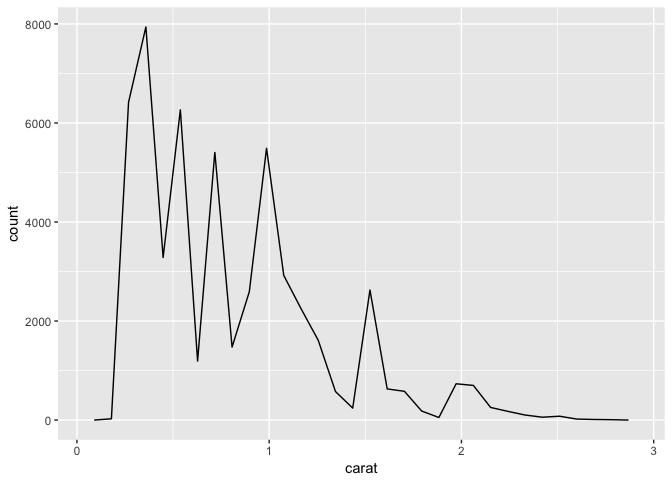

# DataExp_part1_2017-05-18.Rmd


## Data Exploration - chapter 7

4 questions in section 7.3
2 quesitons for section 7.4
6 questiosn for section 7.5.1 (variation)
3 questions for section 7.5.2
5 questions for section 7.5.3

But overall, these look easier than the last chapter


```r
library(tidyverse)
```

```
## Loading tidyverse: ggplot2
## Loading tidyverse: tibble
## Loading tidyverse: tidyr
## Loading tidyverse: readr
## Loading tidyverse: purrr
## Loading tidyverse: dplyr
```

```
## Conflicts with tidy packages ----------------------------------------------
```

```
## filter(): dplyr, stats
## lag():    dplyr, stats
```
### 7.3 Variation

useful control:  coord_cartesian

```r
ggplot(diamonds) +
  geom_histogram(mapping = aes(x = y), binwidth = 0.5) +
  coord_cartesian(ylim = c(0,50))
```

<!-- -->

```r
# note that y is width and x is length
```

#### 7.3.4 Exercises

##### 7.3.4.1   Explore the distribution of each of the x, y, and z variables in diamonds. What do you learn? Think about a diamond and how you might decide which dimension is the length, width, and depth.

?diamonds is the easiest way to figure out what x, y, and z mean


```r
ggplot(diamonds) +
  geom_jitter(mapping = aes(x=x, y= y), alpha = 0.2)
```

<!-- -->

```r
# some exterme outliers, with y = 30 or 60!
# but most are fairly linear between x and y

huge <- diamonds %>% 
  filter(y >8 )
dim(huge)
```

```
## [1] 1781   10
```

```r
small <- diamonds %>% 
  filter(between(y, 0.1, 6)) 

ggplot(huge) +
  geom_jitter(mapping = aes(x=x, y= y), alpha = 0.5) # 
```

<!-- -->

```r
ggplot(small) +
  geom_jitter(mapping = aes(x=x, y= y), alpha = 0.2) +
  geom_abline()  # y usually bigger than x, not always
```

<!-- -->

```r
ggplot(small) +
  geom_jitter(mapping = aes(x=x, y= z), alpha = 0.2) +
  coord_cartesian(ylim = c(3,8), xlim = c(3,8)) +
  geom_abline()  # without outlier, an see z usually smaller than x
```

<!-- -->

```r
ggplot(huge) +
  geom_jitter(mapping = aes(x=x, y= z), alpha = 0.2) +
  geom_abline() 
```

<!-- -->

```r
ggplot(small) +
  geom_jitter(mapping = aes(x=y, y= z), alpha = 0.2) +
  geom_abline() 
```

<!-- -->

Easy to see that z smaller than x or y.  I suspect x and y are arbitrary.

##### 7.3.4.2   Explore the distribution of price. Do you discover anything unusual or surprising? (Hint: Carefully think about the binwidth and make sure you try a wide range of values.)

```r
ggplot(diamonds) + 
  geom_histogram(mapping = aes(x = price), binwidth = 0.5) # whoa, that was slow.  
```

<!-- -->

```r
# try some bigger bins
ggplot(diamonds) + 
  geom_histogram(mapping = aes(x = price), binwidth = 10) # quite a tail to right
```

<!-- -->

```r
# I think I see a gap around 2000

ggplot(diamonds) + 
  geom_histogram(mapping = aes(x = price), binwidth = 10) +
  coord_cartesian(xlim = c(0, 2500)) # yes, bit gat at 1500.  Odd
```

<!-- -->

##### 7.3.4.3  How many diamonds are 0.99 carat? How many are 1 carat? What do you think is the cause of the difference?


```r
carat.99 <- diamonds %>% 
  filter(carat == 0.99) # 23

carat.1 <- diamonds %>% 
  filter(carat == 1)  #1,558
```

Presumably this is due to rounding

##### 7.3.4.4  Compare and contrast coord_cartesian() vs xlim() or ylim() when zooming in on a histogram. What happens if you leave binwidth unset? What happens if you try and zoom so only half a bar shows?


```r
# first, coord_cartesian
ggplot(diamonds) + 
  geom_histogram(mapping = aes(x = price), binwidth = 10) +
  coord_cartesian(xlim = c(0, 2500)) 
```

<!-- -->

```r
# then, xlim
ggplot(diamonds) + 
  geom_histogram(mapping = aes(x = price), binwidth = 10) +
  xlim(0, 2500)
```

```
## Warning: Removed 26398 rows containing non-finite values (stat_bin).
```

<!-- -->

coord_cartesian will print the data to the very edge of the chart


```r
# no binwidth
ggplot(diamonds) + 
  geom_histogram(mapping = aes(x = price)) +
  coord_cartesian(xlim = c(0, 2500))  # yuck; huge bins
```

```
## `stat_bin()` using `bins = 30`. Pick better value with `binwidth`.
```

<!-- -->

```r
ggplot(diamonds) + 
  geom_histogram(mapping = aes(x = price)) +
  xlim(0, 2500)   # much smaller bins.  Looks OK.
```

```
## `stat_bin()` using `bins = 30`. Pick better value with `binwidth`.
```

```
## Warning: Removed 26398 rows containing non-finite values (stat_bin).
```

<!-- -->

```r
# no half bins included, though
```

### 7.4 Missing values

ifelse explained

#### 7.4.1 Exercises

##### 7.4.1.1  What happens to missing values in a histogram? What happens to missing values in a bar chart? Why is there a difference?


```r
library(nycflights13)
# graph out dep_delay as both histogram and as bar chart

ggplot(flights) +
  geom_histogram(mapping = aes(x = dep_delay), binwidth = 10) 
```

```
## Warning: Removed 8255 rows containing non-finite values (stat_bin).
```

<!-- -->

```r
# get a warning: Removed 8255 rows containing non-finite values (stat_bin)

ggplot(flights) +
  geom_freqpoly(mapping = aes(x = dep_delay)) # get the same warning as above (stat_bin)
```

```
## `stat_bin()` using `bins = 30`. Pick better value with `binwidth`.
```

```
## Warning: Removed 8255 rows containing non-finite values (stat_bin).
```

<!-- -->

```r
#
ggplot(flights) +
  geom_bar(mapping = aes(x = dep_delay)) # get the same warning as above (stat_count, though)
```

```
## Warning: Removed 8255 rows containing non-finite values (stat_count).
```

<!-- -->

```r
# weird - that is not what I expected, and not what the example shows

# OK, try with a vector that is clearly categorical and not continuous
diamonds_NA <- diamonds %>% 
  mutate(y = ifelse(y < 3 | y > 20, NA, y))

diamonds_NA2 <- diamonds %>% 
  mutate(cut = if_else(runif(n()) < 0.1, NA_character_, as.character(cut)))

ggplot(diamonds_NA2) +
  geom_bar(mapping = aes(x = cut))
```

<!-- -->

```r
diamonds_NA2  # ran without error, because now NA just another category
```

```
## # A tibble: 53,940 × 10
##    carat       cut color clarity depth table price     x     y     z
##    <dbl>     <chr> <ord>   <ord> <dbl> <dbl> <int> <dbl> <dbl> <dbl>
## 1   0.23     Ideal     E     SI2  61.5    55   326  3.95  3.98  2.43
## 2   0.21   Premium     E     SI1  59.8    61   326  3.89  3.84  2.31
## 3   0.23      Good     E     VS1  56.9    65   327  4.05  4.07  2.31
## 4   0.29   Premium     I     VS2  62.4    58   334  4.20  4.23  2.63
## 5   0.31      Good     J     SI2  63.3    58   335  4.34  4.35  2.75
## 6   0.24 Very Good     J    VVS2  62.8    57   336  3.94  3.96  2.48
## 7   0.24 Very Good     I    VVS1  62.3    57   336  3.95  3.98  2.47
## 8   0.26 Very Good     H     SI1  61.9    55   337  4.07  4.11  2.53
## 9   0.22      Fair     E     VS2  65.1    61   337  3.87  3.78  2.49
## 10  0.23 Very Good     H     VS1  59.4    61   338  4.00  4.05  2.39
## # ... with 53,930 more rows
```

With geom_histogram, NA values are just discarded
with geom_bar, if the values are characters and not numbers, it will make an NA category.

otherwise, geom_bar will discard NA values like geom_histogram

##### 7.4.1.2  What does na.rm = T do in mean and sum?


```r
# use the flights dataset to compute mean and sum of dep_delay, with and wihtout na.rm = T

mean(flights$dep_delay, na.rm = F)  # NA
```

```
## [1] NA
```

```r
mean(flights$dep_delay, na.rm = T)  # 12.63907
```

```
## [1] 12.63907
```

```r
sum(flights$dep_delay, na.rm = F)  # NA
```

```
## [1] NA
```

```r
sum(flights$dep_delay, na.rm = T)  # 4152200
```

```
## [1] 4152200
```

As one would expect.

### 7.5 Covariation

### 7.5.1 categorical and continuous variables

often, density better way to plot y axis than simply by counts

IQR = 25th to 75th percentile.  whiskers go to farthest non-outliers
reorder function - can be embedded within aes in geom_boxplot
and remember coord_flip() for long names

##### 7.5.1.1  Improve the visualisation of the departure times of cancelled vs. non-cancelled flights.


```r
# original code:
nycflights13::flights %>% 
  mutate(
    cancelled = is.na(dep_time),
    sched_hour = sched_dep_time %/% 100,
    sched_min = sched_dep_time %% 100,
    sched_dep_time = sched_hour + sched_min / 60
  ) %>% 
  ggplot(mapping = aes(sched_dep_time)) + 
    geom_freqpoly(mapping = aes(colour = cancelled), binwidth = 1/4)
```

<!-- -->

```r
# make into a boxplot, with the 2 cats being cancelled and non-cancelled and y = dep_time

nycflights13::flights %>% 
  mutate(
    cancelled = is.na(dep_time),
    sched_hour = sched_dep_time %/% 100,
    sched_min = sched_dep_time %% 100,
    sched_dep_time = sched_hour + sched_min / 60
  ) %>% 
  ggplot(mapping = aes(x = cancelled, y = sched_dep_time)) + 
    geom_boxplot(notch = T)
```

<!-- -->

```r
# very clear that earlier flights are less likely to be cancelled
```

##### 7.5.1.2  What variable in the diamonds dataset is most important for predicting the price of a diamond? How is that variable correlated with cut? Why does the combination of those two relationships lead to lower quality diamonds being more expensive?


```r
head(diamonds)
```

```
## # A tibble: 6 × 10
##   carat       cut color clarity depth table price     x     y     z
##   <dbl>     <ord> <ord>   <ord> <dbl> <dbl> <int> <dbl> <dbl> <dbl>
## 1  0.23     Ideal     E     SI2  61.5    55   326  3.95  3.98  2.43
## 2  0.21   Premium     E     SI1  59.8    61   326  3.89  3.84  2.31
## 3  0.23      Good     E     VS1  56.9    65   327  4.05  4.07  2.31
## 4  0.29   Premium     I     VS2  62.4    58   334  4.20  4.23  2.63
## 5  0.31      Good     J     SI2  63.3    58   335  4.34  4.35  2.75
## 6  0.24 Very Good     J    VVS2  62.8    57   336  3.94  3.96  2.48
```

```r
# carat?
ggplot(diamonds, mapping = aes(x = carat, y = price)) +
  geom_jitter(alpha = .1) 
```

<!-- -->

```r
ggplot(diamonds, mapping = aes(x = carat, y = log(price))) +
  geom_jitter(alpha = .1) # close to linear relationship
```

<!-- -->

```r
# cut?
ggplot(diamonds, mapping = aes(x = cut, y = price)) +
  geom_boxplot() # not a great correlation
```

<!-- -->

```r
# color?
ggplot(diamonds, mapping = aes(x = color, y = price)) +
  geom_boxplot() # pretty good correlation here (assuming D - J is ordered)
```

<!-- -->

```r
# clarity?
ggplot(diamonds, mapping = aes(x = clarity, y = price)) +
  geom_boxplot() # poor correlation here (assuming I1 to IF is ordered)
```

<!-- -->

```r
# depth?
ggplot(diamonds, mapping = aes(x = depth, y = price)) +
  geom_jitter(alpha = 0.1) # no correlation here
```

<!-- -->

```r
# table?
ggplot(diamonds, mapping = aes(x = table, y = price)) +
  geom_jitter(alpha = 0.1) # no correlation here
```

<!-- -->

(So looks like carat and color are what matter most)

How is carat correlated with cut?

```r
ggplot(diamonds, mapping = aes(x = cut, y = carat)) +
  geom_boxplot()
```

<!-- -->

Carat and cut appear almost _inversely_ correlated.
(with 'premium' cut class the exception)

Why give larger diamonds only a 'fair' cut?

##### 7.5.1.3  Install the ggstance package, and create a horizontal boxplot. How does this compare to using coord_flip()?

Google tells me that "While coord_flip() can only flip a plot as a whole, ggstance provides flipped versions of Geoms, Stats and Positions. This makes it easier to build horizontal layer or use vertical positioning (e.g. vertical dodging). Also, horizontal Geoms draw horizontal legend keys to keep the appearance of your plots consistent."


```r
library(ggstance)
```

```
## 
## Attaching package: 'ggstance'
```

```
## The following objects are masked from 'package:ggplot2':
## 
##     geom_errorbarh, GeomErrorbarh
```

```r
# let's compare

ggplot(diamonds, mapping = aes(x = y)) +
  geom_histogram(binwidth = 0.5) 
```

<!-- -->

```r
ggplot(diamonds, mapping = aes(x = y)) +
  geom_histogram(binwidth = 0.5)  +
  coord_cartesian(ylim = c(0,50))
```

<!-- -->

```r
ggplot(diamonds, mapping = aes(x = y)) +
  geom_histogram(binwidth = 0.5) +
  coord_cartesian(ylim = c(0,50)) +
  coord_flip()  # ignores my xlim
```

<!-- -->

```r
#ggplot(diamonds) +
#  geom_histogramh(mapping = aes(x = y), binwidth = 0.5)
 # that doesn't run: I think I need a y aesthetic

#ggplot(diamonds, mapping = aes(y = y)) +
#  geom_histogramh(binwidth = .1) 
# not sure why that won't run.  

# try a boxplot instead

ggplot(data = mpg) +
  geom_boxplot(mapping = aes(x = reorder(class, hwy, FUN = median), y = hwy)) +
  coord_flip()
```

<!-- -->

```r
ggplot(data = mpg) +
  geom_boxploth(mapping = aes(y = reorder(class, hwy, FUN = median), x = hwy)) 
```

<!-- -->

```r
# that runs fine.  
```

##### 7.5.1.4  One problem with boxplots is that they were developed in an era of much smaller datasets and tend to display a prohibitively large number of “outlying values”. One approach to remedy this problem is the letter value plot. Install the lvplot package, and try using geom_lv() to display the distribution of price vs cut. What do you learn? How do you interpret the plots?

note that: Letter-value plots are a variation of boxplots that replace the whiskers with a variable
number of letter values, selected based on the uncertainty associated with each estimate
and hence on the number of observations


```r
library(lvplot)

ggplot(diamonds, mapping = aes(x = cut, y = price)) +
  geom_lv(aes(fill=..LV..))
```

<!-- -->

```r
ggplot(diamonds, mapping = aes(x = cut, y = price)) +
  geom_lv()
```

<!-- -->

```r
# kind of nice; the fatness of the bars tells you about number of points included
# and not many outliers are drawn in
```

##### 7.5.1.5  Compare and contrast geom_violin() with a facetted geom_histogram(), or a coloured geom_freqpoly(). What are the pros and cons of each method?


```r
ggplot(diamonds, mapping = aes(x = cut, y = price)) +
  geom_violin() # kind of nice.  width of shape easy to see
```

<!-- -->

```r
ggplot(diamonds, mapping = aes(x = price)) +
  geom_histogram(bins = 10) + 
  facet_grid(. ~ cut)  # messy, but clearly see that most 'ideal' diamonds are lowest priced.
```

<!-- -->

```r
ggplot(diamonds, mapping = aes(x = price)) +
  geom_freqpoly(mapping = aes(colour = cut), binwidth = 1000) 
```

<!-- -->

```r
# easy to see there are many more 'ideal' diamonds than the other categories

ggplot(diamonds, mapping = aes(x = price, y = ..density..)) +
  geom_freqpoly(mapping = aes(colour = cut), binwidth = 1000) 
```

<!-- -->

```r
# easy to see there are many more 'ideal' diamonds than the other categories
```

##### 7.5.1.6   If you have a small dataset, it’s sometimes useful to use geom_jitter() to see the relationship between a continuous and categorical variable. The ggbeeswarm package provides a number of methods similar to geom_jitter(). List them and briefly describe what each one does.

A google search tells me there is geom_quasirandom and geom_beeswarm


```r
library(ggbeeswarm)

ggplot(diamonds, mapping = aes(x = cut, y = price)) +
  geom_jitter(alpha = .1) # yikes!  overwhelming
```

<!-- -->

```r
#ggplot(diamonds, mapping = aes(x = cut, y = price)) +
 # geom_beeswarm() #runs way too slowly.  

ggplot(diamonds, mapping = aes(x = cut, y = price)) +
  geom_quasirandom(alpha = .1) # ran OK.  looks like violinplot
```

<!-- -->

```r
ggplot(diamonds, mapping = aes(x = cut, y = price)) +
  geom_violin() # more differences between groups than quasirandom
```

<!-- -->

```r
# try a smaller dataset

ggplot(mpg, mapping = aes(x = class, y = hwy)) +
  geom_jitter() # messy!
```

<!-- -->

```r
ggplot(mpg, mapping = aes(x = class, y = hwy)) +
  geom_beeswarm() # more organized, but lost some data off right side
```

<!-- -->

```r
# each grouping centered on category

ggplot(mpg, mapping = aes(x = class, y = hwy)) +
  geom_quasirandom() # don't lose the data as with beeswarm
```

<!-- -->

```r
# more densely plotted than beeswarm
# but not centered on category name
```

### 7.5.2 Two categorical variables

geom_count is a handy way to visualize # of observations
Or, geom_tile looks cool.  like a heatmap, kind of.  (use fill = n)

##### 7.5.2.1   How could you rescale the count dataset above to more clearly show the distribution of cut within colour, or colour within cut?

The most obvious thing would be to facet

```r
#original plot
ggplot(data = diamonds) +
  geom_count(mapping = aes(x = cut, y = color))
```

<!-- -->

```r
ggplot(data = diamonds) +
  geom_count(mapping = aes(x = cut, y = color)) +
  facet_grid(.~ color) # not clear
```

<!-- -->

```r
# how about a bar plot?
ggplot(data = diamonds, mapping = aes(x = cut)) +
  geom_bar(mapping = aes(color = color, fill = color), position = "dodge")
```

<!-- -->

```r
# or instead (to better see proportions)
ggplot(data = diamonds, mapping = aes(x = cut)) +
  geom_bar(mapping = aes(fill = color), position = "fill")
```

<!-- -->

```r
# or reversed
ggplot(data = diamonds, mapping = aes(x = color)) +
  geom_bar(mapping = aes(fill = cut), position = "fill")
```

<!-- -->

The solutions page suggests the following:


```r
diamonds %>% 
  count(color, cut) %>% 
  mutate(prop = n/sum(n)) %>% 
  ggplot(mapping = aes(x = color, y = cut)) +
  geom_tile(mapping = aes(fill = prop)) +
  scale_fill_distiller(limits = c(0,1))
```

<!-- -->

##### 7.5.2.2   Use geom_tile() together with dplyr to explore how average flight delays vary by destination and month of year. What makes the plot difficult to read? How could you improve it?

OK, I want to compute mean flight delay after grouping by month and dest


```r
str(flights)
```

```
## Classes 'tbl_df', 'tbl' and 'data.frame':	336776 obs. of  19 variables:
##  $ year          : int  2013 2013 2013 2013 2013 2013 2013 2013 2013 2013 ...
##  $ month         : int  1 1 1 1 1 1 1 1 1 1 ...
##  $ day           : int  1 1 1 1 1 1 1 1 1 1 ...
##  $ dep_time      : int  517 533 542 544 554 554 555 557 557 558 ...
##  $ sched_dep_time: int  515 529 540 545 600 558 600 600 600 600 ...
##  $ dep_delay     : num  2 4 2 -1 -6 -4 -5 -3 -3 -2 ...
##  $ arr_time      : int  830 850 923 1004 812 740 913 709 838 753 ...
##  $ sched_arr_time: int  819 830 850 1022 837 728 854 723 846 745 ...
##  $ arr_delay     : num  11 20 33 -18 -25 12 19 -14 -8 8 ...
##  $ carrier       : chr  "UA" "UA" "AA" "B6" ...
##  $ flight        : int  1545 1714 1141 725 461 1696 507 5708 79 301 ...
##  $ tailnum       : chr  "N14228" "N24211" "N619AA" "N804JB" ...
##  $ origin        : chr  "EWR" "LGA" "JFK" "JFK" ...
##  $ dest          : chr  "IAH" "IAH" "MIA" "BQN" ...
##  $ air_time      : num  227 227 160 183 116 150 158 53 140 138 ...
##  $ distance      : num  1400 1416 1089 1576 762 ...
##  $ hour          : num  5 5 5 5 6 5 6 6 6 6 ...
##  $ minute        : num  15 29 40 45 0 58 0 0 0 0 ...
##  $ time_hour     : POSIXct, format: "2013-01-01 05:00:00" "2013-01-01 05:00:00" ...
```

```r
flights %>% 
  group_by(month, dest) %>% 
  select(month , dest, mean_delay = mean(arr_delay, na.rm = TRUE)) %>% 
  ggplot(mapping = aes(x = factor(month), y = dest)) +
  geom_tile(aes(fill = mean_delay))
```

<!-- -->

```r
# messy!!  Would be easier to look at if data were sorted
library(viridis)
```

```
## Loading required package: viridisLite
```

```r
flights %>% 
  group_by(month, dest) %>% 
  select(month , dest, mean_delay = mean(arr_delay, na.rm = TRUE)) %>% 
  group_by(dest) %>% 
  ungroup() %>% 
  arrange (mean_delay, dest) %>% 
  ggplot(mapping = aes(x = factor(month), y = dest)) +
  geom_tile(aes(fill = mean_delay)) + 
  scale_fill_viridis()
```

<!-- -->

```r
# sorting didn't help much; for some reason, it increased NAs;  why??
```

the example solution is below


```r
library(forcats)

flights %>%
  group_by(month, dest) %>%
  summarise(dep_delay = mean(dep_delay, na.rm = TRUE)) %>%
  group_by(dest) %>%
  filter(n() == 12) %>%  # why do this? why not >= 12?
  ungroup() %>%  #1008 rows
  mutate(dest = fct_reorder(dest, dep_delay)) %>%
  ggplot(aes(x = factor(month), y = dest, fill = dep_delay)) +
  geom_tile() +
  scale_fill_viridis() +
  labs(x = "Month", y = "Destination", fill = "Departure Delay")
```

<!-- -->

```r
# try with bigger dataset


flights %>%
  group_by(month, dest) %>%
  summarise(dep_delay = mean(dep_delay, na.rm = TRUE)) %>%
  group_by(dest) %>%
  filter(n() >= 12) %>%  # why do this? why not >= 12?
  ungroup() %>%  # same; 1008 rows
  mutate(dest = fct_reorder(dest, dep_delay)) %>%  # ordered by destination, which is now a factor
  ggplot(aes(x = factor(month), y = dest, fill = dep_delay)) +
  geom_tile() +
  scale_fill_viridis() +
  labs(x = "Month", y = "Destination", fill = "Departure Delay")  # looks same as above
```

<!-- -->

##### 7.5.2.3   Why is it slightly better to use aes(x = color, y = cut) rather than aes(x = cut, y = color) in the example above?


```r
# example:
diamonds %>% 
  count(color, cut) %>%  
  ggplot(mapping = aes(x = color, y = cut)) +
    geom_tile(mapping = aes(fill = n))
```

<!-- -->

```r
# don't see color variation across last row.

# opposite is
diamonds %>% 
  count(color, cut) %>%  
  ggplot(mapping = aes(x = cut, y = color)) +
    geom_tile(mapping = aes(fill = n))
```

<!-- -->

```r
# can't see any color variation across first column (fair)
```

They seem very similar to me.  But maybe better to have more columns than rows?   

### 7.5.3 Two continuous variables

bin in 2D:use geom_bin2d() or geom_hex(); fill color display # points


```r
library(hexbin)
smaller <- diamonds %>% 
  filter(carat < 3)

ggplot(data = smaller) +
  geom_bin2d(mapping = aes(x = carat, y = price))
```

<!-- -->

```r
ggplot(data = smaller) +
  geom_hex(mapping = aes(x = carat, y = price))
```

<!-- -->
Or, bin one continous variable and pretend it is categorical

```r
ggplot(data = smaller, mapping = aes(x = carat, y = price)) +
  geom_boxplot(mapping = aes(group = cut_width(carat, 0.1)))  # handy
```

<!-- -->

```r
# and the varwidth thig is cool too
ggplot(data = smaller, mapping = aes(x = carat, y = price)) +
  geom_boxplot(mapping = aes(group = cut_width(carat, 0.1)), varwidth = T)
```

<!-- -->

```r
# or, bin with about same # points per bin

ggplot(data = smaller, mapping = aes(x = carat, y = price)) +
  geom_boxplot(mapping = aes(group = cut_number(carat, 20)))
```

<!-- -->

### 7.5.3.1 Excercises

##### 7.5.3.1 Instead of summarising the conditional distribution with a boxplot, you could use a frequency polygon. What do you need to consider when using cut_width() vs cut_number()? How does that impact a visualisation of the 2d distribution of carat and price?


```r
ggplot(data = smaller, mapping = aes(x = carat, color = price)) +
  geom_freqpoly()
```

```
## `stat_bin()` using `bins = 30`. Pick better value with `binwidth`.
```

<!-- -->

```r
#nope
ggplot(data = smaller, mapping = aes(x = carat, color = cut_width(price, 1000))) +
  geom_freqpoly() #totally illegible
```

```
## `stat_bin()` using `bins = 30`. Pick better value with `binwidth`.
```

<!-- -->

```r
ggplot(data = smaller, aes(x = price, color = cut_width(carat, .25))) +
  geom_freqpoly() # better
```

```
## `stat_bin()` using `bins = 30`. Pick better value with `binwidth`.
```

<!-- -->

```r
ggplot(data = smaller, aes(x = price, color = cut_number(carat, 11))) +
  geom_freqpoly() # better
```

```
## `stat_bin()` using `bins = 30`. Pick better value with `binwidth`.
```

<!-- -->

```r
#
ggplot(data = smaller, mapping = aes(x = price, y = color)) +
  geom_hex(bins = 15) # super weird
```

<!-- -->

```r
ggplot(data = smaller, mapping = aes(x = price, y = color)) +
  geom_bin2d(bins = 15) #nah, not that great either
```

<!-- -->

##### 7.5.3.2 Visualise the distribution of carat, partitioned by price.

I think the goal is to bin carat and then plot carat on y axis.  Note this is almost the same as the example in the book.

```r
ggplot(data = smaller, mapping = aes(y = carat, x = price)) + 
  geom_boxplot(mapping = aes(group = cut_width(price, 1000)))
```

<!-- -->

##### 7.5.3.3 How does the price distribution of very large diamonds compare to small diamonds. Is it as you expect, or does it surprise you?

For the smaller diamonds, there appears to be a good correlation between size and price.  But after about 1.5 carats, that relationship is less apparent.  Perhaps once diamonds get to be a certain size, the quality of the stone is more important in determining price.

##### 7.5.3.4 Combine two of the techniques you’ve learned to visualise the combined distribution of cut, carat, and price.

Perhaps graph carat by price but group by cut?  


```r
# can I use 'color' with geom_count?

ggplot(data = smaller) + 
  geom_count(mapping = aes(x = carat, y = price, color = cut))
```

<!-- -->

```r
# that doesn't seem to address the question adequately

ggplot(data = smaller) + 
  geom_hex(mapping = aes(x = carat, y = price, color = cut)) +
  facet_grid(. ~ cut)
```

<!-- -->

```r
# or maybe

ggplot(data = smaller, mapping = aes(x = carat, y = price)) + 
  geom_boxplot(mapping = aes(group = cut_width(carat, 0.5), fill = cut)) +
  facet_grid(. ~ cut)
```

<!-- -->

```r
# differnece between color and fill is outline only vs middle of object

ggplot(data = smaller, mapping = aes(x = carat, y = price)) + 
  geom_boxplot(mapping = aes(group = cut_width(carat, 0.5), color = cut)) +
  facet_grid(. ~ cut)
```

<!-- -->

##### 7.5.3.5 Two dimensional plots reveal outliers that are not visible in one dimensional plots. For example, some points in the plot below have an unusual combination of x and y values, which makes the points outliers even though their x and y values appear normal when examined separately.


```r
ggplot(data = diamonds) +
  geom_point(mapping = aes(x = x, y = y)) +
  coord_cartesian(xlim = c(4, 11), ylim = c(4, 11))
```

<!-- -->

Why is a scatterplot a better display than a binned plot for this case?

I would guess because a binned plot would not show me those outliers (Unless the bins were so small as to make the plot illegible)


```r
ggplot(data = diamonds, mapping = aes(x = x, y = y)) +
  geom_boxplot(mapping = aes(group = cut_width(x, .5))) +
  coord_cartesian(xlim = c(4, 11), ylim = c(4, 11))
```

<!-- -->

Actually, I do detect these outliers.  But they don't pop out of the plot as readily as in the first example
