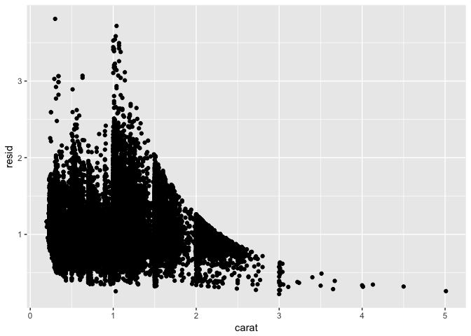
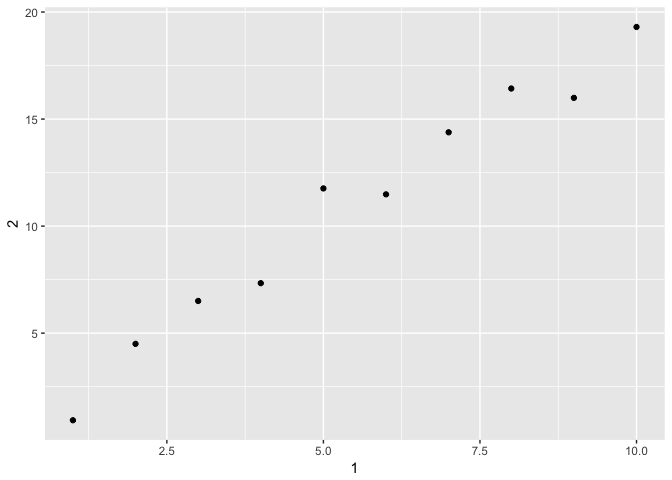

# DataExp_part2_2017-05-28.Rmd
chapter 7, part 2 (7.6 - 7.8)
Workflow chapter
Tibbles chapter


## 7.  Data Exploration 

### 7.6 patterns and models


```r
library(tidyverse)
```

```
## Loading tidyverse: ggplot2
## Loading tidyverse: tibble
## Loading tidyverse: tidyr
## Loading tidyverse: readr
## Loading tidyverse: purrr
## Loading tidyverse: dplyr
```

```
## Conflicts with tidy packages ----------------------------------------------
```

```
## filter(): dplyr, stats
## lag():    dplyr, stats
```

```r
library(modelr)
mod <- lm(log(price) ~ log(carat), data = diamonds)

diamonds2 <- diamonds %>% 
  add_residuals(mod) %>% 
  mutate(resid = exp(resid))

ggplot(data = diamonds2) + 
  geom_point(mapping = aes(x = carat, y = resid))
```

<!-- -->

```r
ggplot(data = diamonds2) + 
  geom_boxplot(mapping = aes(x = cut, y = resid))
```

<!-- -->

### 7.7 ggplot calls


```r
diamonds %>% 
  count(cut, clarity) %>% 
  ggplot(aes(clarity, cut, fill = n)) + 
    geom_tile()  # can pipe the extracted data to gglot without explicitly naming it
```

<!-- -->

## 8.  Workflow

keyboard shortcuts that will work together to make sure you’ve captured the important parts of your code in the editor:

Press Cmd/Ctrl + Shift + F10 to restart RStudio.
Press Cmd/Ctrl + Shift + S to rerun the current script.

### 8.3 Paths

Never use absolute paths in scripts - bad for sharing.


```r
getwd()
```

```
## [1] "/Users/slharmer/R /R_club_RforDataScience/Rclub-r4ds_Stacey.Harmer/R-club-May-31"
```

## 10.  Tibbles

### 10.2  Creating Tibbles


```r
as_tibble(iris)
```

```
## # A tibble: 150 × 5
##    Sepal.Length Sepal.Width Petal.Length Petal.Width Species
##           <dbl>       <dbl>        <dbl>       <dbl>  <fctr>
## 1           5.1         3.5          1.4         0.2  setosa
## 2           4.9         3.0          1.4         0.2  setosa
## 3           4.7         3.2          1.3         0.2  setosa
## 4           4.6         3.1          1.5         0.2  setosa
## 5           5.0         3.6          1.4         0.2  setosa
## 6           5.4         3.9          1.7         0.4  setosa
## 7           4.6         3.4          1.4         0.3  setosa
## 8           5.0         3.4          1.5         0.2  setosa
## 9           4.4         2.9          1.4         0.2  setosa
## 10          4.9         3.1          1.5         0.1  setosa
## # ... with 140 more rows
```

```r
tibble(
  x = 1:5, 
  y = 1, 
  z = x ^ 2 + y
)
```

```
## # A tibble: 5 × 3
##       x     y     z
##   <int> <dbl> <dbl>
## 1     1     1     2
## 2     2     1     5
## 3     3     1    10
## 4     4     1    17
## 5     5     1    26
```

```r
ex <- tribble(
  ~x,  ~y,
  "a", 1:3,
  "b", 4:6
)
ex
```

```
## # A tibble: 2 × 2
##       x         y
##   <chr>    <list>
## 1     a <int [3]>
## 2     b <int [3]>
```

```r
ex$y  # now I can see the lists
```

```
## [[1]]
## [1] 1 2 3
## 
## [[2]]
## [1] 4 5 6
```

Tibbles can handle non-standard column names. Just use the backtick, which is found on my keyboard on same key as ~


```r
tb <- tibble(
  `:)` = "smile", 
  ` ` = "space",
  `2000` = "number"
)
tb
```

```
## # A tibble: 1 × 3
##    `:)`   ` ` `2000`
##   <chr> <chr>  <chr>
## 1 smile space number
```

A Tribble is a transposed tibble


```r
tibble(
  a = lubridate::now() + runif(1e3) * 86400,
  b = lubridate::today() + runif(1e3) * 30,
  c = 1:1e3,
  d = runif(1e3),
  e = sample(letters, 1e3, replace = TRUE)
)
```

```
## # A tibble: 1,000 × 5
##                      a          b     c          d     e
##                 <dttm>     <date> <int>      <dbl> <chr>
## 1  2017-05-30 20:11:01 2017-06-11     1 0.56082779     y
## 2  2017-05-29 23:52:51 2017-06-16     2 0.48996811     q
## 3  2017-05-30 00:43:32 2017-06-06     3 0.64778004     z
## 4  2017-05-30 20:33:06 2017-05-31     4 0.71619307     i
## 5  2017-05-30 09:52:48 2017-06-13     5 0.03721926     j
## 6  2017-05-30 08:39:06 2017-06-06     6 0.17936133     i
## 7  2017-05-30 20:52:02 2017-06-03     7 0.96699474     w
## 8  2017-05-30 10:19:17 2017-06-16     8 0.18761223     m
## 9  2017-05-30 05:20:19 2017-06-09     9 0.93857634     x
## 10 2017-05-30 01:40:17 2017-06-19    10 0.38325657     w
## # ... with 990 more rows
```

```r
nycflights13::flights %>% 
  print(n = 10, width = Inf)
```

```
## # A tibble: 336,776 × 19
##     year month   day dep_time sched_dep_time dep_delay arr_time
##    <int> <int> <int>    <int>          <int>     <dbl>    <int>
## 1   2013     1     1      517            515         2      830
## 2   2013     1     1      533            529         4      850
## 3   2013     1     1      542            540         2      923
## 4   2013     1     1      544            545        -1     1004
## 5   2013     1     1      554            600        -6      812
## 6   2013     1     1      554            558        -4      740
## 7   2013     1     1      555            600        -5      913
## 8   2013     1     1      557            600        -3      709
## 9   2013     1     1      557            600        -3      838
## 10  2013     1     1      558            600        -2      753
##    sched_arr_time arr_delay carrier flight tailnum origin  dest air_time
##             <int>     <dbl>   <chr>  <int>   <chr>  <chr> <chr>    <dbl>
## 1             819        11      UA   1545  N14228    EWR   IAH      227
## 2             830        20      UA   1714  N24211    LGA   IAH      227
## 3             850        33      AA   1141  N619AA    JFK   MIA      160
## 4            1022       -18      B6    725  N804JB    JFK   BQN      183
## 5             837       -25      DL    461  N668DN    LGA   ATL      116
## 6             728        12      UA   1696  N39463    EWR   ORD      150
## 7             854        19      B6    507  N516JB    EWR   FLL      158
## 8             723       -14      EV   5708  N829AS    LGA   IAD       53
## 9             846        -8      B6     79  N593JB    JFK   MCO      140
## 10            745         8      AA    301  N3ALAA    LGA   ORD      138
##    distance  hour minute           time_hour
##       <dbl> <dbl>  <dbl>              <dttm>
## 1      1400     5     15 2013-01-01 05:00:00
## 2      1416     5     29 2013-01-01 05:00:00
## 3      1089     5     40 2013-01-01 05:00:00
## 4      1576     5     45 2013-01-01 05:00:00
## 5       762     6      0 2013-01-01 06:00:00
## 6       719     5     58 2013-01-01 05:00:00
## 7      1065     6      0 2013-01-01 06:00:00
## 8       229     6      0 2013-01-01 06:00:00
## 9       944     6      0 2013-01-01 06:00:00
## 10      733     6      0 2013-01-01 06:00:00
## # ... with 3.368e+05 more rows
```

### 10.3  Subsetting


```r
df <- tibble(
  x = runif(5),
  y = rnorm(5)
)

# Extract by name
df$x
```

```
## [1] 0.70194046 0.83536726 0.10245580 0.01199939 0.38296469
```

```r
#> [1] 0.434 0.395 0.548 0.762 0.254
df[["x"]]
```

```
## [1] 0.70194046 0.83536726 0.10245580 0.01199939 0.38296469
```

```r
#> [1] 0.434 0.395 0.548 0.762 0.254

# Extract by position
df[[1]]
```

```
## [1] 0.70194046 0.83536726 0.10245580 0.01199939 0.38296469
```

 NOTE - to use subsetted data in a pipe, you need a placeholder  (a period)
 
 

```r
df %>% .$x
```

```
## [1] 0.70194046 0.83536726 0.10245580 0.01199939 0.38296469
```

```r
#> [1] 0.434 0.395 0.548 0.762 0.254
df %>% .[["x"]]
```

```
## [1] 0.70194046 0.83536726 0.10245580 0.01199939 0.38296469
```

### 10.5  Exercises

#### 10.5.1 How can you tell if an object is a tibble?

```r
ex <- tribble(
  ~x,  ~y,
  "a", 1:3,
  "b", 4:6
)
ex  # tells me it is a tibble
```

```
## # A tibble: 2 × 2
##       x         y
##   <chr>    <list>
## 1     a <int [3]>
## 2     b <int [3]>
```

```r
mtcars  # Does not say what it is
```

```
##                      mpg cyl  disp  hp drat    wt  qsec vs am gear carb
## Mazda RX4           21.0   6 160.0 110 3.90 2.620 16.46  0  1    4    4
## Mazda RX4 Wag       21.0   6 160.0 110 3.90 2.875 17.02  0  1    4    4
## Datsun 710          22.8   4 108.0  93 3.85 2.320 18.61  1  1    4    1
## Hornet 4 Drive      21.4   6 258.0 110 3.08 3.215 19.44  1  0    3    1
## Hornet Sportabout   18.7   8 360.0 175 3.15 3.440 17.02  0  0    3    2
## Valiant             18.1   6 225.0 105 2.76 3.460 20.22  1  0    3    1
## Duster 360          14.3   8 360.0 245 3.21 3.570 15.84  0  0    3    4
## Merc 240D           24.4   4 146.7  62 3.69 3.190 20.00  1  0    4    2
## Merc 230            22.8   4 140.8  95 3.92 3.150 22.90  1  0    4    2
## Merc 280            19.2   6 167.6 123 3.92 3.440 18.30  1  0    4    4
## Merc 280C           17.8   6 167.6 123 3.92 3.440 18.90  1  0    4    4
## Merc 450SE          16.4   8 275.8 180 3.07 4.070 17.40  0  0    3    3
## Merc 450SL          17.3   8 275.8 180 3.07 3.730 17.60  0  0    3    3
## Merc 450SLC         15.2   8 275.8 180 3.07 3.780 18.00  0  0    3    3
## Cadillac Fleetwood  10.4   8 472.0 205 2.93 5.250 17.98  0  0    3    4
## Lincoln Continental 10.4   8 460.0 215 3.00 5.424 17.82  0  0    3    4
## Chrysler Imperial   14.7   8 440.0 230 3.23 5.345 17.42  0  0    3    4
## Fiat 128            32.4   4  78.7  66 4.08 2.200 19.47  1  1    4    1
## Honda Civic         30.4   4  75.7  52 4.93 1.615 18.52  1  1    4    2
## Toyota Corolla      33.9   4  71.1  65 4.22 1.835 19.90  1  1    4    1
## Toyota Corona       21.5   4 120.1  97 3.70 2.465 20.01  1  0    3    1
## Dodge Challenger    15.5   8 318.0 150 2.76 3.520 16.87  0  0    3    2
## AMC Javelin         15.2   8 304.0 150 3.15 3.435 17.30  0  0    3    2
## Camaro Z28          13.3   8 350.0 245 3.73 3.840 15.41  0  0    3    4
## Pontiac Firebird    19.2   8 400.0 175 3.08 3.845 17.05  0  0    3    2
## Fiat X1-9           27.3   4  79.0  66 4.08 1.935 18.90  1  1    4    1
## Porsche 914-2       26.0   4 120.3  91 4.43 2.140 16.70  0  1    5    2
## Lotus Europa        30.4   4  95.1 113 3.77 1.513 16.90  1  1    5    2
## Ford Pantera L      15.8   8 351.0 264 4.22 3.170 14.50  0  1    5    4
## Ferrari Dino        19.7   6 145.0 175 3.62 2.770 15.50  0  1    5    6
## Maserati Bora       15.0   8 301.0 335 3.54 3.570 14.60  0  1    5    8
## Volvo 142E          21.4   4 121.0 109 4.11 2.780 18.60  1  1    4    2
```

#### 10.5.2    Compare and contrast the following operations on a data.frame and equivalent tibble. What is different? Why might the default data frame behaviours cause you frustration?


```r
df <- data.frame(abc = 1, xyz = "a")
df
```

```
##   abc xyz
## 1   1   a
```

```r
str(df)  # 1 observation of 2 variables
```

```
## 'data.frame':	1 obs. of  2 variables:
##  $ abc: num 1
##  $ xyz: Factor w/ 1 level "a": 1
```

```r
df$x  # I just get 'a';  this is due to partial matching of column name
```

```
## [1] a
## Levels: a
```

```r
df[, "xyz"] # this is as I would have expected
```

```
## [1] a
## Levels: a
```

```r
df[, c("abc", "xyz")] # as is this.  but a lot of typing
```

```
##   abc xyz
## 1   1   a
```

```r
df.tib <- tibble(abc = 1, xyz = "a")
df.tib
```

```
## # A tibble: 1 × 2
##     abc   xyz
##   <dbl> <chr>
## 1     1     a
```

```r
df.tib$x # error message
```

```
## Warning: Unknown or uninitialised column: 'x'.
```

```
## NULL
```

```r
df.tib[, "xyz"]  # returns in format that makes clear what I've asked for
```

```
## # A tibble: 1 × 1
##     xyz
##   <chr>
## 1     a
```

```r
df.tib[, c("abc", "xyz")] # ditto
```

```
## # A tibble: 1 × 2
##     abc   xyz
##   <dbl> <chr>
## 1     1     a
```

#### 10.5.3   If you have the name of a variable stored in an object, e.g. var <- "mpg", how can you extract the reference variable from a tibble?


```r
str(mtcars)
```

```
## 'data.frame':	32 obs. of  11 variables:
##  $ mpg : num  21 21 22.8 21.4 18.7 18.1 14.3 24.4 22.8 19.2 ...
##  $ cyl : num  6 6 4 6 8 6 8 4 4 6 ...
##  $ disp: num  160 160 108 258 360 ...
##  $ hp  : num  110 110 93 110 175 105 245 62 95 123 ...
##  $ drat: num  3.9 3.9 3.85 3.08 3.15 2.76 3.21 3.69 3.92 3.92 ...
##  $ wt  : num  2.62 2.88 2.32 3.21 3.44 ...
##  $ qsec: num  16.5 17 18.6 19.4 17 ...
##  $ vs  : num  0 0 1 1 0 1 0 1 1 1 ...
##  $ am  : num  1 1 1 0 0 0 0 0 0 0 ...
##  $ gear: num  4 4 4 3 3 3 3 4 4 4 ...
##  $ carb: num  4 4 1 1 2 1 4 2 2 4 ...
```

```r
mtcars.tib <- as_tibble(mtcars)

var <- "mpg"

mtcars.tib[[var]] # that worked
```

```
##  [1] 21.0 21.0 22.8 21.4 18.7 18.1 14.3 24.4 22.8 19.2 17.8 16.4 17.3 15.2
## [15] 10.4 10.4 14.7 32.4 30.4 33.9 21.5 15.5 15.2 13.3 19.2 27.3 26.0 30.4
## [29] 15.8 19.7 15.0 21.4
```

```r
# mtcars %>% .$var  # doesn't work
# mtcars$var  # doesn't work

mtcars$mpg # does work
```

```
##  [1] 21.0 21.0 22.8 21.4 18.7 18.1 14.3 24.4 22.8 19.2 17.8 16.4 17.3 15.2
## [15] 10.4 10.4 14.7 32.4 30.4 33.9 21.5 15.5 15.2 13.3 19.2 27.3 26.0 30.4
## [29] 15.8 19.7 15.0 21.4
```

#### 10.5.4   Practice referring to non-syntactic names in the following data frame by:


```r
annoying <- tibble(
  `1` = 1:10,
  `2` = `1` * 2 + rnorm(length(`1`))
)
# extract the variable called 1

annoying[1] # still a tibble
```

```
## # A tibble: 10 × 1
##      `1`
##    <int>
## 1      1
## 2      2
## 3      3
## 4      4
## 5      5
## 6      6
## 7      7
## 8      8
## 9      9
## 10    10
```

```r
annoying[[1]]  # a vector
```

```
##  [1]  1  2  3  4  5  6  7  8  9 10
```

```r
annoying$`1` # a vector
```

```
##  [1]  1  2  3  4  5  6  7  8  9 10
```

```r
#Plotting a scatterplot of 1 vs 2.

ggplot(annoying, aes(`1`, `2`)) +
  geom_point()
```

<!-- -->

```r
# Creating a new column called 3 which is 2 divided by 1.

annoying.2 <- mutate(annoying,
                     `3` = `2`/`1`)
# OR
annoying[["3"]]  <- annoying[["2"]]/annoying[["1"]]

# Renaming the columns to one, two and three.

annoying.3 <- select(annoying.2, 1, 2,3) # that runs
annoying.3 <- rename(annoying.2, one = `1`, two = `2`, three = `3`) # that took some fiddling
```

#### 10.5.5   What does tibble::enframe() do? When might you use it?


```r
rainbow <- c("red", "orange", "yellow", "green", "blue", "indigo", "violet")

enframe(rainbow)  # makes a tibble.  automatically provides a rownumber column
```

```
## # A tibble: 7 × 2
##    name  value
##   <int>  <chr>
## 1     1    red
## 2     2 orange
## 3     3 yellow
## 4     4  green
## 5     5   blue
## 6     6 indigo
## 7     7 violet
```

```r
#  enframe(letters[1:7], rainbow)  #error

# this only works with vectors of lists (to create a 2 column vdate frame)
```

Seems like a fast way to convert vector to dataframe. 


#### 10.5.6   What option controls how many additional column names are printed at the footer of a tibble?

This is controlled by how many columns you view the values for

Here are some setting options:

options(tibble.print_max = n, tibble.print_min = m): if more than m rows, print only n rows. 

Use options(dplyr.print_min = Inf) to always show all rows.

Use options(tibble.width = Inf) to always print all columns, regardless of the width of the screen.


```r
package?tibble
```

I find that: 
tibble.max_extra_cols
Number of extra columns printed in reduced form. Default: 100.
