# Rclub_Sept20
Stacey Harmer  
9/13/2017  

Sept 20: Chapter 22 (it is short) + Chapter 23.1 - 23.2


# 22 Intro to models

pair of ideas that you must understand in order to do inference correctly:

Each observation can either be used for exploration or confirmation, not both.

You can use an observation as many times as you like for exploration, but you can only use it once for confirmation. As soon as you use an observation twice, you’ve switched from confirmation to exploration.

# 23  Model Basics


```r
library(tidyverse)
```

```
## Loading tidyverse: ggplot2
## Loading tidyverse: tibble
## Loading tidyverse: tidyr
## Loading tidyverse: readr
## Loading tidyverse: purrr
## Loading tidyverse: dplyr
```

```
## Conflicts with tidy packages ----------------------------------------------
```

```
## filter(): dplyr, stats
## lag():    dplyr, stats
```

```r
library(modelr)
options(na.action = na.warn)
```

# 23.2  A simple model


```r
ggplot(sim1, aes(x, y)) + 
  geom_point()
```

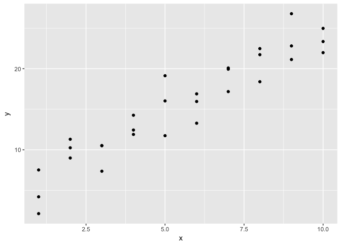<!-- -->


```r
models <- tibble(
  a1 = runif(250, -20, 40),
  a2 = runif(250, -5, 5)
)
```


```r
ggplot(sim1, aes(x, y)) + 
  geom_abline(aes(intercept = a1, slope = a2), data = models, alpha = 1/4) +
  geom_point()
```

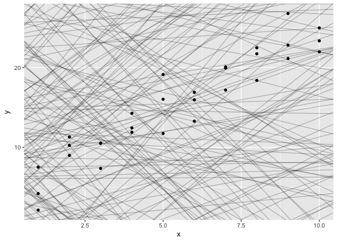<!-- -->

we first turn our model family into an R function. This takes the model parameters and the data as inputs, and gives values predicted by the model as output:


```r
model1 <- function(a, data) {
  a[1] + data$x * a[2]
}

model1(c(7, 1.5), sim1)
```

```
##  [1]  8.5  8.5  8.5 10.0 10.0 10.0 11.5 11.5 11.5 13.0 13.0 13.0 14.5 14.5
## [15] 14.5 16.0 16.0 16.0 17.5 17.5 17.5 19.0 19.0 19.0 20.5 20.5 20.5 22.0
## [29] 22.0 22.0
```


```r
measure_distance <- function(mod, data) {
  diff <- data$y - model1(mod, data)
  sqrt(mean(diff ^ 2))
}
measure_distance(c(7, 1.5), sim1)
```

```
## [1] 2.665212
```

```r
#> [1] 2.67
```

now expand to the big list of coeffs

```r
sim1_dist <- function(a1, a2) {
  measure_distance(c(a1, a2), sim1)
}

models <- models %>% 
  mutate(dist = purrr::map2_dbl(a1, a2, sim1_dist))
models
```

```
## # A tibble: 250 × 3
##            a1          a2      dist
##         <dbl>       <dbl>     <dbl>
## 1    7.209987  4.17198936 16.009231
## 2   12.584311  4.81556449 24.957935
## 3   35.306505 -4.09313623 17.982441
## 4    5.891299  3.97150224 13.583866
## 5   29.031651 -1.87370030 11.917309
## 6    3.756869 -3.36590146 34.092714
## 7    8.444701  1.32888471  2.983225
## 8   23.199365 -1.80025154 11.480236
## 9   35.145920  2.50938036 33.536697
## 10 -13.394525 -0.09144168 30.114389
## # ... with 240 more rows
```

overlay 10 best models on the data


```r
ggplot(sim1, aes(x, y)) + 
  geom_point(size = 2, colour = "grey30") + 
  geom_abline(
    aes(intercept = a1, slope = a2, colour = -dist), 
    data = filter(models, rank(dist) <= 10)
  )
```

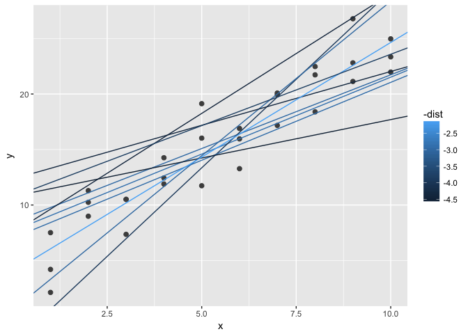<!-- -->

```r
ggplot(sim1, aes(x, y)) + 
  geom_point(size = 2, colour = "grey30") + 
  geom_abline(
    aes(intercept = a1, slope = a2, colour = -dist), 
    data = filter(models, rank(dist) <= 3)
  )
```

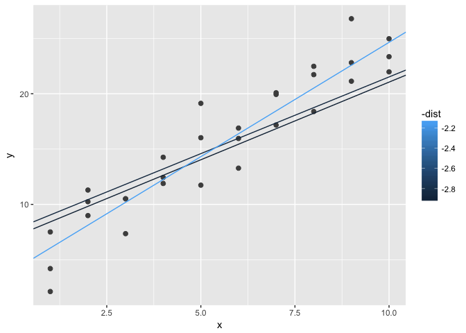<!-- -->

Or look at model parameters


```r
ggplot(models, aes(a1, a2)) +
  geom_point(data = filter(models, rank(dist) <= 10), size = 4, colour = "red") +
  geom_point(aes(colour = -dist))
```

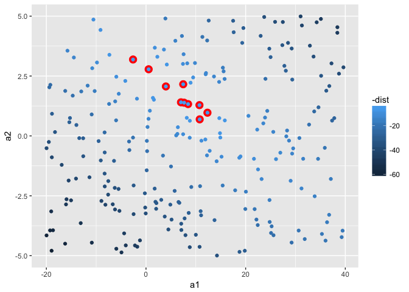<!-- -->

```r
ggplot(models, aes(a1, a2)) +
  geom_point(data = filter(models, rank(dist) <= 2), size = 4, colour = "red") +
  geom_point(aes(colour = -dist))
```

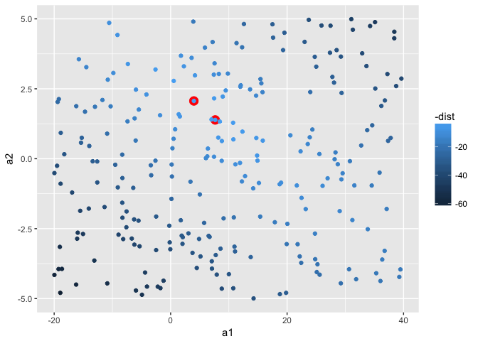<!-- -->

Or, start with a grid search


```r
grid <- expand.grid(
  a1 = seq(-5, 0, length = 5),
  a2 = seq(1, 2, length = 5)
  )

grid <- expand.grid(
  a1 = seq(-5, 20, length = 25),
  a2 = seq(1, 3, length = 25)
  ) %>% 
  mutate(dist = purrr::map2_dbl(a1, a2, sim1_dist))

grid %>% 
  ggplot(aes(a1, a2)) +
  geom_point(data = filter(grid, rank(dist) <= 10), size = 4, colour = "red") +
  geom_point(aes(colour = -dist)) 
```

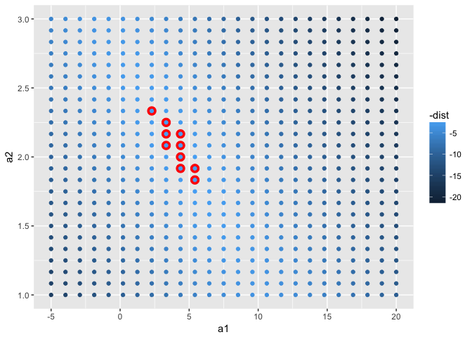<!-- -->

back to dataset


```r
  ggplot(sim1, aes(x, y)) + 
    geom_point(size = 2, colour = "grey30") + 
    geom_abline(
      aes(intercept = a1, slope = a2, colour = -dist), 
      data = filter(grid, rank(dist) <= 10)
    )
```

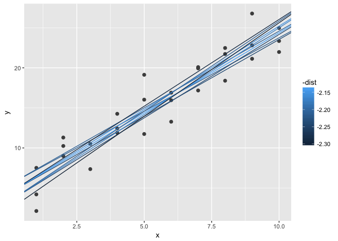<!-- -->

better way to optimum model:


```r
best <- optim(c(0, 0), measure_distance, data = sim1) 
head(best)
```

```
## $par
## [1] 4.222248 2.051204
## 
## $value
## [1] 2.128181
## 
## $counts
## function gradient 
##       77       NA 
## 
## $convergence
## [1] 0
## 
## $message
## NULL
```

```r
best$par  
```

```
## [1] 4.222248 2.051204
```

```r
#> [1] 4.22 2.05

ggplot(sim1, aes(x, y)) + 
  geom_point(size = 2, colour = "grey30") + 
  geom_abline(intercept = best$par[1], slope = best$par[2])
```

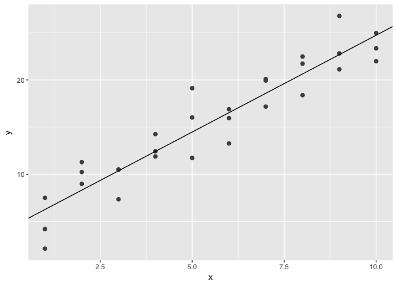<!-- -->

linear model


```r
sim1_mod <- lm(y ~ x, data = sim1)
coef(sim1_mod)
```

```
## (Intercept)           x 
##    4.220822    2.051533
```

```r
summary(sim1_mod)
```

```
## 
## Call:
## lm(formula = y ~ x, data = sim1)
## 
## Residuals:
##     Min      1Q  Median      3Q     Max 
## -4.1469 -1.5197  0.1331  1.4670  4.6516 
## 
## Coefficients:
##             Estimate Std. Error t value Pr(>|t|)    
## (Intercept)   4.2208     0.8688   4.858 4.09e-05 ***
## x             2.0515     0.1400  14.651 1.17e-14 ***
## ---
## Signif. codes:  0 '***' 0.001 '**' 0.01 '*' 0.05 '.' 0.1 ' ' 1
## 
## Residual standard error: 2.203 on 28 degrees of freedom
## Multiple R-squared:  0.8846,	Adjusted R-squared:  0.8805 
## F-statistic: 214.7 on 1 and 28 DF,  p-value: 1.173e-14
```

## 23.2.1  Exercises

1. One downside of the linear model is that it is sensitive to unusual values because the distance incorporates a squared term. Fit a linear model to the simulated data below, and visualise the results. Rerun a few times to generate different simulated datasets. What do you notice about the model?


```r
sim1a <- tibble(
  x = rep(1:10, each = 3),
  y = x * 1.5 + 6 + rt(length(x), df = 2)
)

# model fit
sim_mod_1a <- lm(y ~ x, data = sim1a)
sim_mod_1a[[1]][1]
```

```
## (Intercept) 
##    5.318395
```

```r
ggplot(sim1a, aes(x, y)) + 
  geom_point(size = 2, colour = "grey30") + 
  geom_abline(intercept = sim_mod_1a[[1]][1], slope = sim_mod_1a[[1]][2])
```

<!-- -->

had to run a few times till I got a version that is really weird.
here, one outlier seemed to change entire slope of line

Keep my last, weird dataset

```r
sim_odd <- sim1a 

ggplot(sim_odd, aes(x, y)) + 
  geom_point(size = 2, colour = "grey30") + 
  geom_abline(intercept = sim_mod_1a[[1]][1], slope = sim_mod_1a[[1]][2])
```

<!-- -->

```r
best_odd <- optim(c(0, 0), measure_distance, data = sim_odd)
best_odd$par
```

```
## [1] 5.318279 1.693092
```

```r
ggplot(sim_odd, aes(x, y)) + 
  geom_point(size = 2, colour = "grey30") + 
  geom_abline(intercept = best_odd$par[1], slope = best_odd$par[2])
```

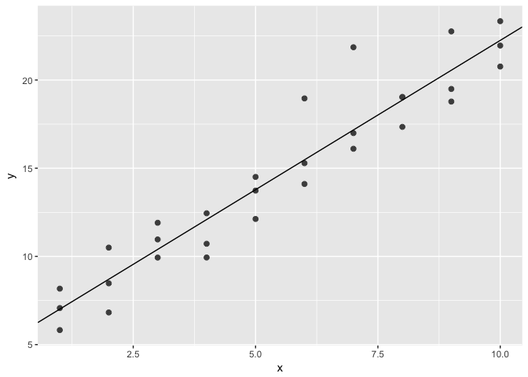<!-- -->

```r
# these plots are pretty identical
```


2.  One way to make linear models more robust is to use a different distance measure. For example, instead of root-mean-squared distance, you could use mean-absolute distance:


```r
make_prediction <- function(a, data){
   a[1] + data$x * a[2]
}

measure_distance <- function(mod, data) {
  diff <- data$y - make_prediction(mod, data)
  mean(abs(diff))
}
```

Use optim() to fit this model to the simulated data above and compare it to the linear model.


```r
optim_mean_ab_dist <- optim(c(0, 0), measure_distance, data = sim_odd)
optim_mean_ab_dist$par
```

```
## [1] 5.417690 1.653415
```

```r
ggplot(sim_odd, aes(x, y)) + 
  geom_point(size = 2, colour = "grey30") + 
  geom_abline(intercept = optim_mean_ab_dist$par[1], slope = optim_mean_ab_dist$par[2])
```

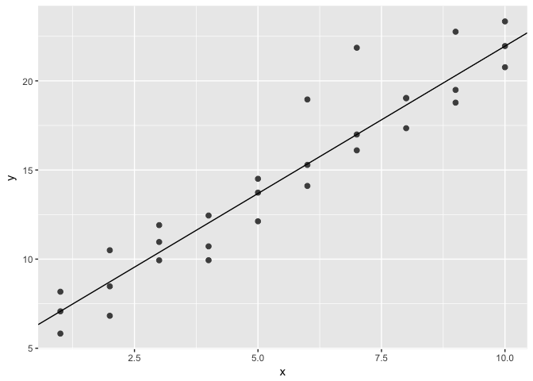<!-- -->

Yes, that looks much better.

3. One challenge with performing numerical optimisation is that it’s only guaranteed to find one local optima. What’s the problem with optimising a three parameter model like this?


```r
model1 <- function(a, data) {
  a[1] + data$x * a[2] + a[3]
}
```

I would guess that with 3 parameters there are many ways to optimize, and that solutions with similar optimization metrics may have very different parameter values.

(that is, as long as a1 and a3 equal same value, will fit equivalently)
