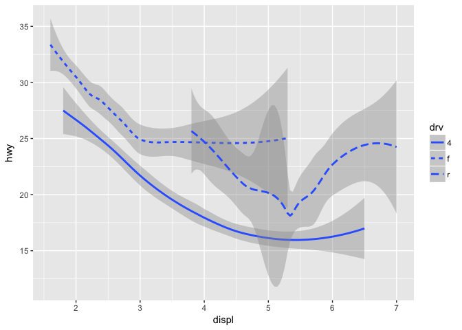
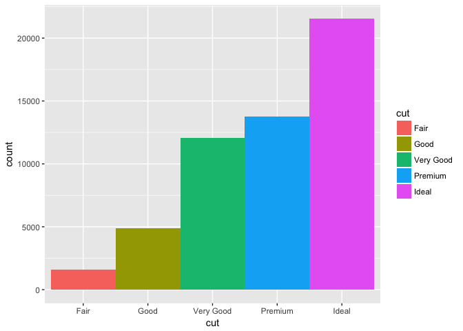
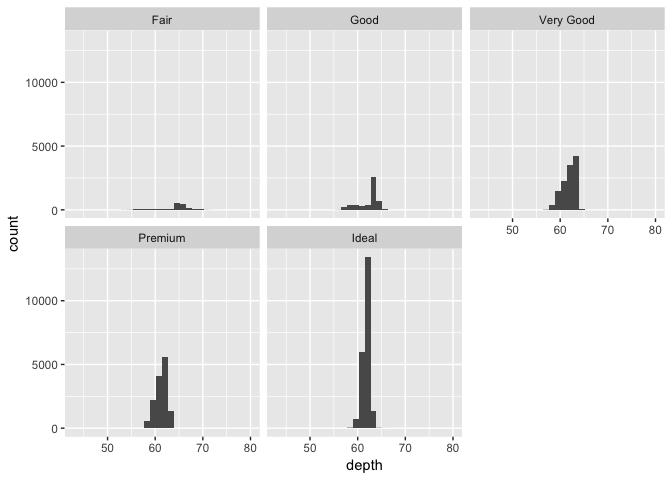
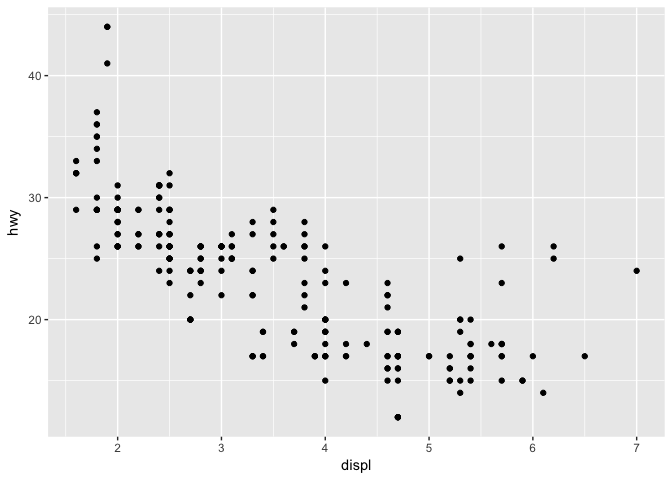

# DataVis_part2_2017-05-01.Rmd
Stacey Harmer  
5/1/2017  


### Section 3.6: Geometric objects


```
## Loading tidyverse: ggplot2
## Loading tidyverse: tibble
## Loading tidyverse: tidyr
## Loading tidyverse: readr
## Loading tidyverse: purrr
## Loading tidyverse: dplyr
```

```
## Conflicts with tidy packages ----------------------------------------------
```

```
## filter(): dplyr, stats
## lag():    dplyr, stats
```

```
## `geom_smooth()` using method = 'loess'
```

<!-- -->

####  3.6.1 Exercises

##### 1.  What geom to draw:
linechart: geom_smooth, or geom_(ab/h/v)line, or geom_segment, or geom_spoke
boxplot: geom_boxplot
histogram: geom_histogram
area chart: geom_area

##### 2.  Predict output of code cblock.
scatterplot, hwy vs displ, colored by drive type.  then a smoothed line over it fitting all the data.
That last point was wrong; geom_smooth took the color by drv argument.


```r
ggplot(data = mpg, mapping = aes(x = displ, y = hwy, color = drv)) + 
  geom_point() + 
  geom_smooth(se = FALSE)
```

```
## `geom_smooth()` using method = 'loess'
```

<!-- -->

##### 3.  show.legend = FALSE.  default is true


```r
ggplot(data = diamonds) + 
  geom_bar(
    mapping = aes(x = cut, fill = cut), 
    show.legend = FALSE,
    width = 1
  )
```

<!-- -->

```r
#and
ggplot(data = diamonds) + 
  geom_bar(
    mapping = aes(x = cut, fill = cut), 
    width = 1
  )
```

<!-- -->
##### 4.  se argument for geom_smooth - adds std error interval to graph


```r
ggplot(data = mpg, mapping = aes(x = displ, y = hwy, color = drv)) + 
  geom_point() + 
  geom_smooth(se = FALSE)
```

```
## `geom_smooth()` using method = 'loess'
```

<!-- -->

```r
# compare to

ggplot(data = mpg, mapping = aes(x = displ, y = hwy, color = drv)) + 
  geom_point() + 
  geom_smooth(se = TRUE)
```

```
## `geom_smooth()` using method = 'loess'
```

<!-- -->

##### 5.  will graphs look different?  No, will look the same.  2nd is just more verbose.

##### 6.  Recreate R code for below

```r
# 1.
ggplot(data = mpg, mapping = aes(x = displ, y = hwy)) + 
  geom_point() + 
  geom_smooth(se = FALSE)
```

```
## `geom_smooth()` using method = 'loess'
```

<!-- -->

```r
# 2.
ggplot(data = mpg, mapping = aes(x = displ, y = hwy)) + 
  geom_point() + 
  geom_smooth(mapping = aes(group = drv), se = FALSE)
```

```
## `geom_smooth()` using method = 'loess'
```

<!-- -->

```r
# 3.
ggplot(data = mpg, mapping = aes(x = displ, y = hwy, color = drv)) + 
  geom_point() + 
  geom_smooth( se = FALSE)
```

```
## `geom_smooth()` using method = 'loess'
```

<!-- -->

```r
# 4.
ggplot(data = mpg, mapping = aes(x = displ, y = hwy)) + 
  geom_point(mapping = aes(color = drv)) + 
  geom_smooth( se = FALSE)
```

```
## `geom_smooth()` using method = 'loess'
```

<!-- -->

```r
# 5.
ggplot(data = mpg, mapping = aes(x = displ, y = hwy)) + 
  geom_point(mapping = aes(color = drv)) + 
  geom_smooth( se = FALSE, mapping = aes(linetype = drv))
```

```
## `geom_smooth()` using method = 'loess'
```

<!-- -->

```r
# 6.
ggplot(data = mpg, mapping = aes(x = displ, y = hwy, color = drv)) + 
  geom_point(mapping = aes( fill = drv), size =3, shape = 21, stroke = 3, color= "white")
```

<!-- -->

### Section 3.7: Statistical transformations

to grph proportion, use aes(x = cut, y = ..prop.. , group = 1)
Note that you can use stat_summary to make a graph - kind of cool.

####  3.7.1 Exercises

##### 1. Geom associated with stat_summary
stat_summary is associteed with geom_histogram or geom_freqpoly

```r
ggplot(data = diamonds) + 
  stat_summary(
    mapping = aes(x = cut, y = depth),
    fun.ymin = min,
    fun.ymax = max,
    fun.y = median
  )
```

<!-- -->

```r
# rewrite to use geom_histogram
#ggplot(data = diamonds) + 
 # geom_histogram(
  #  mapping = aes(x = cut))
# failed, because x is not continous

ggplot(data = diamonds) + 
  geom_histogram(mapping = aes(x = cut), stat = "count")
```

```
## Warning: Ignoring unknown parameters: binwidth, bins, pad
```

<!-- -->

```r
# that works, but not graphing depth

ggplot(data = diamonds) + 
  geom_histogram(mapping = aes(x = depth)) +
  facet_wrap(~ cut)
```

```
## `stat_bin()` using `bins = 30`. Pick better value with `binwidth`.
```

<!-- -->

##### 2. geom_col vs geom_bar


```r
ggplot(data = diamonds) + 
  geom_col(
    mapping = aes(x = cut, y = depth))
```

<!-- -->

```r
# worked;  maps mean (?) values on y axis
# that is, heights of bars represents values in the data; no transformation

ggplot(data = diamonds) + 
  geom_bar(
    mapping = aes(x = cut))
```

<!-- -->

```r
# maps counts on y axis; transforms the data
```

##### 3. Make list of pairs of geoms and stats:
######  primitives
?geom_curve # stat = identity
?geom_path # identity
?geom_polygon # same
?geom_rect # same
?geom_ribbon # same
######  the line segments
?geom_segment # identity
?geom_spoke # identity
?geom_hline  #doesn't use a stat; values specified directly

######  one variable, continuous
?geom_area # identity
?geom_density # density
?geom_dotplot # identity
?geom_freqpoly # bin (histogram/frequency)
?geom_histogram # bin
?geom_qq #qnorm seems default distribution (quantile-quantile plot)

I think this uses stat_qq; which is only used for this.

######  various others:
?geom_count # stat is sum
? geom_hex # stat is binhex

##### 4. What variables does stat_smooth compute?  What parameters can be used?
computes the formula I specify; lots of flexibility with that
(default formula is y ~ x)

parameters include confidence interval, amount of smoothing 
 (span; smaller # is wigglier),
smoothign method (loess, lm, etc)

##### 5. what are the problems with these 2 graphs?


```r
ggplot(data = diamonds) + 
  geom_bar(mapping = aes(x = cut, y = ..prop..))
```

<!-- -->

```r
# this graph sets each category sum = 1, so toally uninformative

ggplot(data = diamonds) + 
  geom_bar(mapping = aes(x = cut, fill = color, y = ..prop..))
```

<!-- -->

```r
# as above, although this time split into the groups by color


ggplot(data = diamonds) + 
  geom_bar(mapping = aes(x = cut, fill = color, y = ..prop.., group = 1))
```

<!-- -->

```r
# much better

ggplot(data = diamonds) + 
  geom_bar(mapping = aes(x = cut, fill = color)) # now I can see all the subcategories
```

<!-- -->
although not clear to me why the number in the group category doesn't seem to matter


### Section 3.8: Position adjustments
default: stacked bars.  But can change position.  
Identity not very useful for bar graphs (need to use alpha).  
Fill can be useful for comparing proportions between categories
 dodge is also nice

####  3.8.1 Exercises

##### 1. problem = overplotting.  Jitter as solution

```r
ggplot(data = mpg, mapping = aes(x = cty, y = hwy)) + 
  geom_point()
```

<!-- -->

```r
ggplot(data = mpg, mapping = aes(x = cty, y = hwy)) + 
  geom_jitter()
```

<!-- -->

##### 2. parameters in geom_jitter?
position
width
height


```r
ggplot(data = mpg, mapping = aes(x = cty, y = hwy)) + 
  geom_jitter(position = "identity")  # that undoes the jitter; kind of useless
```

<!-- -->

```r
ggplot(data = mpg, mapping = aes(x = cty, y = hwy)) + 
  geom_jitter(position = "nudge")  # that undoes the jitter; kind of useless
```

<!-- -->

##### 3. geom_jitter vs geom_count

```r
example(geom_count)
```

```
## 
## gm_cnt> ggplot(mpg, aes(cty, hwy)) +
## gm_cnt+  geom_point()
```

<!-- -->

```
## 
## gm_cnt> ggplot(mpg, aes(cty, hwy)) +
## gm_cnt+  geom_count()
```

<!-- -->

```
## 
## gm_cnt> # Best used in conjunction with scale_size_area which ensures that
## gm_cnt> # counts of zero would be given size 0. Doesn't make much different
## gm_cnt> # here because the smallest count is already close to 0.
## gm_cnt> ggplot(mpg, aes(cty, hwy)) +
## gm_cnt+  geom_count() +
## gm_cnt+  scale_size_area()
```

<!-- -->

```
## 
## gm_cnt> # Display proportions instead of counts -------------------------------------
## gm_cnt> # By default, all categorical variables in the plot form the groups.
## gm_cnt> # Specifying geom_count without a group identifier leads to a plot which is
## gm_cnt> # not useful:
## gm_cnt> d <- ggplot(diamonds, aes(x = cut, y = clarity))
## 
## gm_cnt> d + geom_count(aes(size = ..prop..))
```

<!-- -->

```
## 
## gm_cnt> # To correct this problem and achieve a more desirable plot, we need
## gm_cnt> # to specify which group the proportion is to be calculated over.
## gm_cnt> d + geom_count(aes(size = ..prop.., group = 1)) +
## gm_cnt+   scale_size_area(max_size = 10)
```

<!-- -->

```
## 
## gm_cnt> # Or group by x/y variables to have rows/columns sum to 1.
## gm_cnt> d + geom_count(aes(size = ..prop.., group = cut)) +
## gm_cnt+   scale_size_area(max_size = 10)
```

<!-- -->

```
## 
## gm_cnt> d + geom_count(aes(size = ..prop.., group = clarity)) +
## gm_cnt+   scale_size_area(max_size = 10)
```

<!-- -->

```r
ggplot(data = mpg, mapping = aes(x = cty, y = hwy)) + 
  geom_jitter()
```

<!-- -->

```r
ggplot(data = mpg, mapping = aes(x = cty, y = hwy)) + 
  geom_count() # in some ways nicer than jitter
```

<!-- -->

```r
ggplot(data = mpg, mapping = aes(x = cty, y = hwy)) + 
  geom_count() +
  scale_size_area(max_size = 20)
```

<!-- -->

```r
# can specify hte size of hte symbols that way
```
can use the scale_size_area() to get sense of size of groups

##### 4. default position for geom_boxplot

```r
head(mpg)
```

```
## # A tibble: 6 × 11
##   manufacturer model displ  year   cyl      trans   drv   cty   hwy    fl
##          <chr> <chr> <dbl> <int> <int>      <chr> <chr> <int> <int> <chr>
## 1         audi    a4   1.8  1999     4   auto(l5)     f    18    29     p
## 2         audi    a4   1.8  1999     4 manual(m5)     f    21    29     p
## 3         audi    a4   2.0  2008     4 manual(m6)     f    20    31     p
## 4         audi    a4   2.0  2008     4   auto(av)     f    21    30     p
## 5         audi    a4   2.8  1999     6   auto(l5)     f    16    26     p
## 6         audi    a4   2.8  1999     6 manual(m5)     f    18    26     p
## # ... with 1 more variables: class <chr>
```

```r
summary(mpg)
```

```
##  manufacturer          model               displ            year     
##  Length:234         Length:234         Min.   :1.600   Min.   :1999  
##  Class :character   Class :character   1st Qu.:2.400   1st Qu.:1999  
##  Mode  :character   Mode  :character   Median :3.300   Median :2004  
##                                        Mean   :3.472   Mean   :2004  
##                                        3rd Qu.:4.600   3rd Qu.:2008  
##                                        Max.   :7.000   Max.   :2008  
##       cyl           trans               drv                 cty       
##  Min.   :4.000   Length:234         Length:234         Min.   : 9.00  
##  1st Qu.:4.000   Class :character   Class :character   1st Qu.:14.00  
##  Median :6.000   Mode  :character   Mode  :character   Median :17.00  
##  Mean   :5.889                                         Mean   :16.86  
##  3rd Qu.:8.000                                         3rd Qu.:19.00  
##  Max.   :8.000                                         Max.   :35.00  
##       hwy             fl               class          
##  Min.   :12.00   Length:234         Length:234        
##  1st Qu.:18.00   Class :character   Class :character  
##  Median :24.00   Mode  :character   Mode  :character  
##  Mean   :23.44                                        
##  3rd Qu.:27.00                                        
##  Max.   :44.00
```

```r
# let's plot displ, split by class
ggplot(data = mpg, mapping = aes(x = class, y = displ)) +
  geom_boxplot() # fine. 
```

<!-- -->

```r
ggplot(data = mpg, mapping = aes(x = class, y = displ)) +
  geom_boxplot(position = "dodge") # same 
```

<!-- -->

```r
ggplot(data = mpg, mapping = aes(x = class, y = displ)) +
  geom_boxplot(position = "identity") # same
```

<!-- -->

```r
#ggplot(data = mpg, mapping = aes(x = class, y = displ)) +
 # geom_boxplot(position = "stack") # error
#ggplot(data = mpg, mapping = aes(x = class, y = displ)) +
 # geom_boxplot(position = "fill")  # error
#ggplot(data = mpg, mapping = aes(x = class, y = displ)) +
#  geom_boxplot(position = "jitter") # error
ggplot(data = mpg, mapping = aes(x = class, y = displ), position = "jitter") +
  geom_boxplot() # looks same as original
```

<!-- -->

```r
# so I guess position = identity.  use information in data to specify position
```


### Section 3.9: Coordinate positions
coord_flip could be useful; can't think that I'll use coord_quickmap
but I might use coord_polar someday

####  3.9.1 Exercises

##### 1. take bar chart and make it a pie chart


```r
barplot <- ggplot(data = diamonds) + 
  geom_bar(mapping = aes(x = cut, fill = clarity))
# stacked bar chart

barplot
```

<!-- -->

```r
barplot + coord_polar()  #nice
```

<!-- -->

##### 2. What does labs() do?
Modifies axis, legend, and plot labels.

```r
example(labs)
```

```
## 
## labs> p <- ggplot(mtcars, aes(mpg, wt, colour = cyl)) + geom_point()
## 
## labs> p + labs(colour = "Cylinders")
```

<!-- -->

```
## 
## labs> p + labs(x = "New x label")
```

<!-- -->

```
## 
## labs> # The plot title appears at the top-left, with the subtitle
## labs> # display in smaller text underneath it
## labs> p + labs(title = "New plot title")
```

<!-- -->

```
## 
## labs> p + labs(title = "New plot title", subtitle = "A subtitle")
```

<!-- -->

```
## 
## labs> # The caption appears in the bottom-right, and is often used for
## labs> # sources, notes or copyright
## labs> p + labs(caption = "(based on data from ...)")
```

<!-- -->

##### 3. coord_quickmap vs coord_map


```r
nz <- map_data("nz")
```

```
## 
## Attaching package: 'maps'
```

```
## The following object is masked from 'package:purrr':
## 
##     map
```

```r
ggplot(nz, aes(long, lat, group = group)) +
  geom_polygon(fill = "white", colour = "black")
```

<!-- -->

```r
#weird proportions

ggplot(nz, aes(long, lat, group = group)) +
  geom_polygon(fill = "white", colour = "black") +
  coord_quickmap()  
```

<!-- -->

```r
ggplot(nz, aes(long, lat, group = group)) +
  geom_polygon(fill = "white", colour = "black") +
  coord_map()  
```

<!-- -->

```r
# proportions slightly different
?coord_map  # more precise than quickmap. 
# quickmap is faster - best close to equator
```

##### 4. relationship between cty and hwy mpg?

```r
ggplot(data = mpg, mapping = aes(x = cty, y = hwy)) +
  geom_point() + 
  geom_abline() +
  coord_fixed()
```

<!-- -->
roughly linear relationship between hwy and city mileage

```r
ggplot(data = mpg, mapping = aes(x = cty, y = hwy)) +
  geom_point() + 
  geom_abline() 
```

<!-- -->

```r
# without coord_fixed, graph not necesarily square.  

ggplot(data = mpg, mapping = aes(x = cty, y = hwy)) +
  geom_point() + 
  coord_fixed()
```

<!-- -->

```r
# abline adds a diagonal line
```


### Section 3.10: Grammar of graphics
7 parameters:  data, the geom function, aes mappings, the stat, position adjustment, coordinate function, and faceting.  

## Workflow: basics

### Section 4.1: Coding basics

```r
#  <-  nice shortcut!  Alt and minus key
```

####  4.4 Exercises

##### 1. spot the error
Annoying - a 1 not an i in the name

##### 2. fix the errors

```r
library(tidyverse)

ggplot(data = mpg) +  # data, not dota
  geom_point(mapping = aes(x = displ, y = hwy))
```

<!-- -->

```r
filter(mpg, cyl == 8) # filter, not fliter; and must be == 8
```

```
## # A tibble: 70 × 11
##    manufacturer              model displ  year   cyl      trans   drv
##           <chr>              <chr> <dbl> <int> <int>      <chr> <chr>
## 1          audi         a6 quattro   4.2  2008     8   auto(s6)     4
## 2     chevrolet c1500 suburban 2wd   5.3  2008     8   auto(l4)     r
## 3     chevrolet c1500 suburban 2wd   5.3  2008     8   auto(l4)     r
## 4     chevrolet c1500 suburban 2wd   5.3  2008     8   auto(l4)     r
## 5     chevrolet c1500 suburban 2wd   5.7  1999     8   auto(l4)     r
## 6     chevrolet c1500 suburban 2wd   6.0  2008     8   auto(l4)     r
## 7     chevrolet           corvette   5.7  1999     8 manual(m6)     r
## 8     chevrolet           corvette   5.7  1999     8   auto(l4)     r
## 9     chevrolet           corvette   6.2  2008     8 manual(m6)     r
## 10    chevrolet           corvette   6.2  2008     8   auto(s6)     r
## # ... with 60 more rows, and 4 more variables: cty <int>, hwy <int>,
## #   fl <chr>, class <chr>
```

```r
filter(diamonds, carat > 3) # diamonds, not diamond
```

```
## # A tibble: 32 × 10
##    carat     cut color clarity depth table price     x     y     z
##    <dbl>   <ord> <ord>   <ord> <dbl> <dbl> <int> <dbl> <dbl> <dbl>
## 1   3.01 Premium     I      I1  62.7    58  8040  9.10  8.97  5.67
## 2   3.11    Fair     J      I1  65.9    57  9823  9.15  9.02  5.98
## 3   3.01 Premium     F      I1  62.2    56  9925  9.24  9.13  5.73
## 4   3.05 Premium     E      I1  60.9    58 10453  9.26  9.25  5.66
## 5   3.02    Fair     I      I1  65.2    56 10577  9.11  9.02  5.91
## 6   3.01    Fair     H      I1  56.1    62 10761  9.54  9.38  5.31
## 7   3.65    Fair     H      I1  67.1    53 11668  9.53  9.48  6.38
## 8   3.24 Premium     H      I1  62.1    58 12300  9.44  9.40  5.85
## 9   3.22   Ideal     I      I1  62.6    55 12545  9.49  9.42  5.92
## 10  3.50   Ideal     H      I1  62.8    57 12587  9.65  9.59  6.03
## # ... with 22 more rows
```

##### 3. keyboard shorcut
Can access it via Alt + Shift + K
Can also go to file:///Applications/RStudio.app/Contents/Resources/www/docs/keyboard.htm
Or, look under the 'Tools' menu


