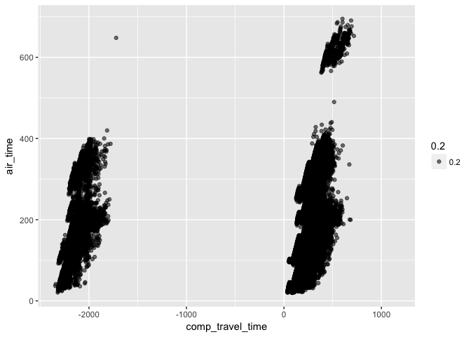
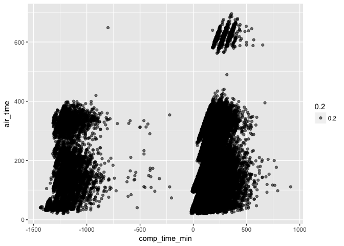
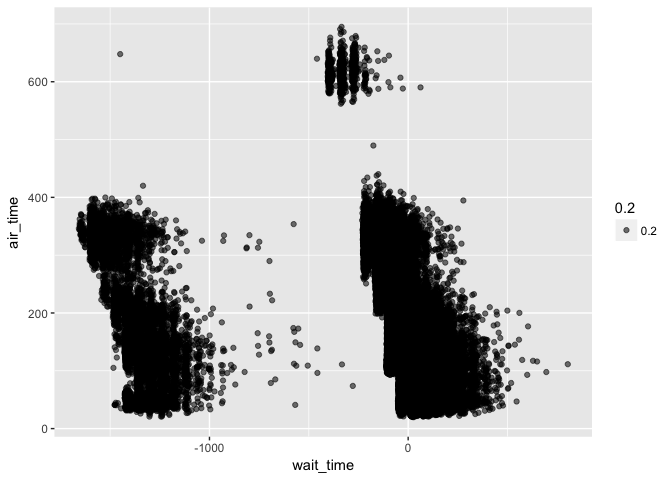
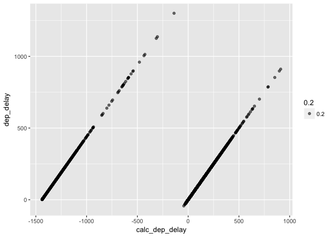

# DataTrans_part1_2017-05-04.Rmd
Stacey Harmer  
5/4/2017  


### Data Transformation (Ch 3 in book, Ch 5 online)


```r
library(nycflights13)
library(tidyverse)
```

```
## Loading tidyverse: ggplot2
## Loading tidyverse: tibble
## Loading tidyverse: tidyr
## Loading tidyverse: readr
## Loading tidyverse: purrr
## Loading tidyverse: dplyr
```

```
## Conflicts with tidy packages ----------------------------------------------
```

```
## filter(): dplyr, stats
## lag():    dplyr, stats
```

```r
flights
```

```
## # A tibble: 336,776 × 19
##     year month   day dep_time sched_dep_time dep_delay arr_time
##    <int> <int> <int>    <int>          <int>     <dbl>    <int>
## 1   2013     1     1      517            515         2      830
## 2   2013     1     1      533            529         4      850
## 3   2013     1     1      542            540         2      923
## 4   2013     1     1      544            545        -1     1004
## 5   2013     1     1      554            600        -6      812
## 6   2013     1     1      554            558        -4      740
## 7   2013     1     1      555            600        -5      913
## 8   2013     1     1      557            600        -3      709
## 9   2013     1     1      557            600        -3      838
## 10  2013     1     1      558            600        -2      753
## # ... with 336,766 more rows, and 12 more variables: sched_arr_time <int>,
## #   arr_delay <dbl>, carrier <chr>, flight <int>, tailnum <chr>,
## #   origin <chr>, dest <chr>, air_time <dbl>, distance <dbl>, hour <dbl>,
## #   minute <dbl>, time_hour <dttm>
```

#### 5.2  Filter rows with filter
This allows you to subset based on values.

```r
jan1 <- filter(flights, month == 1, day == 1)
near(sqrt(2)^2, 2) # kind of neat
```

```
## [1] TRUE
```
###### comparisons
remember 'near'

###### logical operators
remember 'is.na' 

```r
df <- tibble(x = c(1, NA, 3))
filter(df, x > 1)
```

```
## # A tibble: 1 × 1
##       x
##   <dbl>
## 1     3
```

```r
filter(df, is.na(x) | x > 1)
```

```
## # A tibble: 2 × 1
##       x
##   <dbl>
## 1    NA
## 2     3
```

##### 5.2.4  Exercises

##### 5.2.4.1  Find all flights that:

```r
# 1.  had arrival delay > 2 hrs

(delay <- filter(flights, arr_delay > 120))
```

```
## # A tibble: 10,034 × 19
##     year month   day dep_time sched_dep_time dep_delay arr_time
##    <int> <int> <int>    <int>          <int>     <dbl>    <int>
## 1   2013     1     1      811            630       101     1047
## 2   2013     1     1      848           1835       853     1001
## 3   2013     1     1      957            733       144     1056
## 4   2013     1     1     1114            900       134     1447
## 5   2013     1     1     1505           1310       115     1638
## 6   2013     1     1     1525           1340       105     1831
## 7   2013     1     1     1549           1445        64     1912
## 8   2013     1     1     1558           1359       119     1718
## 9   2013     1     1     1732           1630        62     2028
## 10  2013     1     1     1803           1620       103     2008
## # ... with 10,024 more rows, and 12 more variables: sched_arr_time <int>,
## #   arr_delay <dbl>, carrier <chr>, flight <int>, tailnum <chr>,
## #   origin <chr>, dest <chr>, air_time <dbl>, distance <dbl>, hour <dbl>,
## #   minute <dbl>, time_hour <dttm>
```

```r
summary(delay)
```

```
##       year          month             day           dep_time   
##  Min.   :2013   Min.   : 1.000   Min.   : 1.00   Min.   :   1  
##  1st Qu.:2013   1st Qu.: 4.000   1st Qu.: 8.00   1st Qu.:1540  
##  Median :2013   Median : 6.000   Median :16.00   Median :1908  
##  Mean   :2013   Mean   : 6.338   Mean   :15.68   Mean   :1736  
##  3rd Qu.:2013   3rd Qu.: 8.000   3rd Qu.:23.00   3rd Qu.:2129  
##  Max.   :2013   Max.   :12.000   Max.   :31.00   Max.   :2400  
##  sched_dep_time   dep_delay         arr_time    sched_arr_time
##  Min.   : 500   Min.   : -11.0   Min.   :   1   Min.   :   1  
##  1st Qu.:1429   1st Qu.: 132.0   1st Qu.: 237   1st Qu.:1558  
##  Median :1700   Median : 163.0   Median :1826   Median :1859  
##  Mean   :1602   Mean   : 177.5   Mean   :1411   Mean   :1765  
##  3rd Qu.:1901   3rd Qu.: 208.0   3rd Qu.:2147   3rd Qu.:2108  
##  Max.   :2359   Max.   :1301.0   Max.   :2400   Max.   :2359  
##    arr_delay        carrier              flight       tailnum         
##  Min.   : 121.0   Length:10034       Min.   :   1   Length:10034      
##  1st Qu.: 138.0   Class :character   1st Qu.: 581   Class :character  
##  Median : 164.0   Mode  :character   Median :1694   Mode  :character  
##  Mean   : 185.2                      Mean   :2258                     
##  3rd Qu.: 208.0                      3rd Qu.:4105                     
##  Max.   :1272.0                      Max.   :6177                     
##     origin              dest              air_time        distance     
##  Length:10034       Length:10034       Min.   : 22.0   Min.   :  80.0  
##  Class :character   Class :character   1st Qu.: 79.0   1st Qu.: 488.0  
##  Mode  :character   Mode  :character   Median :120.0   Median : 762.0  
##                                        Mean   :141.2   Mean   : 957.6  
##                                        3rd Qu.:167.0   3rd Qu.:1096.0  
##                                        Max.   :653.0   Max.   :4983.0  
##       hour           minute        time_hour                  
##  Min.   : 5.00   Min.   : 0.00   Min.   :2013-01-01 06:00:00  
##  1st Qu.:14.00   1st Qu.:10.00   1st Qu.:2013-04-19 11:00:00  
##  Median :17.00   Median :29.00   Median :2013-06-27 18:00:00  
##  Mean   :15.75   Mean   :27.33   Mean   :2013-06-26 17:24:09  
##  3rd Qu.:19.00   3rd Qu.:43.75   3rd Qu.:2013-08-13 17:00:00  
##  Max.   :23.00   Max.   :59.00   Max.   :2013-12-31 17:00:00
```

```r
# 2. flew to IAH or HOU
(hou <- filter(flights, dest == "IAH" | dest == "HOU" ))
```

```
## # A tibble: 9,313 × 19
##     year month   day dep_time sched_dep_time dep_delay arr_time
##    <int> <int> <int>    <int>          <int>     <dbl>    <int>
## 1   2013     1     1      517            515         2      830
## 2   2013     1     1      533            529         4      850
## 3   2013     1     1      623            627        -4      933
## 4   2013     1     1      728            732        -4     1041
## 5   2013     1     1      739            739         0     1104
## 6   2013     1     1      908            908         0     1228
## 7   2013     1     1     1028           1026         2     1350
## 8   2013     1     1     1044           1045        -1     1352
## 9   2013     1     1     1114            900       134     1447
## 10  2013     1     1     1205           1200         5     1503
## # ... with 9,303 more rows, and 12 more variables: sched_arr_time <int>,
## #   arr_delay <dbl>, carrier <chr>, flight <int>, tailnum <chr>,
## #   origin <chr>, dest <chr>, air_time <dbl>, distance <dbl>, hour <dbl>,
## #   minute <dbl>, time_hour <dttm>
```

```r
# 3.  Operated by United, America, Delta
(carr <- filter(flights, carrier == "UA"| carrier == "AA" | carrier == "DL"))
```

```
## # A tibble: 139,504 × 19
##     year month   day dep_time sched_dep_time dep_delay arr_time
##    <int> <int> <int>    <int>          <int>     <dbl>    <int>
## 1   2013     1     1      517            515         2      830
## 2   2013     1     1      533            529         4      850
## 3   2013     1     1      542            540         2      923
## 4   2013     1     1      554            600        -6      812
## 5   2013     1     1      554            558        -4      740
## 6   2013     1     1      558            600        -2      753
## 7   2013     1     1      558            600        -2      924
## 8   2013     1     1      558            600        -2      923
## 9   2013     1     1      559            600        -1      941
## 10  2013     1     1      559            600        -1      854
## # ... with 139,494 more rows, and 12 more variables: sched_arr_time <int>,
## #   arr_delay <dbl>, carrier <chr>, flight <int>, tailnum <chr>,
## #   origin <chr>, dest <chr>, air_time <dbl>, distance <dbl>, hour <dbl>,
## #   minute <dbl>, time_hour <dttm>
```

```r
summary(carr) # note that NAs are still included
```

```
##       year          month             day           dep_time   
##  Min.   :2013   Min.   : 1.000   Min.   : 1.00   Min.   :   1  
##  1st Qu.:2013   1st Qu.: 4.000   1st Qu.: 8.00   1st Qu.: 857  
##  Median :2013   Median : 7.000   Median :16.00   Median :1359  
##  Mean   :2013   Mean   : 6.547   Mean   :15.73   Mean   :1328  
##  3rd Qu.:2013   3rd Qu.:10.000   3rd Qu.:23.00   3rd Qu.:1729  
##  Max.   :2013   Max.   :12.000   Max.   :31.00   Max.   :2400  
##                                                  NA's   :1671  
##  sched_dep_time   dep_delay         arr_time    sched_arr_time
##  Min.   : 500   Min.   : -33.0   Min.   :   1   Min.   :   1  
##  1st Qu.: 900   1st Qu.:  -5.0   1st Qu.:1121   1st Qu.:1139  
##  Median :1355   Median :  -1.0   Median :1602   Median :1623  
##  Mean   :1319   Mean   :  10.3   Mean   :1534   Mean   :1562  
##  3rd Qu.:1719   3rd Qu.:   7.0   3rd Qu.:1955   3rd Qu.:1959  
##  Max.   :2359   Max.   :1014.0   Max.   :2400   Max.   :2359  
##                 NA's   :1671     NA's   :1783                 
##    arr_delay          carrier              flight       tailnum         
##  Min.   : -75.000   Length:139504      Min.   :   1   Length:139504     
##  1st Qu.: -20.000   Class :character   1st Qu.: 464   Class :character  
##  Median :  -8.000   Mode  :character   Median :1111   Mode  :character  
##  Mean   :   2.151                      Mean   :1093                     
##  3rd Qu.:   9.000                      3rd Qu.:1635                     
##  Max.   :1007.000                      Max.   :2599                     
##  NA's   :2117                                                           
##     origin              dest              air_time        distance   
##  Length:139504      Length:139504      Min.   : 23.0   Min.   :  94  
##  Class :character   Class :character   1st Qu.:126.0   1st Qu.: 762  
##  Mode  :character   Mode  :character   Median :162.0   Median :1096  
##                                        Mean   :193.2   Mean   :1384  
##                                        3rd Qu.:280.0   3rd Qu.:2133  
##                                        Max.   :695.0   Max.   :4963  
##                                        NA's   :2117                  
##       hour           minute       time_hour                  
##  Min.   : 5.00   Min.   : 0.0   Min.   :2013-01-01 05:00:00  
##  1st Qu.: 9.00   1st Qu.: 5.0   1st Qu.:2013-04-04 16:00:00  
##  Median :13.00   Median :25.0   Median :2013-07-03 06:00:00  
##  Mean   :12.94   Mean   :25.3   Mean   :2013-07-03 04:20:04  
##  3rd Qu.:17.00   3rd Qu.:44.0   3rd Qu.:2013-10-01 05:00:00  
##  Max.   :23.00   Max.   :59.0   Max.   :2013-12-31 23:00:00  
## 
```

```r
summary(carr) # note that NAs are still included
```

```
##       year          month             day           dep_time   
##  Min.   :2013   Min.   : 1.000   Min.   : 1.00   Min.   :   1  
##  1st Qu.:2013   1st Qu.: 4.000   1st Qu.: 8.00   1st Qu.: 857  
##  Median :2013   Median : 7.000   Median :16.00   Median :1359  
##  Mean   :2013   Mean   : 6.547   Mean   :15.73   Mean   :1328  
##  3rd Qu.:2013   3rd Qu.:10.000   3rd Qu.:23.00   3rd Qu.:1729  
##  Max.   :2013   Max.   :12.000   Max.   :31.00   Max.   :2400  
##                                                  NA's   :1671  
##  sched_dep_time   dep_delay         arr_time    sched_arr_time
##  Min.   : 500   Min.   : -33.0   Min.   :   1   Min.   :   1  
##  1st Qu.: 900   1st Qu.:  -5.0   1st Qu.:1121   1st Qu.:1139  
##  Median :1355   Median :  -1.0   Median :1602   Median :1623  
##  Mean   :1319   Mean   :  10.3   Mean   :1534   Mean   :1562  
##  3rd Qu.:1719   3rd Qu.:   7.0   3rd Qu.:1955   3rd Qu.:1959  
##  Max.   :2359   Max.   :1014.0   Max.   :2400   Max.   :2359  
##                 NA's   :1671     NA's   :1783                 
##    arr_delay          carrier              flight       tailnum         
##  Min.   : -75.000   Length:139504      Min.   :   1   Length:139504     
##  1st Qu.: -20.000   Class :character   1st Qu.: 464   Class :character  
##  Median :  -8.000   Mode  :character   Median :1111   Mode  :character  
##  Mean   :   2.151                      Mean   :1093                     
##  3rd Qu.:   9.000                      3rd Qu.:1635                     
##  Max.   :1007.000                      Max.   :2599                     
##  NA's   :2117                                                           
##     origin              dest              air_time        distance   
##  Length:139504      Length:139504      Min.   : 23.0   Min.   :  94  
##  Class :character   Class :character   1st Qu.:126.0   1st Qu.: 762  
##  Mode  :character   Mode  :character   Median :162.0   Median :1096  
##                                        Mean   :193.2   Mean   :1384  
##                                        3rd Qu.:280.0   3rd Qu.:2133  
##                                        Max.   :695.0   Max.   :4963  
##                                        NA's   :2117                  
##       hour           minute       time_hour                  
##  Min.   : 5.00   Min.   : 0.0   Min.   :2013-01-01 05:00:00  
##  1st Qu.: 9.00   1st Qu.: 5.0   1st Qu.:2013-04-04 16:00:00  
##  Median :13.00   Median :25.0   Median :2013-07-03 06:00:00  
##  Mean   :12.94   Mean   :25.3   Mean   :2013-07-03 04:20:04  
##  3rd Qu.:17.00   3rd Qu.:44.0   3rd Qu.:2013-10-01 05:00:00  
##  Max.   :23.00   Max.   :59.0   Max.   :2013-12-31 23:00:00  
## 
```

```r
(carr2 <- filter(flights, !is.na(dep_delay), carrier == "UA"| carrier == "AA" | carrier == "DL"))
```

```
## # A tibble: 137,833 × 19
##     year month   day dep_time sched_dep_time dep_delay arr_time
##    <int> <int> <int>    <int>          <int>     <dbl>    <int>
## 1   2013     1     1      517            515         2      830
## 2   2013     1     1      533            529         4      850
## 3   2013     1     1      542            540         2      923
## 4   2013     1     1      554            600        -6      812
## 5   2013     1     1      554            558        -4      740
## 6   2013     1     1      558            600        -2      753
## 7   2013     1     1      558            600        -2      924
## 8   2013     1     1      558            600        -2      923
## 9   2013     1     1      559            600        -1      941
## 10  2013     1     1      559            600        -1      854
## # ... with 137,823 more rows, and 12 more variables: sched_arr_time <int>,
## #   arr_delay <dbl>, carrier <chr>, flight <int>, tailnum <chr>,
## #   origin <chr>, dest <chr>, air_time <dbl>, distance <dbl>, hour <dbl>,
## #   minute <dbl>, time_hour <dttm>
```

```r
summary(carr2) #NAs not in this tibble
```

```
##       year          month            day           dep_time   
##  Min.   :2013   Min.   : 1.00   Min.   : 1.00   Min.   :   1  
##  1st Qu.:2013   1st Qu.: 4.00   1st Qu.: 8.00   1st Qu.: 857  
##  Median :2013   Median : 7.00   Median :16.00   Median :1359  
##  Mean   :2013   Mean   : 6.56   Mean   :15.75   Mean   :1328  
##  3rd Qu.:2013   3rd Qu.:10.00   3rd Qu.:23.00   3rd Qu.:1729  
##  Max.   :2013   Max.   :12.00   Max.   :31.00   Max.   :2400  
##                                                               
##  sched_dep_time   dep_delay         arr_time    sched_arr_time
##  Min.   : 500   Min.   : -33.0   Min.   :   1   Min.   :   1  
##  1st Qu.: 900   1st Qu.:  -5.0   1st Qu.:1121   1st Qu.:1139  
##  Median :1354   Median :  -1.0   Median :1602   Median :1622  
##  Mean   :1318   Mean   :  10.3   Mean   :1534   Mean   :1562  
##  3rd Qu.:1716   3rd Qu.:   7.0   3rd Qu.:1955   3rd Qu.:1958  
##  Max.   :2359   Max.   :1014.0   Max.   :2400   Max.   :2359  
##                                  NA's   :112                  
##    arr_delay          carrier              flight       tailnum         
##  Min.   : -75.000   Length:137833      Min.   :   1   Length:137833     
##  1st Qu.: -20.000   Class :character   1st Qu.: 467   Class :character  
##  Median :  -8.000   Mode  :character   Median :1115   Mode  :character  
##  Mean   :   2.151                      Mean   :1094                     
##  3rd Qu.:   9.000                      3rd Qu.:1635                     
##  Max.   :1007.000                      Max.   :2599                     
##  NA's   :446                                                            
##     origin              dest              air_time        distance   
##  Length:137833      Length:137833      Min.   : 23.0   Min.   :  94  
##  Class :character   Class :character   1st Qu.:126.0   1st Qu.: 762  
##  Mode  :character   Mode  :character   Median :162.0   Median :1096  
##                                        Mean   :193.2   Mean   :1386  
##                                        3rd Qu.:280.0   3rd Qu.:2133  
##                                        Max.   :695.0   Max.   :4963  
##                                        NA's   :446                   
##       hour           minute        time_hour                  
##  Min.   : 5.00   Min.   : 0.00   Min.   :2013-01-01 05:00:00  
##  1st Qu.: 9.00   1st Qu.: 5.00   1st Qu.:2013-04-05 11:00:00  
##  Median :13.00   Median :25.00   Median :2013-07-03 15:00:00  
##  Mean   :12.93   Mean   :25.31   Mean   :2013-07-03 14:19:21  
##  3rd Qu.:17.00   3rd Qu.:44.00   3rd Qu.:2013-10-01 10:00:00  
##  Max.   :23.00   Max.   :59.00   Max.   :2013-12-31 23:00:00  
## 
```

```r
# 4. departed in summer
(summ <- filter(flights, month == 7 | month == 8 | month == 9))
```

```
## # A tibble: 86,326 × 19
##     year month   day dep_time sched_dep_time dep_delay arr_time
##    <int> <int> <int>    <int>          <int>     <dbl>    <int>
## 1   2013     7     1        1           2029       212      236
## 2   2013     7     1        2           2359         3      344
## 3   2013     7     1       29           2245       104      151
## 4   2013     7     1       43           2130       193      322
## 5   2013     7     1       44           2150       174      300
## 6   2013     7     1       46           2051       235      304
## 7   2013     7     1       48           2001       287      308
## 8   2013     7     1       58           2155       183      335
## 9   2013     7     1      100           2146       194      327
## 10  2013     7     1      100           2245       135      337
## # ... with 86,316 more rows, and 12 more variables: sched_arr_time <int>,
## #   arr_delay <dbl>, carrier <chr>, flight <int>, tailnum <chr>,
## #   origin <chr>, dest <chr>, air_time <dbl>, distance <dbl>, hour <dbl>,
## #   minute <dbl>, time_hour <dttm>
```

```r
# 5. left without delay, but arrived more than 2 hrs late
(slow <- filter(flights, dep_delay <= 0 & arr_delay > 120))
```

```
## # A tibble: 29 × 19
##     year month   day dep_time sched_dep_time dep_delay arr_time
##    <int> <int> <int>    <int>          <int>     <dbl>    <int>
## 1   2013     1    27     1419           1420        -1     1754
## 2   2013    10     7     1350           1350         0     1736
## 3   2013    10     7     1357           1359        -2     1858
## 4   2013    10    16      657            700        -3     1258
## 5   2013    11     1      658            700        -2     1329
## 6   2013     3    18     1844           1847        -3       39
## 7   2013     4    17     1635           1640        -5     2049
## 8   2013     4    18      558            600        -2     1149
## 9   2013     4    18      655            700        -5     1213
## 10  2013     5    22     1827           1830        -3     2217
## # ... with 19 more rows, and 12 more variables: sched_arr_time <int>,
## #   arr_delay <dbl>, carrier <chr>, flight <int>, tailnum <chr>,
## #   origin <chr>, dest <chr>, air_time <dbl>, distance <dbl>, hour <dbl>,
## #   minute <dbl>, time_hour <dttm>
```

```r
# 6. delayed at least 1 hr, but arrived < 30 min late
(fast <- filter(flights, dep_delay >= 60 & arr_delay <= 30))
```

```
## # A tibble: 239 × 19
##     year month   day dep_time sched_dep_time dep_delay arr_time
##    <int> <int> <int>    <int>          <int>     <dbl>    <int>
## 1   2013     1     3     1850           1745        65     2148
## 2   2013     1     3     1950           1845        65     2228
## 3   2013     1     3     2015           1915        60     2135
## 4   2013     1     6     1019            900        79     1558
## 5   2013     1     7     1543           1430        73     1758
## 6   2013     1    11     1020            920        60     1311
## 7   2013     1    12     1706           1600        66     1949
## 8   2013     1    12     1953           1845        68     2154
## 9   2013     1    19     1456           1355        61     1636
## 10  2013     1    21     1531           1430        61     1843
## # ... with 229 more rows, and 12 more variables: sched_arr_time <int>,
## #   arr_delay <dbl>, carrier <chr>, flight <int>, tailnum <chr>,
## #   origin <chr>, dest <chr>, air_time <dbl>, distance <dbl>, hour <dbl>,
## #   minute <dbl>, time_hour <dttm>
```

```r
# 7. departed between midnight and 6 am
(late <- filter(flights, dep_time <= 0600 | dep_time == 2400))
```

```
## # A tibble: 9,373 × 19
##     year month   day dep_time sched_dep_time dep_delay arr_time
##    <int> <int> <int>    <int>          <int>     <dbl>    <int>
## 1   2013     1     1      517            515         2      830
## 2   2013     1     1      533            529         4      850
## 3   2013     1     1      542            540         2      923
## 4   2013     1     1      544            545        -1     1004
## 5   2013     1     1      554            600        -6      812
## 6   2013     1     1      554            558        -4      740
## 7   2013     1     1      555            600        -5      913
## 8   2013     1     1      557            600        -3      709
## 9   2013     1     1      557            600        -3      838
## 10  2013     1     1      558            600        -2      753
## # ... with 9,363 more rows, and 12 more variables: sched_arr_time <int>,
## #   arr_delay <dbl>, carrier <chr>, flight <int>, tailnum <chr>,
## #   origin <chr>, dest <chr>, air_time <dbl>, distance <dbl>, hour <dbl>,
## #   minute <dbl>, time_hour <dttm>
```

##### 5.2.4.2  What does between() do?

```r
?between
between(1:10, 4, 6)  # returns list of T/F 
```

```
##  [1] FALSE FALSE FALSE  TRUE  TRUE  TRUE FALSE FALSE FALSE FALSE
```

```r
# simplify any of the above code?
# yes, number 4

(summ2 <- flights[between(flights$month, 7, 9) ,])
```

```
## # A tibble: 86,326 × 19
##     year month   day dep_time sched_dep_time dep_delay arr_time
##    <int> <int> <int>    <int>          <int>     <dbl>    <int>
## 1   2013     7     1        1           2029       212      236
## 2   2013     7     1        2           2359         3      344
## 3   2013     7     1       29           2245       104      151
## 4   2013     7     1       43           2130       193      322
## 5   2013     7     1       44           2150       174      300
## 6   2013     7     1       46           2051       235      304
## 7   2013     7     1       48           2001       287      308
## 8   2013     7     1       58           2155       183      335
## 9   2013     7     1      100           2146       194      327
## 10  2013     7     1      100           2245       135      337
## # ... with 86,316 more rows, and 12 more variables: sched_arr_time <int>,
## #   arr_delay <dbl>, carrier <chr>, flight <int>, tailnum <chr>,
## #   origin <chr>, dest <chr>, air_time <dbl>, distance <dbl>, hour <dbl>,
## #   minute <dbl>, time_hour <dttm>
```

```r
# or, 
summ3 <- filter(flights, between(month, 7, 9))

library(compare)
```

```
## 
## Attaching package: 'compare'
```

```
## The following object is masked from 'package:base':
## 
##     isTRUE
```

```r
compare(summ, summ2)  #TRUE.  so this did work as expected
```

```
## TRUE
```

```r
compare(summ, summ3)  # TRUE also
```

```
## TRUE
```

##### 5.2.4.3  How many flights have a missing dep_time?

```r
summary(flights)
```

```
##       year          month             day           dep_time   
##  Min.   :2013   Min.   : 1.000   Min.   : 1.00   Min.   :   1  
##  1st Qu.:2013   1st Qu.: 4.000   1st Qu.: 8.00   1st Qu.: 907  
##  Median :2013   Median : 7.000   Median :16.00   Median :1401  
##  Mean   :2013   Mean   : 6.549   Mean   :15.71   Mean   :1349  
##  3rd Qu.:2013   3rd Qu.:10.000   3rd Qu.:23.00   3rd Qu.:1744  
##  Max.   :2013   Max.   :12.000   Max.   :31.00   Max.   :2400  
##                                                  NA's   :8255  
##  sched_dep_time   dep_delay          arr_time    sched_arr_time
##  Min.   : 106   Min.   : -43.00   Min.   :   1   Min.   :   1  
##  1st Qu.: 906   1st Qu.:  -5.00   1st Qu.:1104   1st Qu.:1124  
##  Median :1359   Median :  -2.00   Median :1535   Median :1556  
##  Mean   :1344   Mean   :  12.64   Mean   :1502   Mean   :1536  
##  3rd Qu.:1729   3rd Qu.:  11.00   3rd Qu.:1940   3rd Qu.:1945  
##  Max.   :2359   Max.   :1301.00   Max.   :2400   Max.   :2359  
##                 NA's   :8255      NA's   :8713                 
##    arr_delay          carrier              flight       tailnum         
##  Min.   : -86.000   Length:336776      Min.   :   1   Length:336776     
##  1st Qu.: -17.000   Class :character   1st Qu.: 553   Class :character  
##  Median :  -5.000   Mode  :character   Median :1496   Mode  :character  
##  Mean   :   6.895                      Mean   :1972                     
##  3rd Qu.:  14.000                      3rd Qu.:3465                     
##  Max.   :1272.000                      Max.   :8500                     
##  NA's   :9430                                                           
##     origin              dest              air_time        distance   
##  Length:336776      Length:336776      Min.   : 20.0   Min.   :  17  
##  Class :character   Class :character   1st Qu.: 82.0   1st Qu.: 502  
##  Mode  :character   Mode  :character   Median :129.0   Median : 872  
##                                        Mean   :150.7   Mean   :1040  
##                                        3rd Qu.:192.0   3rd Qu.:1389  
##                                        Max.   :695.0   Max.   :4983  
##                                        NA's   :9430                  
##       hour           minute        time_hour                  
##  Min.   : 1.00   Min.   : 0.00   Min.   :2013-01-01 05:00:00  
##  1st Qu.: 9.00   1st Qu.: 8.00   1st Qu.:2013-04-04 13:00:00  
##  Median :13.00   Median :29.00   Median :2013-07-03 10:00:00  
##  Mean   :13.18   Mean   :26.23   Mean   :2013-07-03 05:02:36  
##  3rd Qu.:17.00   3rd Qu.:44.00   3rd Qu.:2013-10-01 07:00:00  
##  Max.   :23.00   Max.   :59.00   Max.   :2013-12-31 23:00:00  
## 
```

```r
# 8255 flights don't list a departure time, although they did all have scheduled dep_times
# same number (8255) also lack dep_delay; same flights.  
# arr_time missing for 8713; arr_delay missing for 9430
# I'm not sure why these are different.  

# anyway, presumably some flights never took off (8255) and then additional flights didn't make it to their final destination
```

##### 5.2.4.4  NA

```r
NA ^ 0 # 1; because any positive number to 0 = 1 (but what about negative?)
```

```
## [1] 1
```

```r
-5 ^ 0
```

```
## [1] -1
```

```r
NA | TRUE  #True; that makes sense (| means or, after all)
```

```
## [1] TRUE
```

```r
FALSE & NA # False.  why not NA?  well, can't be TRUE.
```

```
## [1] FALSE
```

```r
# if something is False, it is False no matter other attributes

NA * 0  # NA.  why not 0??  
```

```
## [1] NA
```

```r
 -1 * 0 # 0
```

```
## [1] 0
```

```r
Inf * 0 # NaN
```

```
## [1] NaN
```

```r
#  so x * 0 is not always 0
```

#### 5.3  Arrange rows with arrange
Changes order of rows.  usage seems pretty intuitive

```r
arrange(flights, year, month, day)
```

```
## # A tibble: 336,776 × 19
##     year month   day dep_time sched_dep_time dep_delay arr_time
##    <int> <int> <int>    <int>          <int>     <dbl>    <int>
## 1   2013     1     1      517            515         2      830
## 2   2013     1     1      533            529         4      850
## 3   2013     1     1      542            540         2      923
## 4   2013     1     1      544            545        -1     1004
## 5   2013     1     1      554            600        -6      812
## 6   2013     1     1      554            558        -4      740
## 7   2013     1     1      555            600        -5      913
## 8   2013     1     1      557            600        -3      709
## 9   2013     1     1      557            600        -3      838
## 10  2013     1     1      558            600        -2      753
## # ... with 336,766 more rows, and 12 more variables: sched_arr_time <int>,
## #   arr_delay <dbl>, carrier <chr>, flight <int>, tailnum <chr>,
## #   origin <chr>, dest <chr>, air_time <dbl>, distance <dbl>, hour <dbl>,
## #   minute <dbl>, time_hour <dttm>
```
Can stick 'desc()' in there to reverse order of sorting

##### 5.3.1  Exercises

###### 5.3.1.1  use arrange() to sort all NAs to the start

```r
sort.NA.top <- arrange(flights, desc(is.na(arr_delay)))
head(sort.NA.top) # seemed to work
```

```
## # A tibble: 6 × 19
##    year month   day dep_time sched_dep_time dep_delay arr_time
##   <int> <int> <int>    <int>          <int>     <dbl>    <int>
## 1  2013     1     1     1525           1530        -5     1934
## 2  2013     1     1     1528           1459        29     2002
## 3  2013     1     1     1740           1745        -5     2158
## 4  2013     1     1     1807           1738        29     2251
## 5  2013     1     1     1939           1840        59       29
## 6  2013     1     1     1952           1930        22     2358
## # ... with 12 more variables: sched_arr_time <int>, arr_delay <dbl>,
## #   carrier <chr>, flight <int>, tailnum <chr>, origin <chr>, dest <chr>,
## #   air_time <dbl>, distance <dbl>, hour <dbl>, minute <dbl>,
## #   time_hour <dttm>
```

###### 5.3.1.2.  sort flights to find most delayed flights

```r
(del.flight <- arrange(flights, desc(dep_delay)))
```

```
## # A tibble: 336,776 × 19
##     year month   day dep_time sched_dep_time dep_delay arr_time
##    <int> <int> <int>    <int>          <int>     <dbl>    <int>
## 1   2013     1     9      641            900      1301     1242
## 2   2013     6    15     1432           1935      1137     1607
## 3   2013     1    10     1121           1635      1126     1239
## 4   2013     9    20     1139           1845      1014     1457
## 5   2013     7    22      845           1600      1005     1044
## 6   2013     4    10     1100           1900       960     1342
## 7   2013     3    17     2321            810       911      135
## 8   2013     6    27      959           1900       899     1236
## 9   2013     7    22     2257            759       898      121
## 10  2013    12     5      756           1700       896     1058
## # ... with 336,766 more rows, and 12 more variables: sched_arr_time <int>,
## #   arr_delay <dbl>, carrier <chr>, flight <int>, tailnum <chr>,
## #   origin <chr>, dest <chr>, air_time <dbl>, distance <dbl>, hour <dbl>,
## #   minute <dbl>, time_hour <dttm>
```

```r
head(del.flight)
```

```
## # A tibble: 6 × 19
##    year month   day dep_time sched_dep_time dep_delay arr_time
##   <int> <int> <int>    <int>          <int>     <dbl>    <int>
## 1  2013     1     9      641            900      1301     1242
## 2  2013     6    15     1432           1935      1137     1607
## 3  2013     1    10     1121           1635      1126     1239
## 4  2013     9    20     1139           1845      1014     1457
## 5  2013     7    22      845           1600      1005     1044
## 6  2013     4    10     1100           1900       960     1342
## # ... with 12 more variables: sched_arr_time <int>, arr_delay <dbl>,
## #   carrier <chr>, flight <int>, tailnum <chr>, origin <chr>, dest <chr>,
## #   air_time <dbl>, distance <dbl>, hour <dbl>, minute <dbl>,
## #   time_hour <dttm>
```

```r
# "find the flights that left the earliest"
# not sure what that means. The least delayed flights?
```

##### 5.3.1.3.  Sort flights to find fastest flights

```r
?flights
# this might mean find the shortest flights
short.flights <- arrange(flights, air_time)
head(short.flights)
```

```
## # A tibble: 6 × 19
##    year month   day dep_time sched_dep_time dep_delay arr_time
##   <int> <int> <int>    <int>          <int>     <dbl>    <int>
## 1  2013     1    16     1355           1315        40     1442
## 2  2013     4    13      537            527        10      622
## 3  2013    12     6      922            851        31     1021
## 4  2013     2     3     2153           2129        24     2247
## 5  2013     2     5     1303           1315       -12     1342
## 6  2013     2    12     2123           2130        -7     2211
## # ... with 12 more variables: sched_arr_time <int>, arr_delay <dbl>,
## #   carrier <chr>, flight <int>, tailnum <chr>, origin <chr>, dest <chr>,
## #   air_time <dbl>, distance <dbl>, hour <dbl>, minute <dbl>,
## #   time_hour <dttm>
```

```r
# or, might mean fastest rate of travel (distance/air_time)
flights.rate <- flights
flights.rate$mpm <- flights$distance / flights$air_time

fast.flights <- arrange(flights.rate, desc(mpm))
```
Fastest flight is 11.7 miles per minute, or 702 miles per hour

###### 5.3.1.4.  longest and shortest flights

```r
summary(flights)
```

```
##       year          month             day           dep_time   
##  Min.   :2013   Min.   : 1.000   Min.   : 1.00   Min.   :   1  
##  1st Qu.:2013   1st Qu.: 4.000   1st Qu.: 8.00   1st Qu.: 907  
##  Median :2013   Median : 7.000   Median :16.00   Median :1401  
##  Mean   :2013   Mean   : 6.549   Mean   :15.71   Mean   :1349  
##  3rd Qu.:2013   3rd Qu.:10.000   3rd Qu.:23.00   3rd Qu.:1744  
##  Max.   :2013   Max.   :12.000   Max.   :31.00   Max.   :2400  
##                                                  NA's   :8255  
##  sched_dep_time   dep_delay          arr_time    sched_arr_time
##  Min.   : 106   Min.   : -43.00   Min.   :   1   Min.   :   1  
##  1st Qu.: 906   1st Qu.:  -5.00   1st Qu.:1104   1st Qu.:1124  
##  Median :1359   Median :  -2.00   Median :1535   Median :1556  
##  Mean   :1344   Mean   :  12.64   Mean   :1502   Mean   :1536  
##  3rd Qu.:1729   3rd Qu.:  11.00   3rd Qu.:1940   3rd Qu.:1945  
##  Max.   :2359   Max.   :1301.00   Max.   :2400   Max.   :2359  
##                 NA's   :8255      NA's   :8713                 
##    arr_delay          carrier              flight       tailnum         
##  Min.   : -86.000   Length:336776      Min.   :   1   Length:336776     
##  1st Qu.: -17.000   Class :character   1st Qu.: 553   Class :character  
##  Median :  -5.000   Mode  :character   Median :1496   Mode  :character  
##  Mean   :   6.895                      Mean   :1972                     
##  3rd Qu.:  14.000                      3rd Qu.:3465                     
##  Max.   :1272.000                      Max.   :8500                     
##  NA's   :9430                                                           
##     origin              dest              air_time        distance   
##  Length:336776      Length:336776      Min.   : 20.0   Min.   :  17  
##  Class :character   Class :character   1st Qu.: 82.0   1st Qu.: 502  
##  Mode  :character   Mode  :character   Median :129.0   Median : 872  
##                                        Mean   :150.7   Mean   :1040  
##                                        3rd Qu.:192.0   3rd Qu.:1389  
##                                        Max.   :695.0   Max.   :4983  
##                                        NA's   :9430                  
##       hour           minute        time_hour                  
##  Min.   : 1.00   Min.   : 0.00   Min.   :2013-01-01 05:00:00  
##  1st Qu.: 9.00   1st Qu.: 8.00   1st Qu.:2013-04-04 13:00:00  
##  Median :13.00   Median :29.00   Median :2013-07-03 10:00:00  
##  Mean   :13.18   Mean   :26.23   Mean   :2013-07-03 05:02:36  
##  3rd Qu.:17.00   3rd Qu.:44.00   3rd Qu.:2013-10-01 07:00:00  
##  Max.   :23.00   Max.   :59.00   Max.   :2013-12-31 23:00:00  
## 
```

```r
# min is 17 ; max is 4982 miles
```


#### 5.4  Select columns with select
Some regular expressions are possible here

```r
select(flights, starts_with("c"))
```

```
## # A tibble: 336,776 × 1
##    carrier
##      <chr>
## 1       UA
## 2       UA
## 3       AA
## 4       B6
## 5       DL
## 6       UA
## 7       B6
## 8       EV
## 9       B6
## 10      AA
## # ... with 336,766 more rows
```

```r
select(flights, ends_with("e"))
```

```
## # A tibble: 336,776 × 7
##    dep_time sched_dep_time arr_time sched_arr_time air_time distance
##       <int>          <int>    <int>          <int>    <dbl>    <dbl>
## 1       517            515      830            819      227     1400
## 2       533            529      850            830      227     1416
## 3       542            540      923            850      160     1089
## 4       544            545     1004           1022      183     1576
## 5       554            600      812            837      116      762
## 6       554            558      740            728      150      719
## 7       555            600      913            854      158     1065
## 8       557            600      709            723       53      229
## 9       557            600      838            846      140      944
## 10      558            600      753            745      138      733
## # ... with 336,766 more rows, and 1 more variables: minute <dbl>
```
rename() looks very useful

```r
str(iris)
```

```
## 'data.frame':	150 obs. of  5 variables:
##  $ Sepal.Length: num  5.1 4.9 4.7 4.6 5 5.4 4.6 5 4.4 4.9 ...
##  $ Sepal.Width : num  3.5 3 3.2 3.1 3.6 3.9 3.4 3.4 2.9 3.1 ...
##  $ Petal.Length: num  1.4 1.4 1.3 1.5 1.4 1.7 1.4 1.5 1.4 1.5 ...
##  $ Petal.Width : num  0.2 0.2 0.2 0.2 0.2 0.4 0.3 0.2 0.2 0.1 ...
##  $ Species     : Factor w/ 3 levels "setosa","versicolor",..: 1 1 1 1 1 1 1 1 1 1 ...
```

```r
# rename(iris, Species = species) # failed. Error: Unknown variables: species.
rename(iris, species = Species) # that worked! new name first, previous name second
```

```
##     Sepal.Length Sepal.Width Petal.Length Petal.Width    species
## 1            5.1         3.5          1.4         0.2     setosa
## 2            4.9         3.0          1.4         0.2     setosa
## 3            4.7         3.2          1.3         0.2     setosa
## 4            4.6         3.1          1.5         0.2     setosa
## 5            5.0         3.6          1.4         0.2     setosa
## 6            5.4         3.9          1.7         0.4     setosa
## 7            4.6         3.4          1.4         0.3     setosa
## 8            5.0         3.4          1.5         0.2     setosa
## 9            4.4         2.9          1.4         0.2     setosa
## 10           4.9         3.1          1.5         0.1     setosa
## 11           5.4         3.7          1.5         0.2     setosa
## 12           4.8         3.4          1.6         0.2     setosa
## 13           4.8         3.0          1.4         0.1     setosa
## 14           4.3         3.0          1.1         0.1     setosa
## 15           5.8         4.0          1.2         0.2     setosa
## 16           5.7         4.4          1.5         0.4     setosa
## 17           5.4         3.9          1.3         0.4     setosa
## 18           5.1         3.5          1.4         0.3     setosa
## 19           5.7         3.8          1.7         0.3     setosa
## 20           5.1         3.8          1.5         0.3     setosa
## 21           5.4         3.4          1.7         0.2     setosa
## 22           5.1         3.7          1.5         0.4     setosa
## 23           4.6         3.6          1.0         0.2     setosa
## 24           5.1         3.3          1.7         0.5     setosa
## 25           4.8         3.4          1.9         0.2     setosa
## 26           5.0         3.0          1.6         0.2     setosa
## 27           5.0         3.4          1.6         0.4     setosa
## 28           5.2         3.5          1.5         0.2     setosa
## 29           5.2         3.4          1.4         0.2     setosa
## 30           4.7         3.2          1.6         0.2     setosa
## 31           4.8         3.1          1.6         0.2     setosa
## 32           5.4         3.4          1.5         0.4     setosa
## 33           5.2         4.1          1.5         0.1     setosa
## 34           5.5         4.2          1.4         0.2     setosa
## 35           4.9         3.1          1.5         0.2     setosa
## 36           5.0         3.2          1.2         0.2     setosa
## 37           5.5         3.5          1.3         0.2     setosa
## 38           4.9         3.6          1.4         0.1     setosa
## 39           4.4         3.0          1.3         0.2     setosa
## 40           5.1         3.4          1.5         0.2     setosa
## 41           5.0         3.5          1.3         0.3     setosa
## 42           4.5         2.3          1.3         0.3     setosa
## 43           4.4         3.2          1.3         0.2     setosa
## 44           5.0         3.5          1.6         0.6     setosa
## 45           5.1         3.8          1.9         0.4     setosa
## 46           4.8         3.0          1.4         0.3     setosa
## 47           5.1         3.8          1.6         0.2     setosa
## 48           4.6         3.2          1.4         0.2     setosa
## 49           5.3         3.7          1.5         0.2     setosa
## 50           5.0         3.3          1.4         0.2     setosa
## 51           7.0         3.2          4.7         1.4 versicolor
## 52           6.4         3.2          4.5         1.5 versicolor
## 53           6.9         3.1          4.9         1.5 versicolor
## 54           5.5         2.3          4.0         1.3 versicolor
## 55           6.5         2.8          4.6         1.5 versicolor
## 56           5.7         2.8          4.5         1.3 versicolor
## 57           6.3         3.3          4.7         1.6 versicolor
## 58           4.9         2.4          3.3         1.0 versicolor
## 59           6.6         2.9          4.6         1.3 versicolor
## 60           5.2         2.7          3.9         1.4 versicolor
## 61           5.0         2.0          3.5         1.0 versicolor
## 62           5.9         3.0          4.2         1.5 versicolor
## 63           6.0         2.2          4.0         1.0 versicolor
## 64           6.1         2.9          4.7         1.4 versicolor
## 65           5.6         2.9          3.6         1.3 versicolor
## 66           6.7         3.1          4.4         1.4 versicolor
## 67           5.6         3.0          4.5         1.5 versicolor
## 68           5.8         2.7          4.1         1.0 versicolor
## 69           6.2         2.2          4.5         1.5 versicolor
## 70           5.6         2.5          3.9         1.1 versicolor
## 71           5.9         3.2          4.8         1.8 versicolor
## 72           6.1         2.8          4.0         1.3 versicolor
## 73           6.3         2.5          4.9         1.5 versicolor
## 74           6.1         2.8          4.7         1.2 versicolor
## 75           6.4         2.9          4.3         1.3 versicolor
## 76           6.6         3.0          4.4         1.4 versicolor
## 77           6.8         2.8          4.8         1.4 versicolor
## 78           6.7         3.0          5.0         1.7 versicolor
## 79           6.0         2.9          4.5         1.5 versicolor
## 80           5.7         2.6          3.5         1.0 versicolor
## 81           5.5         2.4          3.8         1.1 versicolor
## 82           5.5         2.4          3.7         1.0 versicolor
## 83           5.8         2.7          3.9         1.2 versicolor
## 84           6.0         2.7          5.1         1.6 versicolor
## 85           5.4         3.0          4.5         1.5 versicolor
## 86           6.0         3.4          4.5         1.6 versicolor
## 87           6.7         3.1          4.7         1.5 versicolor
## 88           6.3         2.3          4.4         1.3 versicolor
## 89           5.6         3.0          4.1         1.3 versicolor
## 90           5.5         2.5          4.0         1.3 versicolor
## 91           5.5         2.6          4.4         1.2 versicolor
## 92           6.1         3.0          4.6         1.4 versicolor
## 93           5.8         2.6          4.0         1.2 versicolor
## 94           5.0         2.3          3.3         1.0 versicolor
## 95           5.6         2.7          4.2         1.3 versicolor
## 96           5.7         3.0          4.2         1.2 versicolor
## 97           5.7         2.9          4.2         1.3 versicolor
## 98           6.2         2.9          4.3         1.3 versicolor
## 99           5.1         2.5          3.0         1.1 versicolor
## 100          5.7         2.8          4.1         1.3 versicolor
## 101          6.3         3.3          6.0         2.5  virginica
## 102          5.8         2.7          5.1         1.9  virginica
## 103          7.1         3.0          5.9         2.1  virginica
## 104          6.3         2.9          5.6         1.8  virginica
## 105          6.5         3.0          5.8         2.2  virginica
## 106          7.6         3.0          6.6         2.1  virginica
## 107          4.9         2.5          4.5         1.7  virginica
## 108          7.3         2.9          6.3         1.8  virginica
## 109          6.7         2.5          5.8         1.8  virginica
## 110          7.2         3.6          6.1         2.5  virginica
## 111          6.5         3.2          5.1         2.0  virginica
## 112          6.4         2.7          5.3         1.9  virginica
## 113          6.8         3.0          5.5         2.1  virginica
## 114          5.7         2.5          5.0         2.0  virginica
## 115          5.8         2.8          5.1         2.4  virginica
## 116          6.4         3.2          5.3         2.3  virginica
## 117          6.5         3.0          5.5         1.8  virginica
## 118          7.7         3.8          6.7         2.2  virginica
## 119          7.7         2.6          6.9         2.3  virginica
## 120          6.0         2.2          5.0         1.5  virginica
## 121          6.9         3.2          5.7         2.3  virginica
## 122          5.6         2.8          4.9         2.0  virginica
## 123          7.7         2.8          6.7         2.0  virginica
## 124          6.3         2.7          4.9         1.8  virginica
## 125          6.7         3.3          5.7         2.1  virginica
## 126          7.2         3.2          6.0         1.8  virginica
## 127          6.2         2.8          4.8         1.8  virginica
## 128          6.1         3.0          4.9         1.8  virginica
## 129          6.4         2.8          5.6         2.1  virginica
## 130          7.2         3.0          5.8         1.6  virginica
## 131          7.4         2.8          6.1         1.9  virginica
## 132          7.9         3.8          6.4         2.0  virginica
## 133          6.4         2.8          5.6         2.2  virginica
## 134          6.3         2.8          5.1         1.5  virginica
## 135          6.1         2.6          5.6         1.4  virginica
## 136          7.7         3.0          6.1         2.3  virginica
## 137          6.3         3.4          5.6         2.4  virginica
## 138          6.4         3.1          5.5         1.8  virginica
## 139          6.0         3.0          4.8         1.8  virginica
## 140          6.9         3.1          5.4         2.1  virginica
## 141          6.7         3.1          5.6         2.4  virginica
## 142          6.9         3.1          5.1         2.3  virginica
## 143          5.8         2.7          5.1         1.9  virginica
## 144          6.8         3.2          5.9         2.3  virginica
## 145          6.7         3.3          5.7         2.5  virginica
## 146          6.7         3.0          5.2         2.3  virginica
## 147          6.3         2.5          5.0         1.9  virginica
## 148          6.5         3.0          5.2         2.0  virginica
## 149          6.2         3.4          5.4         2.3  virginica
## 150          5.9         3.0          5.1         1.8  virginica
```

```r
str(flights)
```

```
## Classes 'tbl_df', 'tbl' and 'data.frame':	336776 obs. of  19 variables:
##  $ year          : int  2013 2013 2013 2013 2013 2013 2013 2013 2013 2013 ...
##  $ month         : int  1 1 1 1 1 1 1 1 1 1 ...
##  $ day           : int  1 1 1 1 1 1 1 1 1 1 ...
##  $ dep_time      : int  517 533 542 544 554 554 555 557 557 558 ...
##  $ sched_dep_time: int  515 529 540 545 600 558 600 600 600 600 ...
##  $ dep_delay     : num  2 4 2 -1 -6 -4 -5 -3 -3 -2 ...
##  $ arr_time      : int  830 850 923 1004 812 740 913 709 838 753 ...
##  $ sched_arr_time: int  819 830 850 1022 837 728 854 723 846 745 ...
##  $ arr_delay     : num  11 20 33 -18 -25 12 19 -14 -8 8 ...
##  $ carrier       : chr  "UA" "UA" "AA" "B6" ...
##  $ flight        : int  1545 1714 1141 725 461 1696 507 5708 79 301 ...
##  $ tailnum       : chr  "N14228" "N24211" "N619AA" "N804JB" ...
##  $ origin        : chr  "EWR" "LGA" "JFK" "JFK" ...
##  $ dest          : chr  "IAH" "IAH" "MIA" "BQN" ...
##  $ air_time      : num  227 227 160 183 116 150 158 53 140 138 ...
##  $ distance      : num  1400 1416 1089 1576 762 ...
##  $ hour          : num  5 5 5 5 6 5 6 6 6 6 ...
##  $ minute        : num  15 29 40 45 0 58 0 0 0 0 ...
##  $ time_hour     : POSIXct, format: "2013-01-01 05:00:00" "2013-01-01 05:00:00" ...
```

```r
tailnum <- rename(flights, tail_num = tailnum) # that worked
str(tailnum) # now 'tailnum' replaced by 'tail_num'
```

```
## Classes 'tbl_df', 'tbl' and 'data.frame':	336776 obs. of  19 variables:
##  $ year          : int  2013 2013 2013 2013 2013 2013 2013 2013 2013 2013 ...
##  $ month         : int  1 1 1 1 1 1 1 1 1 1 ...
##  $ day           : int  1 1 1 1 1 1 1 1 1 1 ...
##  $ dep_time      : int  517 533 542 544 554 554 555 557 557 558 ...
##  $ sched_dep_time: int  515 529 540 545 600 558 600 600 600 600 ...
##  $ dep_delay     : num  2 4 2 -1 -6 -4 -5 -3 -3 -2 ...
##  $ arr_time      : int  830 850 923 1004 812 740 913 709 838 753 ...
##  $ sched_arr_time: int  819 830 850 1022 837 728 854 723 846 745 ...
##  $ arr_delay     : num  11 20 33 -18 -25 12 19 -14 -8 8 ...
##  $ carrier       : chr  "UA" "UA" "AA" "B6" ...
##  $ flight        : int  1545 1714 1141 725 461 1696 507 5708 79 301 ...
##  $ tail_num      : chr  "N14228" "N24211" "N619AA" "N804JB" ...
##  $ origin        : chr  "EWR" "LGA" "JFK" "JFK" ...
##  $ dest          : chr  "IAH" "IAH" "MIA" "BQN" ...
##  $ air_time      : num  227 227 160 183 116 150 158 53 140 138 ...
##  $ distance      : num  1400 1416 1089 1576 762 ...
##  $ hour          : num  5 5 5 5 6 5 6 6 6 6 ...
##  $ minute        : num  15 29 40 45 0 58 0 0 0 0 ...
##  $ time_hour     : POSIXct, format: "2013-01-01 05:00:00" "2013-01-01 05:00:00" ...
```

```r
select(flights, arr_time, dep_time, everything()) # this worked
```

```
## # A tibble: 336,776 × 19
##    arr_time dep_time  year month   day sched_dep_time dep_delay
##       <int>    <int> <int> <int> <int>          <int>     <dbl>
## 1       830      517  2013     1     1            515         2
## 2       850      533  2013     1     1            529         4
## 3       923      542  2013     1     1            540         2
## 4      1004      544  2013     1     1            545        -1
## 5       812      554  2013     1     1            600        -6
## 6       740      554  2013     1     1            558        -4
## 7       913      555  2013     1     1            600        -5
## 8       709      557  2013     1     1            600        -3
## 9       838      557  2013     1     1            600        -3
## 10      753      558  2013     1     1            600        -2
## # ... with 336,766 more rows, and 12 more variables: sched_arr_time <int>,
## #   arr_delay <dbl>, carrier <chr>, flight <int>, tailnum <chr>,
## #   origin <chr>, dest <chr>, air_time <dbl>, distance <dbl>, hour <dbl>,
## #   minute <dbl>, time_hour <dttm>
```

##### 5.4.1  Exercises

###### 5.4.1.1. Think of lots of ways to select dep_time, dep_delay, arr_time, and arr_delay


```r
dep_arr <- c("dep_time", "arr_time", "dep_delay", "arr_delay")
select(flights, one_of(dep_arr)) # that worked
```

```
## # A tibble: 336,776 × 4
##    dep_time arr_time dep_delay arr_delay
##       <int>    <int>     <dbl>     <dbl>
## 1       517      830         2        11
## 2       533      850         4        20
## 3       542      923         2        33
## 4       544     1004        -1       -18
## 5       554      812        -6       -25
## 6       554      740        -4        12
## 7       555      913        -5        19
## 8       557      709        -3       -14
## 9       557      838        -3        -8
## 10      558      753        -2         8
## # ... with 336,766 more rows
```

```r
select(flights, dep_time, dep_delay, arr_time, arr_delay)
```

```
## # A tibble: 336,776 × 4
##    dep_time dep_delay arr_time arr_delay
##       <int>     <dbl>    <int>     <dbl>
## 1       517         2      830        11
## 2       533         4      850        20
## 3       542         2      923        33
## 4       544        -1     1004       -18
## 5       554        -6      812       -25
## 6       554        -4      740        12
## 7       555        -5      913        19
## 8       557        -3      709       -14
## 9       557        -3      838        -8
## 10      558        -2      753         8
## # ... with 336,766 more rows
```

```r
# that worked

select(flights, starts_with("dep"), starts_with("arr"))
```

```
## # A tibble: 336,776 × 4
##    dep_time dep_delay arr_time arr_delay
##       <int>     <dbl>    <int>     <dbl>
## 1       517         2      830        11
## 2       533         4      850        20
## 3       542         2      923        33
## 4       544        -1     1004       -18
## 5       554        -6      812       -25
## 6       554        -4      740        12
## 7       555        -5      913        19
## 8       557        -3      709       -14
## 9       557        -3      838        -8
## 10      558        -2      753         8
## # ... with 336,766 more rows
```

```r
# that worked

str(flights) #these are columns 4, 6, 7, 9
```

```
## Classes 'tbl_df', 'tbl' and 'data.frame':	336776 obs. of  19 variables:
##  $ year          : int  2013 2013 2013 2013 2013 2013 2013 2013 2013 2013 ...
##  $ month         : int  1 1 1 1 1 1 1 1 1 1 ...
##  $ day           : int  1 1 1 1 1 1 1 1 1 1 ...
##  $ dep_time      : int  517 533 542 544 554 554 555 557 557 558 ...
##  $ sched_dep_time: int  515 529 540 545 600 558 600 600 600 600 ...
##  $ dep_delay     : num  2 4 2 -1 -6 -4 -5 -3 -3 -2 ...
##  $ arr_time      : int  830 850 923 1004 812 740 913 709 838 753 ...
##  $ sched_arr_time: int  819 830 850 1022 837 728 854 723 846 745 ...
##  $ arr_delay     : num  11 20 33 -18 -25 12 19 -14 -8 8 ...
##  $ carrier       : chr  "UA" "UA" "AA" "B6" ...
##  $ flight        : int  1545 1714 1141 725 461 1696 507 5708 79 301 ...
##  $ tailnum       : chr  "N14228" "N24211" "N619AA" "N804JB" ...
##  $ origin        : chr  "EWR" "LGA" "JFK" "JFK" ...
##  $ dest          : chr  "IAH" "IAH" "MIA" "BQN" ...
##  $ air_time      : num  227 227 160 183 116 150 158 53 140 138 ...
##  $ distance      : num  1400 1416 1089 1576 762 ...
##  $ hour          : num  5 5 5 5 6 5 6 6 6 6 ...
##  $ minute        : num  15 29 40 45 0 58 0 0 0 0 ...
##  $ time_hour     : POSIXct, format: "2013-01-01 05:00:00" "2013-01-01 05:00:00" ...
```

```r
select(flights, c(4,6,7,9)) # that worked
```

```
## # A tibble: 336,776 × 4
##    dep_time dep_delay arr_time arr_delay
##       <int>     <dbl>    <int>     <dbl>
## 1       517         2      830        11
## 2       533         4      850        20
## 3       542         2      923        33
## 4       544        -1     1004       -18
## 5       554        -6      812       -25
## 6       554        -4      740        12
## 7       555        -5      913        19
## 8       557        -3      709       -14
## 9       557        -3      838        -8
## 10      558        -2      753         8
## # ... with 336,766 more rows
```

```r
select(flights, contains("e")) # too many columns; didn't work!
```

```
## # A tibble: 336,776 × 13
##     year dep_time sched_dep_time dep_delay arr_time sched_arr_time
##    <int>    <int>          <int>     <dbl>    <int>          <int>
## 1   2013      517            515         2      830            819
## 2   2013      533            529         4      850            830
## 3   2013      542            540         2      923            850
## 4   2013      544            545        -1     1004           1022
## 5   2013      554            600        -6      812            837
## 6   2013      554            558        -4      740            728
## 7   2013      555            600        -5      913            854
## 8   2013      557            600        -3      709            723
## 9   2013      557            600        -3      838            846
## 10  2013      558            600        -2      753            745
## # ... with 336,766 more rows, and 7 more variables: arr_delay <dbl>,
## #   carrier <chr>, dest <chr>, air_time <dbl>, distance <dbl>,
## #   minute <dbl>, time_hour <dttm>
```

###### 5.4.1.2. include name of avariable multilple times in select()

```r
select(flights, dep_delay, dep_delay)
```

```
## # A tibble: 336,776 × 1
##    dep_delay
##        <dbl>
## 1          2
## 2          4
## 3          2
## 4         -1
## 5         -6
## 6         -4
## 7         -5
## 8         -3
## 9         -3
## 10        -2
## # ... with 336,766 more rows
```

```r
select(flights, dep_delay) # these seem the same; redundant calls ignored
```

```
## # A tibble: 336,776 × 1
##    dep_delay
##        <dbl>
## 1          2
## 2          4
## 3          2
## 4         -1
## 5         -6
## 6         -4
## 7         -5
## 8         -3
## 9         -3
## 10        -2
## # ... with 336,766 more rows
```

###### 5.4.1.3. what does one_of() funciton do?

```r
vars <- c("year", "month", "day", "dep_delay", "arr_delay")

select(flights, one_of(vars)) # I got all 5 columns; returns columns that match one of above
```

```
## # A tibble: 336,776 × 5
##     year month   day dep_delay arr_delay
##    <int> <int> <int>     <dbl>     <dbl>
## 1   2013     1     1         2        11
## 2   2013     1     1         4        20
## 3   2013     1     1         2        33
## 4   2013     1     1        -1       -18
## 5   2013     1     1        -6       -25
## 6   2013     1     1        -4        12
## 7   2013     1     1        -5        19
## 8   2013     1     1        -3       -14
## 9   2013     1     1        -3        -8
## 10  2013     1     1        -2         8
## # ... with 336,766 more rows
```
Note that this allows us to deal with character vector, not just unquoted variable names.


###### 5.4.1.4.  run code and explain 

```r
select(flights, contains("TIME"))
```

```
## # A tibble: 336,776 × 6
##    dep_time sched_dep_time arr_time sched_arr_time air_time
##       <int>          <int>    <int>          <int>    <dbl>
## 1       517            515      830            819      227
## 2       533            529      850            830      227
## 3       542            540      923            850      160
## 4       544            545     1004           1022      183
## 5       554            600      812            837      116
## 6       554            558      740            728      150
## 7       555            600      913            854      158
## 8       557            600      709            723       53
## 9       557            600      838            846      140
## 10      558            600      753            745      138
## # ... with 336,766 more rows, and 1 more variables: time_hour <dttm>
```

```r
# I am surprised; it ignored case.  

select(flights, contains("TIME", ignore.case = FALSE))
```

```
## # A tibble: 336,776 × 0
```

```r
# but now it doesn't
```

#### 5.5  Mutate - add new variables

```r
flights_sml <- select(flights, 
  year:day, 
  ends_with("delay"), 
  distance, 
  air_time
)
head(flights_sml)
```

```
## # A tibble: 6 × 7
##    year month   day dep_delay arr_delay distance air_time
##   <int> <int> <int>     <dbl>     <dbl>    <dbl>    <dbl>
## 1  2013     1     1         2        11     1400      227
## 2  2013     1     1         4        20     1416      227
## 3  2013     1     1         2        33     1089      160
## 4  2013     1     1        -1       -18     1576      183
## 5  2013     1     1        -6       -25      762      116
## 6  2013     1     1        -4        12      719      150
```

```r
mutate(flights_sml,
  gain = arr_delay - dep_delay,
  speed = distance / air_time * 60
)
```

```
## # A tibble: 336,776 × 9
##     year month   day dep_delay arr_delay distance air_time  gain    speed
##    <int> <int> <int>     <dbl>     <dbl>    <dbl>    <dbl> <dbl>    <dbl>
## 1   2013     1     1         2        11     1400      227     9 370.0441
## 2   2013     1     1         4        20     1416      227    16 374.2731
## 3   2013     1     1         2        33     1089      160    31 408.3750
## 4   2013     1     1        -1       -18     1576      183   -17 516.7213
## 5   2013     1     1        -6       -25      762      116   -19 394.1379
## 6   2013     1     1        -4        12      719      150    16 287.6000
## 7   2013     1     1        -5        19     1065      158    24 404.4304
## 8   2013     1     1        -3       -14      229       53   -11 259.2453
## 9   2013     1     1        -3        -8      944      140    -5 404.5714
## 10  2013     1     1        -2         8      733      138    10 318.6957
## # ... with 336,766 more rows
```
interestingly, function transmute() just puts products of new operation into new tibble

```r
transmute(flights,
  gain = arr_delay - dep_delay,
  hours = air_time / 60,
  gain_per_hour = gain / hours
)
```

```
## # A tibble: 336,776 × 3
##     gain     hours gain_per_hour
##    <dbl>     <dbl>         <dbl>
## 1      9 3.7833333      2.378855
## 2     16 3.7833333      4.229075
## 3     31 2.6666667     11.625000
## 4    -17 3.0500000     -5.573770
## 5    -19 1.9333333     -9.827586
## 6     16 2.5000000      6.400000
## 7     24 2.6333333      9.113924
## 8    -11 0.8833333    -12.452830
## 9     -5 2.3333333     -2.142857
## 10    10 2.3000000      4.347826
## # ... with 336,766 more rows
```

#### 5.5.1  Useful creation functions
Lots of ways to create new columns/variables.
Remember recycling rule for parameter length

modular arithmetic: %% indicates x mod y and %/% indicates integer division,
or "x %% y	means _remainder of x divided by y (x mod y)_" 
and "x %/% y	means _x divided by y but rounded down (integer divide)_"

Offsets - lead() and lag()

```r
x <- 1:10
lag(x)
```

```
##  [1] NA  1  2  3  4  5  6  7  8  9
```

```r
lead(x)  
```

```
##  [1]  2  3  4  5  6  7  8  9 10 NA
```

```r
# note the NA within the output
```
cumulative and rolling aggregates

```r
x
```

```
##  [1]  1  2  3  4  5  6  7  8  9 10
```

```r
cumsum(x)
```

```
##  [1]  1  3  6 10 15 21 28 36 45 55
```

```r
cummean(x)
```

```
##  [1] 1.0 1.5 2.0 2.5 3.0 3.5 4.0 4.5 5.0 5.5
```

ranking

```r
y <- c(1, 2, 2, NA, 3, 4)
min_rank(y) # is NA ignored, and the 2 '2' values called 2 and 3?
```

```
## [1]  1  2  2 NA  4  5
```

```r
ntile(y, 2) # seems like it returns '1' when number in vector is <= 2, but '2' when > 2
```

```
## [1]  1  1  1 NA  2  2
```

```r
ntile(y, 3)
```

```
## [1]  1  1  2 NA  2  3
```
I don't quite understand min_rank?
row_number() doesn't generate ties the way min_rank() does.
dense_rank() allows ties, but those don't count towards final list of numbers
percent_rank() sets range, with min at 0 and max at 1.0
cume_dist() sets range from 0 to 1, and each point as fraction along that range

ntile : Finally, ntile() divides the data up into n evenly sized buckets. It’s a coarse ranking, and it can be used in with mutate() to divide the data into buckets for further summary. 
ntile() is weird.  seems to be whether 

#### 5.5.2  Exercises

##### 5.5.2.1  Convert dep_time and sched_dep_time to # minutes since midnight

```r
head(flights)
```

```
## # A tibble: 6 × 19
##    year month   day dep_time sched_dep_time dep_delay arr_time
##   <int> <int> <int>    <int>          <int>     <dbl>    <int>
## 1  2013     1     1      517            515         2      830
## 2  2013     1     1      533            529         4      850
## 3  2013     1     1      542            540         2      923
## 4  2013     1     1      544            545        -1     1004
## 5  2013     1     1      554            600        -6      812
## 6  2013     1     1      554            558        -4      740
## # ... with 12 more variables: sched_arr_time <int>, arr_delay <dbl>,
## #   carrier <chr>, flight <int>, tailnum <chr>, origin <chr>, dest <chr>,
## #   air_time <dbl>, distance <dbl>, hour <dbl>, minute <dbl>,
## #   time_hour <dttm>
```

```r
flights_minutes <- transmute(flights, 
                             dep_time_min = dep_time %/% 100 * 60 + dep_time %% 100,
                            sched_dep_time_min = sched_dep_time %/% 100 * 60 + sched_dep_time %% 100)
head(flights_minutes)
```

```
## # A tibble: 6 × 2
##   dep_time_min sched_dep_time_min
##          <dbl>              <dbl>
## 1          317                315
## 2          333                329
## 3          342                340
## 4          344                345
## 5          354                360
## 6          354                358
```

```r
head(flights)
```

```
## # A tibble: 6 × 19
##    year month   day dep_time sched_dep_time dep_delay arr_time
##   <int> <int> <int>    <int>          <int>     <dbl>    <int>
## 1  2013     1     1      517            515         2      830
## 2  2013     1     1      533            529         4      850
## 3  2013     1     1      542            540         2      923
## 4  2013     1     1      544            545        -1     1004
## 5  2013     1     1      554            600        -6      812
## 6  2013     1     1      554            558        -4      740
## # ... with 12 more variables: sched_arr_time <int>, arr_delay <dbl>,
## #   carrier <chr>, flight <int>, tailnum <chr>, origin <chr>, dest <chr>,
## #   air_time <dbl>, distance <dbl>, hour <dbl>, minute <dbl>,
## #   time_hour <dttm>
```

```r
# working out the format
test <- c(1215, 905, 620)
(hour <- test %/% 100)
```

```
## [1] 12  9  6
```

```r
(min <- test %/% 100 * 60)
```

```
## [1] 720 540 360
```

```r
(rem <- test %% 100)
```

```
## [1] 15  5 20
```

##### 5.5.2.2  Compare air_time with arr_time - dep_time.
Naively, I'd expect the two to be equal

```r
flights_2 <- select(flights, 
   year:day,                 
  contains("time"),
  -time_hour
)
head(flights_2)
```

```
## # A tibble: 6 × 8
##    year month   day dep_time sched_dep_time arr_time sched_arr_time
##   <int> <int> <int>    <int>          <int>    <int>          <int>
## 1  2013     1     1      517            515      830            819
## 2  2013     1     1      533            529      850            830
## 3  2013     1     1      542            540      923            850
## 4  2013     1     1      544            545     1004           1022
## 5  2013     1     1      554            600      812            837
## 6  2013     1     1      554            558      740            728
## # ... with 1 more variables: air_time <dbl>
```

```r
flights_2 <- mutate(flights_2, comp_travel_time = arr_time - dep_time)
# rearrange for ease of comparison

flights_2 <- arrange(flights_2, air_time, comp_travel_time)
# seems that the computed travel time is always greater.
# let's graph that to be sure

flights_2 <- mutate(flights_2, wait_time = comp_travel_time - air_time)
summary(flights_2)
```

```
##       year          month             day           dep_time   
##  Min.   :2013   Min.   : 1.000   Min.   : 1.00   Min.   :   1  
##  1st Qu.:2013   1st Qu.: 4.000   1st Qu.: 8.00   1st Qu.: 907  
##  Median :2013   Median : 7.000   Median :16.00   Median :1401  
##  Mean   :2013   Mean   : 6.549   Mean   :15.71   Mean   :1349  
##  3rd Qu.:2013   3rd Qu.:10.000   3rd Qu.:23.00   3rd Qu.:1744  
##  Max.   :2013   Max.   :12.000   Max.   :31.00   Max.   :2400  
##                                                  NA's   :8255  
##  sched_dep_time    arr_time    sched_arr_time    air_time    
##  Min.   : 106   Min.   :   1   Min.   :   1   Min.   : 20.0  
##  1st Qu.: 906   1st Qu.:1104   1st Qu.:1124   1st Qu.: 82.0  
##  Median :1359   Median :1535   Median :1556   Median :129.0  
##  Mean   :1344   Mean   :1502   Mean   :1536   Mean   :150.7  
##  3rd Qu.:1729   3rd Qu.:1940   3rd Qu.:1945   3rd Qu.:192.0  
##  Max.   :2359   Max.   :2400   Max.   :2359   Max.   :695.0  
##                 NA's   :8713                  NA's   :9430   
##  comp_travel_time    wait_time        
##  Min.   :-2346.0   Min.   :-2486.000  
##  1st Qu.:  156.0   1st Qu.:   31.000  
##  Median :  216.0   Median :   80.000  
##  Mean   :  153.2   Mean   :    2.432  
##  3rd Qu.:  292.0   3rd Qu.:  123.000  
##  Max.   : 1170.0   Max.   :  484.000  
##  NA's   :8713      NA's   :9430
```

```r
ggplot(flights_2, aes(comp_travel_time, air_time)) +
  geom_jitter(aes(alpha = 0.2))
```

```
## Warning: Removed 9430 rows containing missing values (geom_point).
```

<!-- -->
Hmm, there are two distinct groups.
Often the differnece between 'air_time' and 'arr_time - dep_time' is small.
In these cases, computed values always positive (computed = longer than air)
This may sometimes be time spent on the tarmac.

Sometimes, computed travel time is much less than air_time.  A fault of the time display?
Try again, with minutes rather than hours for computed times


```r
flights_minutes_2 <- transmute(flights, 
                             arr_time_min = arr_time %/% 100 * 60 + arr_time %% 100,
                            dep_time_min = sched_dep_time %/% 100 * 60 + dep_time %% 100, 
                            comp_time_min = arr_time_min - dep_time_min, 
                            air_time = air_time)
head(flights_minutes_2)
```

```
## # A tibble: 6 × 4
##   arr_time_min dep_time_min comp_time_min air_time
##          <dbl>        <dbl>         <dbl>    <dbl>
## 1          510          317           193      227
## 2          530          333           197      227
## 3          563          342           221      160
## 4          604          344           260      183
## 5          492          414            78      116
## 6          460          354           106      150
```

```r
 # now look at the difference between computed and reported airtime

flights_minutes_2 <- mutate(flights_minutes_2, wait_time = comp_time_min - air_time)
# and now plot out
ggplot(flights_minutes_2, aes(comp_time_min, air_time)) +
  geom_jitter(aes(alpha = 0.2))
```

```
## Warning: Removed 9430 rows containing missing values (geom_point).
```

<!-- -->

```r
# still some wonky values, with cmoputed air times much less than reported.
# 24 hours = how many minutes?
60*24 # 1440.  Maybe that explains it.  Next day arrival.
```

```
## [1] 1440
```

```r
ggplot(flights_minutes_2, aes(wait_time, air_time)) +
  geom_jitter(aes(alpha = 0.2))
```

```
## Warning: Removed 9430 rows containing missing values (geom_point).
```

<!-- -->

```r
# and some negative values for wait time.  that is hard to understand.
# Wait, maybe time zone issues? 
```
I would need to know the differences between arrival and departure time zones to fix the data

##### 5.5.2.3  Compare dep_time, sched_dep_time, and  dep_delay.  How do you expect them to be related?

I expect dep_time - sched_dep_time == dep_delay.  let's check

```r
flights_3 <- select(flights, 
   year:day,                 
  contains("dep")
)
head(flights_3)
```

```
## # A tibble: 6 × 6
##    year month   day dep_time sched_dep_time dep_delay
##   <int> <int> <int>    <int>          <int>     <dbl>
## 1  2013     1     1      517            515         2
## 2  2013     1     1      533            529         4
## 3  2013     1     1      542            540         2
## 4  2013     1     1      544            545        -1
## 5  2013     1     1      554            600        -6
## 6  2013     1     1      554            558        -4
```

```r
flights_3 <- mutate(flights_3, 
                    dep_time_mins = dep_time %/% 100 * 60 + dep_time %% 100, 
                    sched_dep_time_mins = sched_dep_time %/% 100 * 60 + sched_dep_time %% 100
                    )

flights_3 <- mutate(flights_3, calc_dep_delay = dep_time_mins - sched_dep_time_mins)
summary(flights_3)
```

```
##       year          month             day           dep_time   
##  Min.   :2013   Min.   : 1.000   Min.   : 1.00   Min.   :   1  
##  1st Qu.:2013   1st Qu.: 4.000   1st Qu.: 8.00   1st Qu.: 907  
##  Median :2013   Median : 7.000   Median :16.00   Median :1401  
##  Mean   :2013   Mean   : 6.549   Mean   :15.71   Mean   :1349  
##  3rd Qu.:2013   3rd Qu.:10.000   3rd Qu.:23.00   3rd Qu.:1744  
##  Max.   :2013   Max.   :12.000   Max.   :31.00   Max.   :2400  
##                                                  NA's   :8255  
##  sched_dep_time   dep_delay       dep_time_mins    sched_dep_time_mins
##  Min.   : 106   Min.   : -43.00   Min.   :   1.0   Min.   :  66       
##  1st Qu.: 906   1st Qu.:  -5.00   1st Qu.: 547.0   1st Qu.: 546       
##  Median :1359   Median :  -2.00   Median : 841.0   Median : 839       
##  Mean   :1344   Mean   :  12.64   Mean   : 822.2   Mean   : 817       
##  3rd Qu.:1729   3rd Qu.:  11.00   3rd Qu.:1064.0   3rd Qu.:1049       
##  Max.   :2359   Max.   :1301.00   Max.   :1440.0   Max.   :1439       
##                 NA's   :8255      NA's   :8255                        
##  calc_dep_delay     
##  Min.   :-1438.000  
##  1st Qu.:   -5.000  
##  Median :   -2.000  
##  Mean   :    7.348  
##  3rd Qu.:   10.000  
##  Max.   :  911.000  
##  NA's   :8255
```

```r
# min is -1438; max is 911.  Large negatives meant delay until next day, I would think?

ggplot(flights_3, aes(calc_dep_delay, dep_delay)) +
  geom_point(aes(alpha = 0.2))
```

```
## Warning: Removed 8255 rows containing missing values (geom_point).
```

<!-- -->

```r
# OK, two linear plots!  The one to the left offset by about 60*24 =   1440 minutes. 
# so next day departure
```

##### 5.5.2.4  Find the 10 most delayed flights using a ranking function. How do you want to handle ties? Carefully read the documentation for min_rank()

OK, I want to rank by dep_delay.  "most common ranking is with min_rank"
That is, tied values are all given the lowest rank

```r
summary(flights) # max dep_delay is  1301.00
```

```
##       year          month             day           dep_time   
##  Min.   :2013   Min.   : 1.000   Min.   : 1.00   Min.   :   1  
##  1st Qu.:2013   1st Qu.: 4.000   1st Qu.: 8.00   1st Qu.: 907  
##  Median :2013   Median : 7.000   Median :16.00   Median :1401  
##  Mean   :2013   Mean   : 6.549   Mean   :15.71   Mean   :1349  
##  3rd Qu.:2013   3rd Qu.:10.000   3rd Qu.:23.00   3rd Qu.:1744  
##  Max.   :2013   Max.   :12.000   Max.   :31.00   Max.   :2400  
##                                                  NA's   :8255  
##  sched_dep_time   dep_delay          arr_time    sched_arr_time
##  Min.   : 106   Min.   : -43.00   Min.   :   1   Min.   :   1  
##  1st Qu.: 906   1st Qu.:  -5.00   1st Qu.:1104   1st Qu.:1124  
##  Median :1359   Median :  -2.00   Median :1535   Median :1556  
##  Mean   :1344   Mean   :  12.64   Mean   :1502   Mean   :1536  
##  3rd Qu.:1729   3rd Qu.:  11.00   3rd Qu.:1940   3rd Qu.:1945  
##  Max.   :2359   Max.   :1301.00   Max.   :2400   Max.   :2359  
##                 NA's   :8255      NA's   :8713                 
##    arr_delay          carrier              flight       tailnum         
##  Min.   : -86.000   Length:336776      Min.   :   1   Length:336776     
##  1st Qu.: -17.000   Class :character   1st Qu.: 553   Class :character  
##  Median :  -5.000   Mode  :character   Median :1496   Mode  :character  
##  Mean   :   6.895                      Mean   :1972                     
##  3rd Qu.:  14.000                      3rd Qu.:3465                     
##  Max.   :1272.000                      Max.   :8500                     
##  NA's   :9430                                                           
##     origin              dest              air_time        distance   
##  Length:336776      Length:336776      Min.   : 20.0   Min.   :  17  
##  Class :character   Class :character   1st Qu.: 82.0   1st Qu.: 502  
##  Mode  :character   Mode  :character   Median :129.0   Median : 872  
##                                        Mean   :150.7   Mean   :1040  
##                                        3rd Qu.:192.0   3rd Qu.:1389  
##                                        Max.   :695.0   Max.   :4983  
##                                        NA's   :9430                  
##       hour           minute        time_hour                  
##  Min.   : 1.00   Min.   : 0.00   Min.   :2013-01-01 05:00:00  
##  1st Qu.: 9.00   1st Qu.: 8.00   1st Qu.:2013-04-04 13:00:00  
##  Median :13.00   Median :29.00   Median :2013-07-03 10:00:00  
##  Mean   :13.18   Mean   :26.23   Mean   :2013-07-03 05:02:36  
##  3rd Qu.:17.00   3rd Qu.:44.00   3rd Qu.:2013-10-01 07:00:00  
##  Max.   :23.00   Max.   :59.00   Max.   :2013-12-31 23:00:00  
## 
```

```r
flights_rank <- select(flights, year:day, dep_time, sched_dep_time, dep_delay, carrier, flight)
head(flights_rank)
```

```
## # A tibble: 6 × 8
##    year month   day dep_time sched_dep_time dep_delay carrier flight
##   <int> <int> <int>    <int>          <int>     <dbl>   <chr>  <int>
## 1  2013     1     1      517            515         2      UA   1545
## 2  2013     1     1      533            529         4      UA   1714
## 3  2013     1     1      542            540         2      AA   1141
## 4  2013     1     1      544            545        -1      B6    725
## 5  2013     1     1      554            600        -6      DL    461
## 6  2013     1     1      554            558        -4      UA   1696
```

```r
flights_rank <- mutate(flights_rank, delay_rank = min_rank(desc(flights$dep_delay)))
# now order them by that new column

flights_rank <- arrange(flights_rank, delay_rank, carrier, flight)
head(flights_rank, n = 10)
```

```
## # A tibble: 10 × 9
##     year month   day dep_time sched_dep_time dep_delay carrier flight
##    <int> <int> <int>    <int>          <int>     <dbl>   <chr>  <int>
## 1   2013     1     9      641            900      1301      HA     51
## 2   2013     6    15     1432           1935      1137      MQ   3535
## 3   2013     1    10     1121           1635      1126      MQ   3695
## 4   2013     9    20     1139           1845      1014      AA    177
## 5   2013     7    22      845           1600      1005      MQ   3075
## 6   2013     4    10     1100           1900       960      DL   2391
## 7   2013     3    17     2321            810       911      DL   2119
## 8   2013     6    27      959           1900       899      DL   2007
## 9   2013     7    22     2257            759       898      DL   2047
## 10  2013    12     5      756           1700       896      AA    172
## # ... with 1 more variables: delay_rank <int>
```

```r
# no ties inthe top 10.    
# HA is Hawaiian Air, MQ is Envoy Air, AA is American, DL is Delta.  
?flights
airlines  #DL has 4 of top 10; MQ has 3.  
```

```
## # A tibble: 16 × 2
##    carrier                        name
##      <chr>                       <chr>
## 1       9E           Endeavor Air Inc.
## 2       AA      American Airlines Inc.
## 3       AS        Alaska Airlines Inc.
## 4       B6             JetBlue Airways
## 5       DL        Delta Air Lines Inc.
## 6       EV    ExpressJet Airlines Inc.
## 7       F9      Frontier Airlines Inc.
## 8       FL AirTran Airways Corporation
## 9       HA      Hawaiian Airlines Inc.
## 10      MQ                   Envoy Air
## 11      OO       SkyWest Airlines Inc.
## 12      UA       United Air Lines Inc.
## 13      US             US Airways Inc.
## 14      VX              Virgin America
## 15      WN      Southwest Airlines Co.
## 16      YV          Mesa Airlines Inc.
```


##### 5.5.2.5  What does 1:3 + 1:10 return? Why?


```r
#  1:3 + 1:10
```
Error, because vectors of different lenghts. Try a few others

```r
1:5 + 1:10  # worked.  vector of length 10.  cycled through 1:5 twice
```

```
##  [1]  2  4  6  8 10  7  9 11 13 15
```

```r
1:10 + 1:5 # same values as above
```

```
##  [1]  2  4  6  8 10  7  9 11 13 15
```

```r
1:5 + 2 # that is more intuitive
```

```
## [1] 3 4 5 6 7
```

##### 5.5.2.6  What trig functions does R provide?


```r
?Trig
```
These functions give the obvious trigonometric functions. They respectively compute the cosine, sine, tangent, arc-cosine, arc-sine, arc-tangent, and the two-argument arc-tangent.


